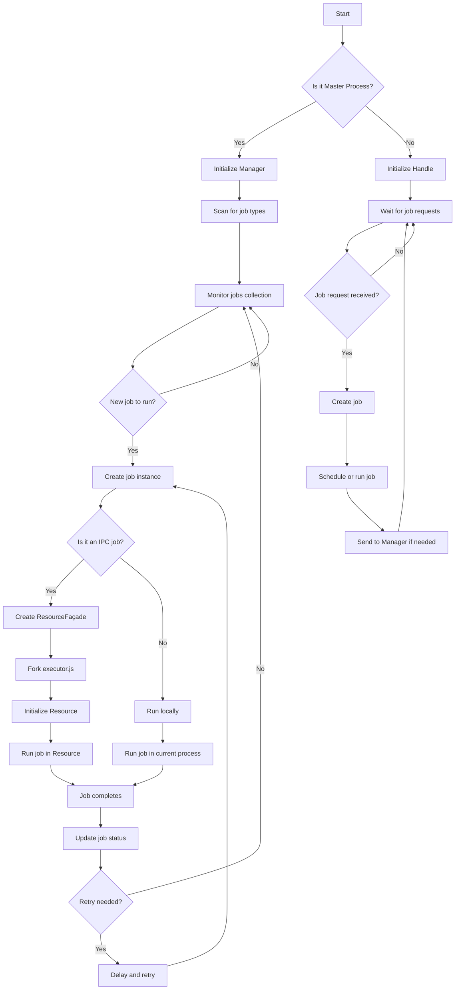
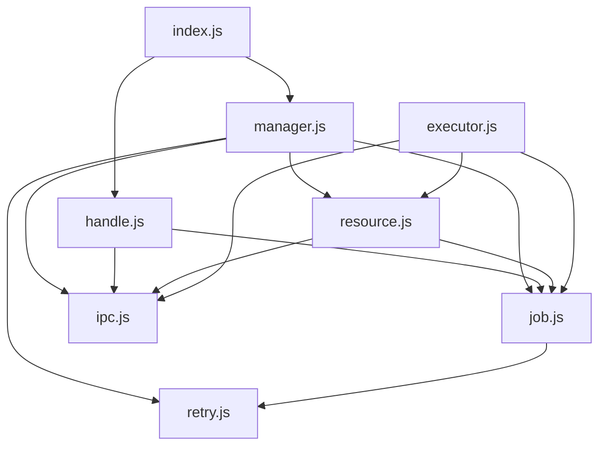
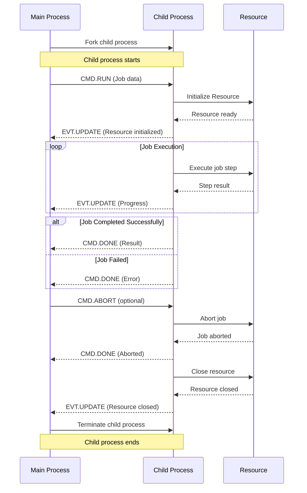
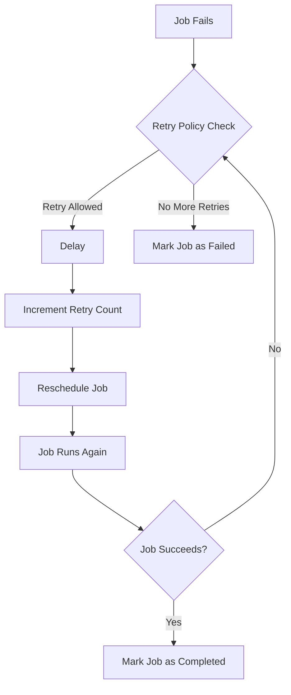
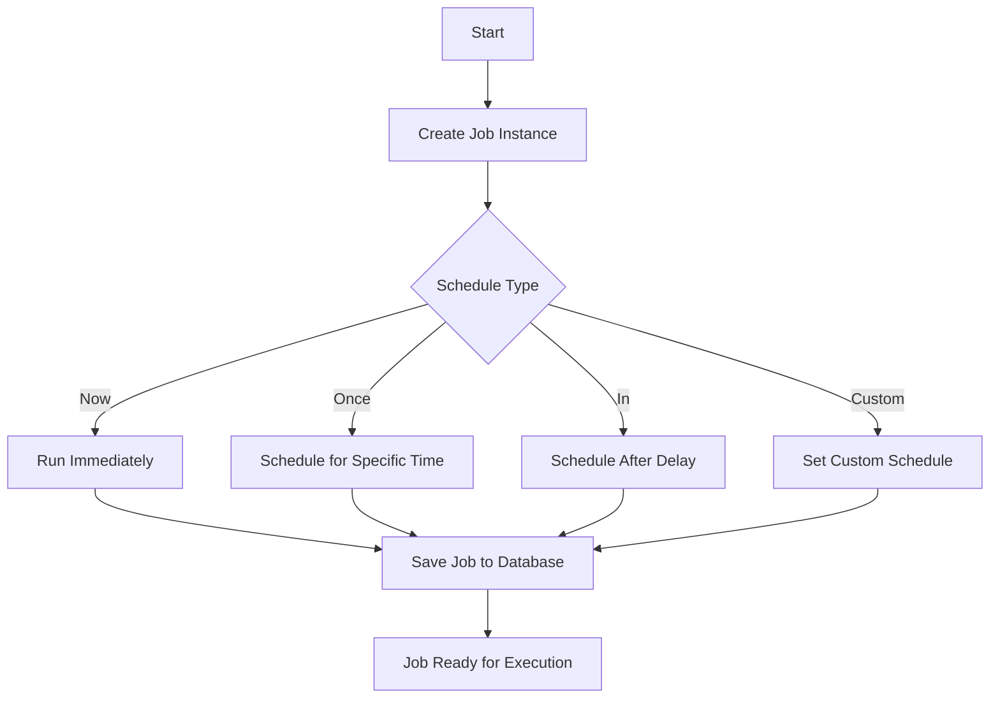

# Jobs Feature Documentation

## Table of Contents
1. [Overview](#overview)
2. [System Architecture](#system-architecture)
3. [Flowcharts](#flowcharts)
    - [Job Lifecycle](#job-lifecycle-flowchart)
    - [Dependency Chart](#dependency-chart)
    - [IPC Communication](#ipc-communication-flow)
    - [Retry Logic](#retry-logic-flowchart)
    - [Job Creation and Scheduling](#job-creation-and-scheduling-flowchart)
4. [Key Components](#key-components)
5. [Job Lifecycle](#job-lifecycle)
6. [IPC Communication](#ipc-communication)
7. [Retry Mechanism](#retry-mechanism)
8. [Usage Guide](#usage-guide)
9. [Implementation Guide](#implementation-guide)
10. [File Breakdown](#file-breakdown)
11. [Configuration](#configuration)
12. [Technical Implementation of Scheduling](#technical-implementation-of-scheduling)
13. [Best Practices](#best-practices)

## Overview

The Jobs feature is a robust system designed to handle asynchronous, potentially long-running tasks in a distributed environment. It supports job scheduling, execution, inter-process communication, and automatic retries. The system is built to be scalable and fault-tolerant, capable of running jobs across multiple processes and servers.

Key features include:
- Flexible job scheduling (immediate, delayed, or recurring)
- Inter-process communication for resource-intensive jobs
- Automatic retry mechanism with customizable policies
- Resource management for efficient job execution
- Scalable architecture supporting distributed environments

## System Architecture

The Jobs system consists of several interconnected components:

- **Manager**: Oversees job execution and resource management
- **Handle**: Provides API for job creation and scheduling
- **Job**: Base class for all job types
- **Resource**: Manages resources for IPC jobs
- **RetryPolicy**: Defines retry behavior for failed jobs
- **IPC**: Handles inter-process communication

These components work together to create, schedule, execute, and monitor jobs across the system.

## Flowcharts

### Job Lifecycle Flowchart



### Dependency Chart



### IPC Communication Flow



### Retry Logic Flowchart



### Job Creation and Scheduling Flowchart



## Key Components

### Manager (manager.js)
The Manager is responsible for overseeing job execution and resource management. It monitors the jobs collection, creates job instances, and delegates execution to the appropriate process.

### Handle (handle.js)
The Handle provides an API for job creation and scheduling. It's the entry point for creating new jobs and defining their execution parameters.

### Job (job.js)
The Job class is the base class for all job types. It defines the structure and basic behavior of a job, including methods for running, aborting, and updating status.

### Resource (resource.js)
The Resource class manages resources for IPC jobs. It handles the lifecycle of resources needed for job execution in separate processes.

### RetryPolicy (retry.js)
The RetryPolicy defines the behavior for retrying failed jobs. It determines if and when a job should be retried based on its failure characteristics.

### IPC (ipc.js)
The IPC module facilitates communication between the main process and child processes running IPC jobs. It provides a robust messaging system for exchanging data, commands, and status updates.

### Executor (executor.js)
The Executor is responsible for setting up and running IPC jobs in separate processes. It initializes the necessary resources and communication channels, executes the job, and reports results back to the main process.

## Job Lifecycle

1. **Creation**: Jobs are created using the Handle API.
2. **Scheduling**: Jobs can be scheduled to run immediately, at a specific time, or on a recurring basis.
3. **Execution**: The Manager picks up scheduled jobs and executes them, either locally or in a separate process for IPC jobs.
4. **Monitoring**: Job progress is monitored and status is updated in the database.
5. **Completion/Failure**: Upon completion or failure, the job status is updated, and the retry policy is consulted if necessary.
6. **Retry**: If required and allowed by the retry policy, failed jobs are rescheduled for another attempt.
7. **Cleanup**: After job completion (successful or failed), any associated resources are cleaned up, and the job's final status is recorded.

## IPC Communication

Inter-Process Communication (IPC) is used for jobs that need to run in separate processes. The system uses a custom IPC module (ipc.js) to facilitate communication between the main process and job processes.

Key aspects of IPC:
- **Channel Creation**: Each IPC job has a unique channel for communication.
- **Message Passing**: The main process and job processes exchange messages for status updates, commands, and results.
- **Resource Management**: IPC is used to manage the lifecycle of resources in separate processes.

The IPC system uses a message-based protocol with the following key message types:
- `CMD.RUN`: Instructs a child process to start running a job
- `CMD.ABORT`: Signals a job to abort its execution
- `CMD.DONE`: Indicates that a job has completed (successfully or with an error)
- `EVT.UPDATE`: Provides progress updates from the job to the main process

Example of sending an IPC message:

```javascript
channel.send(CMD.RUN, jobData);
```

Example of receiving an IPC message:

```javascript
channel.on(CMD.DONE, (result) => {
    // Handle job completion
});
```

## Retry Mechanism

The retry mechanism is implemented through the RetryPolicy class. It defines:

- **Number of Retries**: How many times a job should be retried.
- **Delay**: The delay between retries, which can be fixed or increasing.
- **Error Handling**: Which types of errors should trigger a retry.

Different job types can have custom retry policies tailored to their specific needs.

Example of a custom retry policy:

```javascript
class CustomRetryPolicy extends RetryPolicy {
    constructor(maxRetries, initialDelay) {
        super();
        this.maxRetries = maxRetries;
        this.initialDelay = initialDelay;
    }

    shouldRetry(attempt, error) {
        return attempt < this.maxRetries && this.isRetriableError(error);
    }

    getDelay(attempt) {
        return this.initialDelay * Math.pow(2, attempt); // Exponential backoff
    }

    isRetriableError(error) {
        // Define which errors should trigger a retry
        return error.code === 'NETWORK_ERROR' || error.code === 'RESOURCE_UNAVAILABLE';
    }
}
```

## Usage Guide

This section provides examples and explanations for using the Jobs system, including all supported inputs and scheduling types.

### Creating a Job

To create a job, use the `job()` method from the Handle API:

```javascript
const jobHandle = require('./path/to/handle');

const myJob = jobHandle.job('myJobType', {
    // job data
    param1: 'value1',
    param2: 'value2'
});
```

Parameters:
- `jobType` (string): The type of job to create. This should match a registered job type in the system.
- `jobData` (object): An object containing any data needed for the job execution.

### Scheduling a Job

After creating a job, you can schedule it using one of the following methods:

#### Run Immediately

```javascript
myJob.now();
```

This schedules the job to run as soon as possible.

#### Run Once at a Specific Time

```javascript
myJob.once(new Date('2023-12-31T23:59:59'));
```

This schedules the job to run once at the specified date and time.

#### Run After a Delay

```javascript
myJob.in(3600); // Run after 1 hour
```

This schedules the job to run after the specified number of seconds.

#### Custom Schedule

The `schedule` method is highly flexible and accepts various types of inputs:
It uses ```later.js``` to support this

1. Cron Syntax
   ```javascript
   myJob.schedule('0 0 * * *'); // Run at midnight every day
   ```

2. Natural Language
   ```javascript
   myJob.schedule('every 5 minutes');
   myJob.schedule('at 10:15 am every weekday');
   ```

3. Object Literal
   ```javascript
   myJob.schedule({
     h: [10, 14, 18], // Run at 10am, 2pm, and 6pm
     dw: [1, 3, 5]    // On Monday, Wednesday, and Friday
   });
   ```

4. Array of Schedules
   ```javascript
   myJob.schedule([
     '0 0 * * *',           // At midnight
     'every weekday at 9am'  // Every weekday at 9am
   ]);
   ```

5. Custom Schedule Functions
   ```javascript
   myJob.schedule(function() {
     return Date.now() + 60000; // Run 1 minute from now
   });
   ```

6. Predefined Schedule Constants (if supported by your implementation)
   ```javascript
   myJob.schedule(SCHEDULE.EVERY_HOUR);
   ```


This sets a custom schedule for the job using a cron-like syntax. The example above schedules the job to run every 5 minutes.

### Job Types

Different job types can be implemented by extending the base Job class. Here's an example of a custom job type:

```javascript
const { Job } = require('./path/to/job');

class MyCustomJob extends Job {
    async run(db, done, progress) {
        // Job logic goes here
        // Use 'db' for database operations
        // Call 'progress()' to report progress
        // Call 'done()' when the job is complete
    }
}

module.exports = MyCustomJob;
```

### Handling Job Results

Job results and errors are typically handled in the job implementation. However, for immediate feedback, you can chain promises:

```javascript
myJob.now().then((result) => {
    console.log('Job completed successfully:', result);
}).catch((error) => {
    console.error('Job failed:', error);
});
```

Remember that for long-running jobs, it's better to implement result handling within the job itself, possibly by updating a database or triggering a callback.

## Implementation Guide

To implement a new job type:

1. Create a new job class that extends the base Job class.
2. Implement the `run` method to define the job's main logic.
3. Define a retry policy if needed.
4. Register the job type in the system (usually done automatically by the scanner).
5. Use the Handle API to create and schedule instances of your job.

Example:

```javascript
const { Job } = require('./job.js');
const { DefaultRetryPolicy } = require('./retry.js');

class MyCustomJob extends Job {
    constructor(name, data) {
        super(name, data);
    }

    async run(db, done, progress) {
        // Implement job logic here
        // Use 'db' for database operations
        // Call 'done()' when finished
        // Use 'progress()' to report progress
    }

    retryPolicy() {
        return new DefaultRetryPolicy(3); // Retry up to 3 times
    }
}

module.exports = MyCustomJob;
```

## File Breakdown

### index.js
Entry point that determines whether to load the manager or handle based on the process type.

```javascript
const countlyConfig = require('./../../config', 'dont-enclose');

if (require('cluster').isMaster && process.argv[1].endsWith('api/api.js') && !(countlyConfig && countlyConfig.preventJobs)) {
    module.exports = require('./manager.js');
} else {
    module.exports = require('./handle.js');
}
```

### manager.js
Implements the Manager class, which oversees job execution and resource management.

Key methods:
- `constructor()`: Initializes the manager and starts monitoring jobs.
- `check()`: Periodically checks for new jobs to run.
- `process(jobs)`: Processes a batch of jobs.
- `run(job)`: Executes a single job.

### handle.js
Implements the Handle class, which provides the API for job creation and scheduling.

Key methods:
- `job(name, data)`: Creates a new job instance.
- `schedule(schedule, strict, nextTime)`: Schedules a job.
- `once(date, strict)`: Schedules a job to run once at a specific time.
- `now()`: Schedules a job to run immediately.
- `in(seconds)`: Schedules a job to run after a delay.

### job.js
Defines the base Job class and its subclasses (IPCJob, TransientJob).

Key methods:
- `run(db, done, progress)`: Main method to be implemented by subclasses.
- `_save(set)`: Saves job state to the database.
- `_finish(err)`: Marks a job as finished.
- `retryPolicy()`: Returns the retry policy for the job.

### resource.js
Implements the Resource and ResourceFaçade classes for managing job resources.

Key methods:
- `open()`: Opens a resource.
- `close()`: Closes a resource.
- `run(job)`: Runs a job using the resource.

### retry.js
Defines retry policies for jobs.

Classes:
- `DefaultRetryPolicy`: Standard retry policy.
- `IPCRetryPolicy`: Retry policy specific to IPC jobs.
- `NoRetryPolicy`: Policy for jobs that should never be retried.

### ipc.js
Handles inter-process communication.

Key classes:
- `IdChannel`: Represents a communication channel between processes.

Key methods:
- `send(cmd, data)`: Sends a message through the channel.
- `on(cmd, handler)`: Registers a handler for incoming messages.

### executor.js
Entry point for child processes that run IPC jobs.

Key functionality:
- Sets up the environment for running a job in a separate process.
- Initializes the necessary resources and communication channels.
- Executes the job and communicates results back to the main process.

## Configuration

The Jobs system can be configured through the main application configuration file. Key configuration options include:

- `jobs.concurrency`: Maximum number of jobs that can run concurrently
- `jobs.retryDelay`: Default delay between retry attempts
- `jobs.maxRetries`: Default maximum number of retry attempts
- `jobs.timeout`: Default timeout for job execution

Example configuration:

```javascript
{
    jobs: {
        concurrency: 5,
        retryDelay: 60000, // 1 minute
        maxRetries: 3,
        timeout: 300000 // 5 minutes
    }
}
```

## Technical Implementation of Scheduling

The Jobs system implements scheduling using a combination of database persistence and Node.js timers. Here's a breakdown of the process:

### 1. Schedule Persistence (manager.js)

When a job is scheduled, it's saved to the MongoDB database with a `next` field indicating the next run time. This is handled in the `schedule` method of the Job class:

```javascript
schedule(schedule, strict, nextTime) {
    this._json.schedule = schedule;
    this._json.status = STATUS.SCHEDULED;

    if (strict !== undefined) {
        this._json.strict = strict;
    }

    if (nextTime) {
        this._json.next = nextTime;
    }
    else {
        schedule = typeof schedule === 'string' ? later.parse.text(schedule) : schedule;
        var next = later.schedule(schedule).next(1);
        if (!next) {
            return null;
        }

        this._json.next = next.getTime();
    }
    
    return this._save();
}
```

### 2. Job Checking (manager.js)

The Manager class periodically checks for jobs that are due to run. This is done in the `check` method:

```javascript
check() {
    var find = {
        status: STATUS.SCHEDULED,
        next: {$lt: Date.now()},
        name: {$in: this.types}
    };

    this.collection.find(find).sort({next: 1}).limit(MAXIMUM_IN_LINE_JOBS_PER_NAME).toArray((err, jobs) => {
        if (err) {
            // Error handling
        }
        else if (jobs && jobs.length) {
            this.process(jobs);
        }
        else {
            this.checkAfterDelay();
        }
    });
}
```

### 3. Scheduling Next Check (manager.js)

After processing jobs, the system schedules the next check using Node.js's `setTimeout`:

```javascript
checkAfterDelay(delay) {
    setTimeout(() => {
        this.check();
    }, delay || DELAY_BETWEEN_CHECKS);
}
```

### 4. Job Execution (manager.js)

When it's time to run a job, the `run` method is called:

```javascript
run(job) {
    if (job instanceof JOB.IPCJob) {
        return this.runIPC(job);
    }
    else {
        return this.runLocally(job);
    }
}
```

### 5. Rescheduling Recurring Jobs (job.js)

After a job completes, if it's a recurring job, it's rescheduled:

```javascript
_finish(err) {
    // ... other completion logic ...

    if (this._json.schedule) {
        this.schedule(this._json.schedule, this._json.strict);
    }
}
```

This implementation allows for efficient scheduling of jobs:
- Jobs are persisted in the database, allowing for system restarts without losing scheduled jobs.
- The periodic checking mechanism allows for handling a large number of jobs without keeping them all in memory.
- Using Node.js timers for the checking mechanism provides a simple and reliable way to trigger job processing.
- The use of `later.js` for parsing schedules allows for flexible and powerful schedule definitions.

## Best Practices

1. **Job Atomicity**: Design jobs to be atomic and idempotent where possible. This ensures that jobs can be safely retried without unintended side effects.

7. **Job Data**: Keep job data lightweight and serializable. Avoid storing large objects or non-serializable data in the job's data field.
