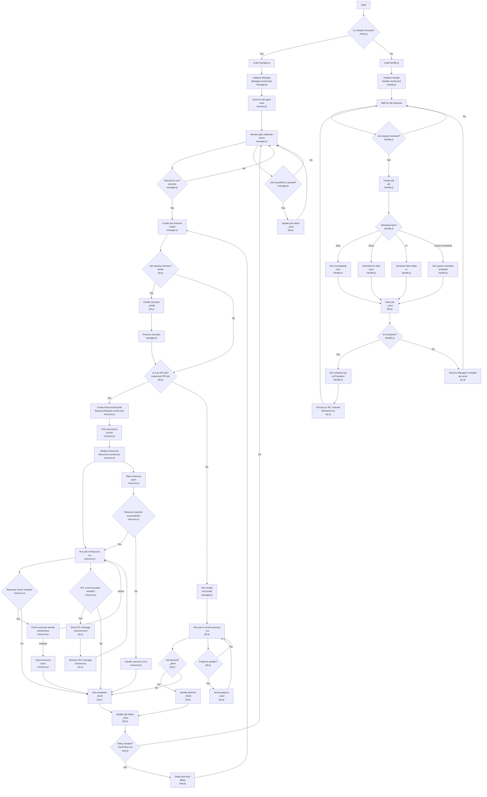

```mermaid

graph TD
    A[Start] --> B{Is it Master Process?<br>index.js}
    B -->|Yes| C[Load manager.js]
    B -->|No| D[Load handle.js]

    C --> E[Initialize Manager<br>Manager.constructor<br>manager.js]
    E --> F[Scan for job types<br>scan<br>scanner.js]
    F --> G[Monitor jobs collection<br>check<br>manager.js]

    D --> H[Initialize Handle<br>Handle.constructor<br>handle.js]
    H --> I[Wait for job requests]

    G --> J{New job to run?<br>process<br>manager.js}
    J -->|Yes| K[Create job instance<br>create<br>manager.js]
    J -->|No| G

    K --> AI{Job requires division?<br>divide<br>job.js}
    AI -->|Yes| AJ[Create sub-jobs<br>_divide<br>job.js]
    AI -->|No| L
    AJ --> AK[Process sub-jobs<br>manager.js]
    AK --> L

    L{Is it an IPC job?<br>instanceof IPCJob<br>job.js}
    L -->|Yes| M[Create ResourceFaçade<br>ResourceFaçade.constructor<br>resource.js]
    L -->|No| N[Run locally<br>runLocally<br>manager.js]

    M --> O[Fork executor.js<br>cp.fork<br>resource.js]
    O --> P[Initialize Resource<br>Resource.constructor<br>resource.js]
    P --> Q[Run job in Resource<br>run<br>resource.js]

    N --> R[Run job in current process<br>_run<br>job.js]

    Q --> AL{Resource check needed?<br>resource.js}
    AL -->|Yes| AM[Check resource activity<br>checkActive<br>resource.js]
    AL -->|No| S
    AM -->|Active| Q
    AM -->|Inactive| AN[Close resource<br>close<br>resource.js]
    AN --> S

    R --> AO{Job aborted?<br>_abort<br>job.js}
    AO -->|Yes| AP[Handle abortion<br>_finish<br>job.js]
    AO -->|No| S
    AP --> T

    S[Job completes<br>_finish<br>job.js]

    S --> T[Update job status<br>_save<br>job.js]
    T --> U{Retry needed?<br>retryPolicy.run<br>retry.js}
    U -->|Yes| V[Delay and retry<br>delay<br>retry.js]
    U -->|No| G
    V --> K

    I --> W{Job request received?<br>handle.js}
    W -->|Yes| X[Create job<br>job<br>handle.js]
    W -->|No| I

    X --> Y{Schedule type?<br>handle.js}
    Y -->|Now| Z[Run immediately<br>now<br>handle.js]
    Y -->|Once| AA[Schedule for later<br>once<br>handle.js]
    Y -->|In| AB[Schedule after delay<br>in<br>handle.js]
    Y -->|Custom Schedule| AC[Set custom schedule<br>schedule<br>handle.js]

    Z --> AD[Save job<br>_save<br>job.js]
    AA --> AD
    AB --> AD
    AC --> AD

    AD --> AE{Is it transient?<br>handle.js}
    AE -->|Yes| AF[Run transient job<br>runTransient<br>handle.js]
    AE -->|No| AG[Send to Manager if needed<br>ipc.send<br>ipc.js]

    AF --> AH[Process in IPC channel<br>IdChannel.on<br>ipc.js]
    AG --> I
    AH --> I

    Q --> AQ{IPC communication needed?<br>resource.js}
    AQ -->|Yes| AR[Send IPC message<br>channel.send<br>ipc.js]
    AQ -->|No| S
    AR --> AS[Receive IPC message<br>channel.on<br>ipc.js]
    AS --> Q

    R --> AT{Progress update?<br>job.js}
    AT -->|Yes| AU[Send progress<br>_save<br>job.js]
    AT -->|No| R
    AU --> R

    G --> AV{Job cancelled or paused?<br>manager.js}
    AV -->|Yes| AW[Update job status<br>_save<br>job.js]
    AV -->|No| G
    AW --> G

    P --> AX[Open resource<br>open<br>resource.js]
    AX --> AY{Resource opened successfully?<br>resource.js}
    AY -->|Yes| Q
    AY -->|No| AZ[Handle resource error<br>resource.js]
    AZ --> S


```