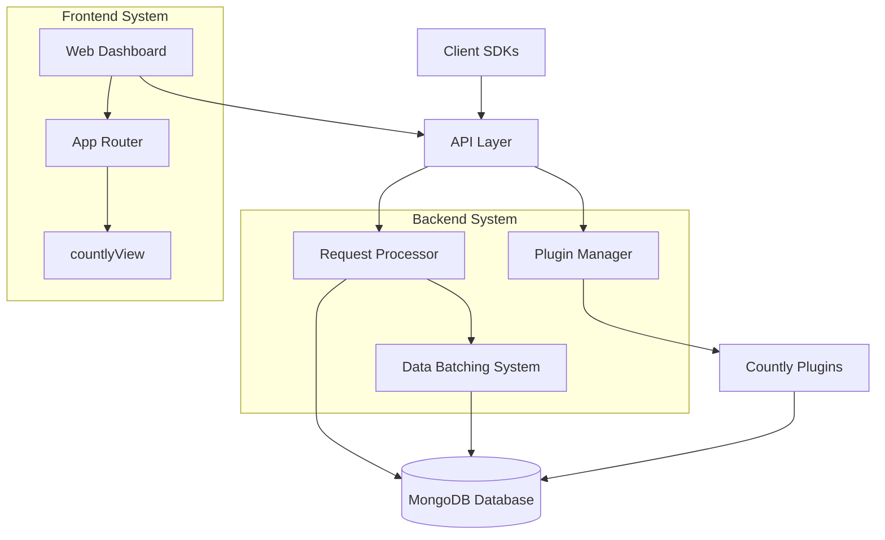
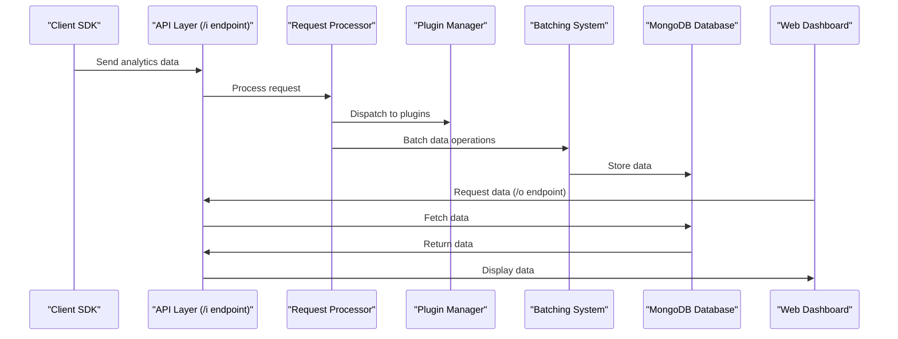
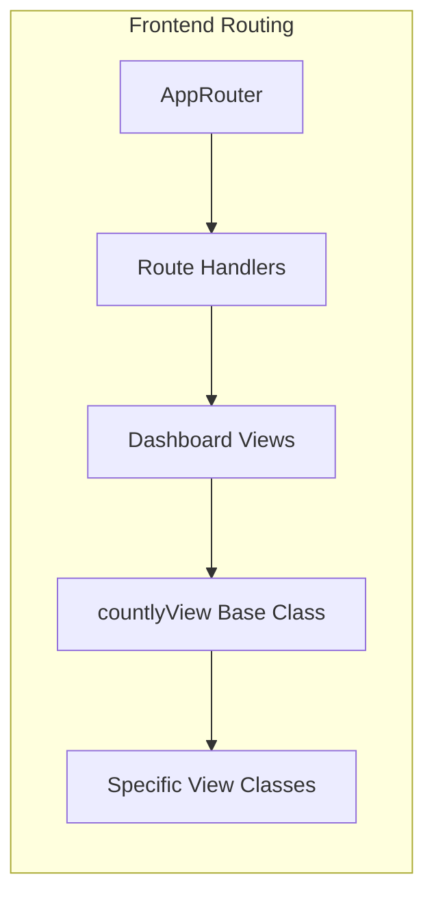
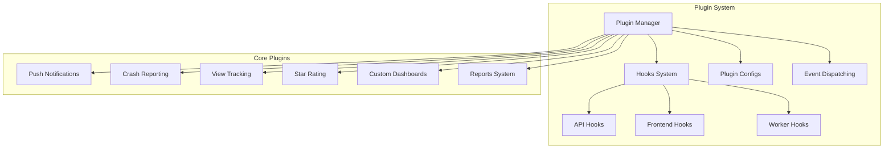

# Overview

<details>
<summary>Relevant source files</summary>

The following files were used as context for generating this wiki page:

- [CHANGELOG.md](https://github.com/Countly/countly-server/blob/1527df18/CHANGELOG.md)
- [api/api.js](https://github.com/Countly/countly-server/blob/1527df18/api/api.js)
- [api/lib/countly.common.js](https://github.com/Countly/countly-server/blob/1527df18/api/lib/countly.common.js)
- [api/parts/data/batcher.js](https://github.com/Countly/countly-server/blob/1527df18/api/parts/data/batcher.js)
- [api/parts/data/events.js](https://github.com/Countly/countly-server/blob/1527df18/api/parts/data/events.js)
- [api/parts/data/exports.js](https://github.com/Countly/countly-server/blob/1527df18/api/parts/data/exports.js)
- [api/parts/data/fetch.js](https://github.com/Countly/countly-server/blob/1527df18/api/parts/data/fetch.js)
- [api/parts/data/usage.js](https://github.com/Countly/countly-server/blob/1527df18/api/parts/data/usage.js)
- [api/parts/mgmt/ip.js](https://github.com/Countly/countly-server/blob/1527df18/api/parts/mgmt/ip.js)
- [api/parts/mgmt/mail.js](https://github.com/Countly/countly-server/blob/1527df18/api/parts/mgmt/mail.js)
- [api/utils/common.js](https://github.com/Countly/countly-server/blob/1527df18/api/utils/common.js)
- [api/utils/requestProcessor.js](https://github.com/Countly/countly-server/blob/1527df18/api/utils/requestProcessor.js)
- [bin/upgrade/18.04.1/upgrade.sh](https://github.com/Countly/countly-server/blob/1527df18/bin/upgrade/18.04.1/upgrade.sh)
- [bin/upgrade/18.04/upgrade.sh](https://github.com/Countly/countly-server/blob/1527df18/bin/upgrade/18.04/upgrade.sh)
- [extend/.gitignore](https://github.com/Countly/countly-server/blob/1527df18/extend/.gitignore)
- [extend/aws_ses.example.js](https://github.com/Countly/countly-server/blob/1527df18/extend/aws_ses.example.js)
- [extend/mail.example.js](https://github.com/Countly/countly-server/blob/1527df18/extend/mail.example.js)
- [frontend/express/app.js](https://github.com/Countly/countly-server/blob/1527df18/frontend/express/app.js)
- [frontend/express/libs/dollar-defender.js](https://github.com/Countly/countly-server/blob/1527df18/frontend/express/libs/dollar-defender.js)
- [frontend/express/libs/express-expose.js](https://github.com/Countly/countly-server/blob/1527df18/frontend/express/libs/express-expose.js)
- [frontend/express/libs/preventBruteforce.js](https://github.com/Countly/countly-server/blob/1527df18/frontend/express/libs/preventBruteforce.js)
- [frontend/express/public/javascripts/countly/countly.common.js](https://github.com/Countly/countly-server/blob/1527df18/frontend/express/public/javascripts/countly/countly.common.js)
- [frontend/express/public/javascripts/countly/countly.event.js](https://github.com/Countly/countly-server/blob/1527df18/frontend/express/public/javascripts/countly/countly.event.js)
- [frontend/express/public/javascripts/countly/countly.helpers.js](https://github.com/Countly/countly-server/blob/1527df18/frontend/express/public/javascripts/countly/countly.helpers.js)
- [frontend/express/public/javascripts/countly/countly.session.js](https://github.com/Countly/countly-server/blob/1527df18/frontend/express/public/javascripts/countly/countly.session.js)
- [frontend/express/public/javascripts/countly/countly.template.js](https://github.com/Countly/countly-server/blob/1527df18/frontend/express/public/javascripts/countly/countly.template.js)
- [frontend/express/public/javascripts/countly/countly.views.js](https://github.com/Countly/countly-server/blob/1527df18/frontend/express/public/javascripts/countly/countly.views.js)
- [frontend/express/public/localization/dashboard/dashboard.properties](https://github.com/Countly/countly-server/blob/1527df18/frontend/express/public/localization/dashboard/dashboard.properties)
- [frontend/express/public/localization/mail/mail.properties](https://github.com/Countly/countly-server/blob/1527df18/frontend/express/public/localization/mail/mail.properties)
- [frontend/express/public/stylesheets/main.css](https://github.com/Countly/countly-server/blob/1527df18/frontend/express/public/stylesheets/main.css)
- [frontend/express/version.info.js](https://github.com/Countly/countly-server/blob/1527df18/frontend/express/version.info.js)
- [frontend/express/views/dashboard.html](https://github.com/Countly/countly-server/blob/1527df18/frontend/express/views/dashboard.html)
- [package-lock.json](https://github.com/Countly/countly-server/blob/1527df18/package-lock.json)
- [package.json](https://github.com/Countly/countly-server/blob/1527df18/package.json)
- [plugins/dbviewer/tests.js](https://github.com/Countly/countly-server/blob/1527df18/plugins/dbviewer/tests.js)
- [plugins/pluginManager.js](https://github.com/Countly/countly-server/blob/1527df18/plugins/pluginManager.js)
- [plugins/plugins/api/api.js](https://github.com/Countly/countly-server/blob/1527df18/plugins/plugins/api/api.js)
- [plugins/plugins/frontend/app.js](https://github.com/Countly/countly-server/blob/1527df18/plugins/plugins/frontend/app.js)
- [plugins/plugins/frontend/public/javascripts/countly.models.js](https://github.com/Countly/countly-server/blob/1527df18/plugins/plugins/frontend/public/javascripts/countly.models.js)
- [plugins/plugins/frontend/public/javascripts/countly.views.js](https://github.com/Countly/countly-server/blob/1527df18/plugins/plugins/frontend/public/javascripts/countly.views.js)
- [plugins/plugins/frontend/public/localization/plugins.properties](https://github.com/Countly/countly-server/blob/1527df18/plugins/plugins/frontend/public/localization/plugins.properties)
- [plugins/plugins/frontend/public/stylesheets/main.scss](https://github.com/Countly/countly-server/blob/1527df18/plugins/plugins/frontend/public/stylesheets/main.scss)
- [plugins/plugins/frontend/public/templates/configurations.html](https://github.com/Countly/countly-server/blob/1527df18/plugins/plugins/frontend/public/templates/configurations.html)
- [plugins/plugins/frontend/public/templates/plugins.html](https://github.com/Countly/countly-server/blob/1527df18/plugins/plugins/frontend/public/templates/plugins.html)
- [plugins/plugins/tests.js](https://github.com/Countly/countly-server/blob/1527df18/plugins/plugins/tests.js)
- [plugins/star-rating/tests.js](https://github.com/Countly/countly-server/blob/1527df18/plugins/star-rating/tests.js)

</details>


Countly Server is an innovative, real-time, open source analytics platform that collects, processes, and visualizes data from mobile and web applications. The server component provides the backend infrastructure, API endpoints, data processing capabilities, and a web dashboard for analytics visualization.

This page provides a high-level overview of the Countly server architecture, key components, and how they interact to deliver analytics functionality.

## Core Architecture

Countly is built with a modular architecture that consists of several core components:



Sources: [frontend/express/public/javascripts/countly/countly.template.js](https://github.com/Countly/countly-server/blob/1527df18/frontend/express/public/javascripts/countly/countly.template.js), [api/utils/requestProcessor.js](https://github.com/Countly/countly-server/blob/1527df18/api/utils/requestProcessor.js), [plugins/pluginManager.js](https://github.com/Countly/countly-server/blob/1527df18/plugins/pluginManager.js), [api/parts/data/batcher.js](https://github.com/Countly/countly-server/blob/1527df18/api/parts/data/batcher.js)

### API Layer

The API layer serves as the entry point for all data coming into the Countly system. It handles requests from client SDKs, processes them through the request processor, and routes data to appropriate plugins. The API exposes multiple endpoints:

- `/i` - Data input endpoint for client SDKs to send analytics data
- `/o` - Data output endpoint for dashboard to fetch analytics data
- `/plugins` - Endpoint for managing plugins
- Other endpoints provided by various plugins

The API layer is designed to handle high volumes of concurrent requests efficiently and supports batching operations for performance optimization.

Sources: [api/api.js](https://github.com/Countly/countly-server/blob/1527df18/api/api.js), [api/utils/requestProcessor.js](https://github.com/Countly/countly-server/blob/1527df18/api/utils/requestProcessor.js)

### Request Processor

The request processor is responsible for validating, processing, and storing incoming data. It performs authentication, request validation, and routes the data to the appropriate handlers based on the request path and parameters.

Sources: [api/utils/requestProcessor.js](https://github.com/Countly/countly-server/blob/1527df18/api/utils/requestProcessor.js)

### Plugin System

Countly's functionality is greatly extended through its plugin system. The plugin manager loads and manages plugins, which can add new endpoints, modify existing functionality, or add new features to the dashboard. Each plugin can register hooks to extend various parts of the system.

Sources: [plugins/pluginManager.js](https://github.com/Countly/countly-server/blob/1527df18/plugins/pluginManager.js)

### Data Batching System

For performance optimization, Countly implements a batching system that collects multiple database operations and executes them in batches:

- WriteBatcher - Collects write operations to execute them in batches
- ReadBatcher - Optimizes read operations through caching and batching
- InsertBatcher - Specialized for batch insert operations

Sources: [api/parts/data/batcher.js](https://github.com/Countly/countly-server/blob/1527df18/api/parts/data/batcher.js)

### Frontend Dashboard

The frontend dashboard provides the user interface for viewing analytics data. It's built using:

- Express.js as the web server
- Backbone.js for routing and views
- Vue.js components for UI elements
- Various visualization libraries for charts and graphs

Sources: [frontend/express/app.js](https://github.com/Countly/countly-server/blob/1527df18/frontend/express/app.js), [frontend/express/public/javascripts/countly/countly.template.js](https://github.com/Countly/countly-server/blob/1527df18/frontend/express/public/javascripts/countly/countly.template.js)

## Data Flow

The following diagram illustrates how data flows through the Countly system:



Sources: [api/utils/requestProcessor.js](https://github.com/Countly/countly-server/blob/1527df18/api/utils/requestProcessor.js), [api/parts/data/usage.js](https://github.com/Countly/countly-server/blob/1527df18/api/parts/data/usage.js), [api/parts/data/fetch.js](https://github.com/Countly/countly-server/blob/1527df18/api/parts/data/fetch.js)

### Data Input Flow

1. Client SDKs collect data from applications and send it to the `/i` endpoint.
2. The request processor validates the request, authenticates the app, and preprocesses the data.
3. Data is processed according to its type (sessions, events, metrics, etc.).
4. Plugin hooks are executed to allow plugins to process the data.
5. Data is batched and stored in MongoDB.

Sources: [api/utils/requestProcessor.js](https://github.com/Countly/countly-server/blob/1527df18/api/utils/requestProcessor.js), [api/parts/data/usage.js](https://github.com/Countly/countly-server/blob/1527df18/api/parts/data/usage.js), [api/parts/data/events.js](https://github.com/Countly/countly-server/blob/1527df18/api/parts/data/events.js)

### Data Output Flow

1. The dashboard makes requests to the `/o` endpoint to fetch data.
2. The API retrieves data from MongoDB.
3. Data is processed and formatted for visualization.
4. The dashboard renders the data using various charts and visualizations.

Sources: [api/parts/data/fetch.js](https://github.com/Countly/countly-server/blob/1527df18/api/parts/data/fetch.js), [frontend/express/public/javascripts/countly/countly.views.js](https://github.com/Countly/countly-server/blob/1527df18/frontend/express/public/javascripts/countly/countly.views.js)

## Key Components

### AppRouter

The `AppRouter` is the main frontend router that manages navigation within the dashboard. It extends Backbone's Router and handles route changes, view initialization, and transition between different sections of the dashboard.



Sources: [frontend/express/public/javascripts/countly/countly.template.js:334-383](https://github.com/Countly/countly-server/blob/1527df18/frontend/express/public/javascripts/countly/countly.template.js#L334-L383)

### countlyView

`countlyView` is the base view class that provides common functionality for all dashboard views. It handles rendering, data binding, and interaction with the API. Specific views like `DashboardView` extend this base class.

Sources: [frontend/express/public/javascripts/countly/countly.views.js](https://github.com/Countly/countly-server/blob/1527df18/frontend/express/public/javascripts/countly/countly.views.js)

### Plugin Manager

The plugin manager (`pluginManager.js`) is the core of Countly's extensibility. It:

- Loads and initializes plugins
- Manages plugin configurations
- Provides hooks for plugins to extend functionality
- Handles dependencies between plugins

Sources: [plugins/pluginManager.js](https://github.com/Countly/countly-server/blob/1527df18/plugins/pluginManager.js)

### Data Processing Components

Several core components handle data processing:

- `countlyCommon` - Provides common utilities for data processing and formatting
- `countlySession` - Processes session data
- `countlyEvent` - Processes event data
- `countlyEvents` - Backend component for event processing
- `usage.js` - Processes user and session information

Sources: [api/lib/countly.common.js](https://github.com/Countly/countly-server/blob/1527df18/api/lib/countly.common.js), [frontend/express/public/javascripts/countly/countly.session.js](https://github.com/Countly/countly-server/blob/1527df18/frontend/express/public/javascripts/countly/countly.session.js), [frontend/express/public/javascripts/countly/countly.event.js](https://github.com/Countly/countly-server/blob/1527df18/frontend/express/public/javascripts/countly/countly.event.js), [api/parts/data/events.js](https://github.com/Countly/countly-server/blob/1527df18/api/parts/data/events.js), [api/parts/data/usage.js](https://github.com/Countly/countly-server/blob/1527df18/api/parts/data/usage.js)

## Database Structure

Countly uses MongoDB as its primary database. Key collections include:

| Collection | Purpose | Related Files |
|------------|---------|---------------|
| `apps` | Stores application information | [api/parts/mgmt/apps.js]() |
| `app_users` | Stores user profiles | [api/parts/mgmt/app_users.js]() |
| `events` | Stores event metadata | [api/parts/data/events.js]() |
| `sessions` | Stores session data | [api/parts/data/usage.js]() |
| `members` | Stores admin user accounts | [frontend/express/app.js]() |
| `plugins` | Stores plugin configurations | [plugins/pluginManager.js]() |
| Various plugin-specific collections | Store plugin-specific data | Plugin files |

## Plugin System Architecture

Countly's plugin system is highly extensible and allows for adding new features without modifying the core codebase:



Sources: [plugins/pluginManager.js](https://github.com/Countly/countly-server/blob/1527df18/plugins/pluginManager.js)

Plugins can:
- Add new API endpoints
- Extend the dashboard UI
- Add new data processing capabilities
- Create new visualizations
- Add new functionalities to existing features

## Server Configuration

Countly can be configured through several configuration files:

- `frontend/express/config.js` - Frontend configuration
- `api/config.js` - API configuration
- Plugin-specific configurations

These configurations can be modified through the dashboard settings or by directly editing the configuration files.

Sources: [frontend/express/app.js:63-65](https://github.com/Countly/countly-server/blob/1527df18/frontend/express/app.js#L63-L65), [api/api.js:52-87](https://github.com/Countly/countly-server/blob/1527df18/api/api.js#L52-L87)

## Version Information

Countly follows a semantic versioning scheme. The version information is stored in `frontend/express/version.info.js`. The current version as of this documentation is:

```
version: "25.03"
```

The server can be deployed in different editions:
- Countly Lite (Community Edition)
- Countly Enterprise
- Countly Cloud
- Countly Flex

Sources: [frontend/express/version.info.js](https://github.com/Countly/countly-server/blob/1527df18/frontend/express/version.info.js), [frontend/express/app.js:27-103](https://github.com/Countly/countly-server/blob/1527df18/frontend/express/app.js#L27-L103), [package.json:1-4](https://github.com/Countly/countly-server/blob/1527df18/package.json#L1-L4)

## Conclusion

Countly Server provides a robust, extensible platform for collecting and analyzing data from mobile and web applications. Its modular architecture and plugin system allow for easy extension and customization to meet specific analytics needs.

For more detailed information about specific aspects of the system, refer to the following pages:
- For architectural details, see [Architecture](#1.1)
- For installation and deployment, see [Installation and Deployment](#1.2)
- For frontend system details, see [Core Frontend System](#2)
- For backend API details, see [Core Backend API](#3)