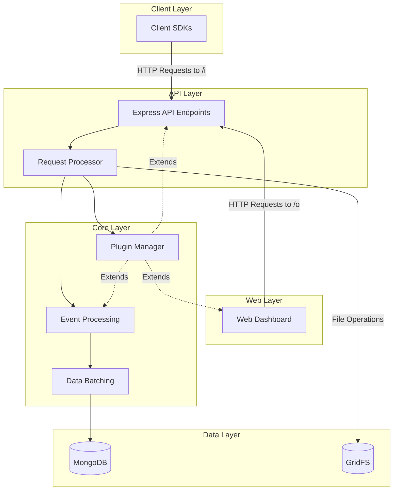
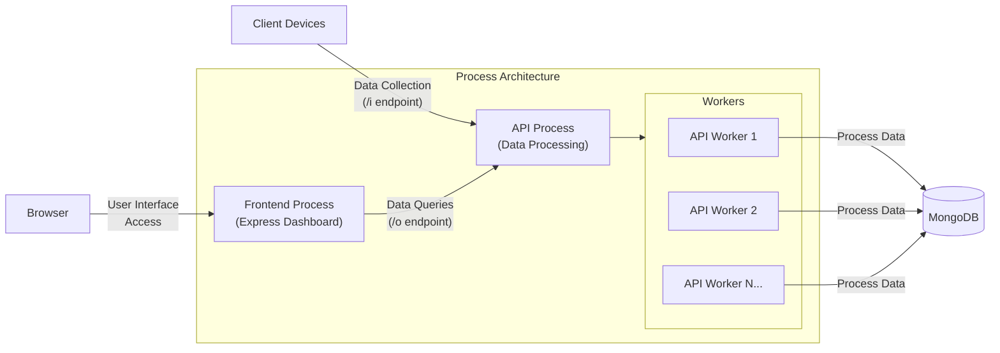
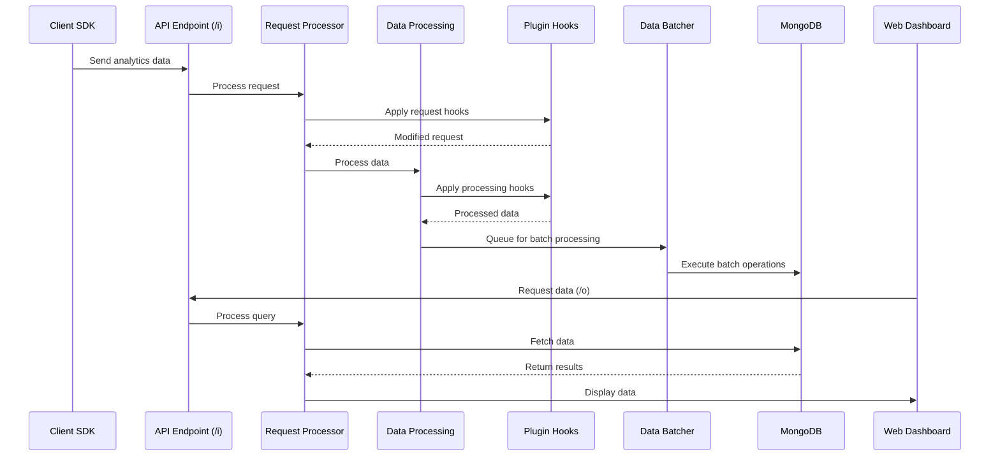
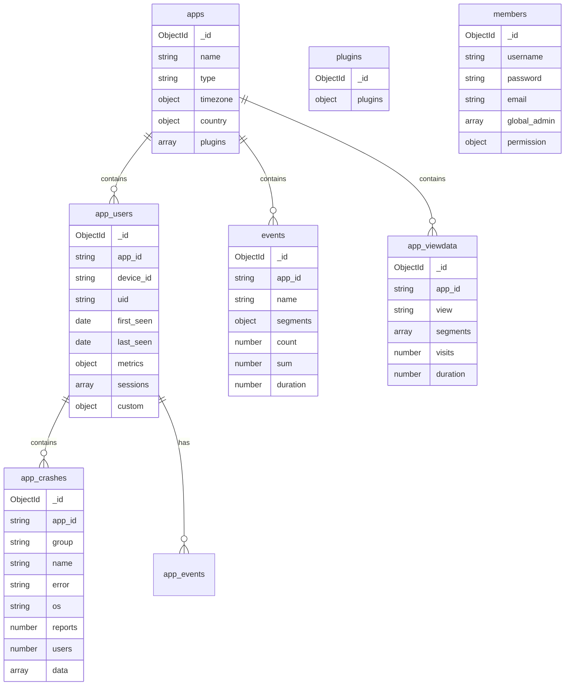
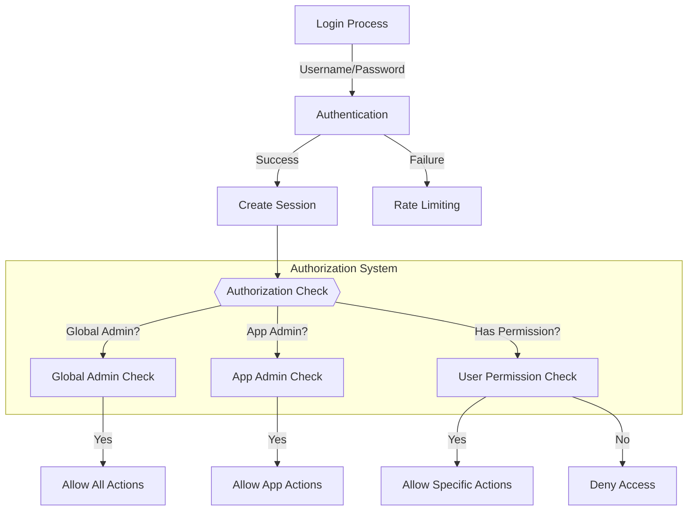
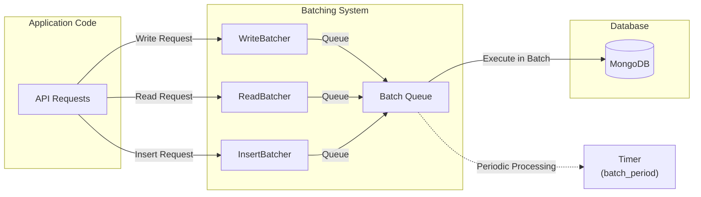
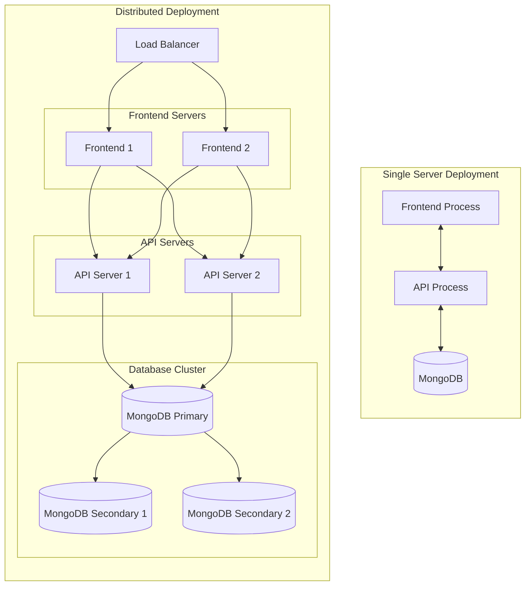

# Architecture

<details>
<summary>Relevant source files</summary>

The following files were used as context for generating this wiki page:

- [CHANGELOG.md](https://github.com/Countly/countly-server/blob/1527df18/CHANGELOG.md)
- [api/api.js](https://github.com/Countly/countly-server/blob/1527df18/api/api.js)
- [api/jobs/task.js](https://github.com/Countly/countly-server/blob/1527df18/api/jobs/task.js)
- [api/jobs/userMerge.js](https://github.com/Countly/countly-server/blob/1527df18/api/jobs/userMerge.js)
- [api/lib/countly.common.js](https://github.com/Countly/countly-server/blob/1527df18/api/lib/countly.common.js)
- [api/parts/data/batcher.js](https://github.com/Countly/countly-server/blob/1527df18/api/parts/data/batcher.js)
- [api/parts/data/events.js](https://github.com/Countly/countly-server/blob/1527df18/api/parts/data/events.js)
- [api/parts/data/exports.js](https://github.com/Countly/countly-server/blob/1527df18/api/parts/data/exports.js)
- [api/parts/data/fetch.js](https://github.com/Countly/countly-server/blob/1527df18/api/parts/data/fetch.js)
- [api/parts/data/usage.js](https://github.com/Countly/countly-server/blob/1527df18/api/parts/data/usage.js)
- [api/parts/mgmt/app_users.js](https://github.com/Countly/countly-server/blob/1527df18/api/parts/mgmt/app_users.js)
- [api/parts/mgmt/ip.js](https://github.com/Countly/countly-server/blob/1527df18/api/parts/mgmt/ip.js)
- [api/parts/mgmt/mail.js](https://github.com/Countly/countly-server/blob/1527df18/api/parts/mgmt/mail.js)
- [api/utils/common.js](https://github.com/Countly/countly-server/blob/1527df18/api/utils/common.js)
- [api/utils/requestProcessor.js](https://github.com/Countly/countly-server/blob/1527df18/api/utils/requestProcessor.js)
- [api/utils/taskmanager.js](https://github.com/Countly/countly-server/blob/1527df18/api/utils/taskmanager.js)
- [bin/upgrade/18.04.1/upgrade.sh](https://github.com/Countly/countly-server/blob/1527df18/bin/upgrade/18.04.1/upgrade.sh)
- [bin/upgrade/18.04/upgrade.sh](https://github.com/Countly/countly-server/blob/1527df18/bin/upgrade/18.04/upgrade.sh)
- [extend/.gitignore](https://github.com/Countly/countly-server/blob/1527df18/extend/.gitignore)
- [extend/aws_ses.example.js](https://github.com/Countly/countly-server/blob/1527df18/extend/aws_ses.example.js)
- [extend/mail.example.js](https://github.com/Countly/countly-server/blob/1527df18/extend/mail.example.js)
- [frontend/express/app.js](https://github.com/Countly/countly-server/blob/1527df18/frontend/express/app.js)
- [frontend/express/libs/dollar-defender.js](https://github.com/Countly/countly-server/blob/1527df18/frontend/express/libs/dollar-defender.js)
- [frontend/express/libs/express-expose.js](https://github.com/Countly/countly-server/blob/1527df18/frontend/express/libs/express-expose.js)
- [frontend/express/libs/preventBruteforce.js](https://github.com/Countly/countly-server/blob/1527df18/frontend/express/libs/preventBruteforce.js)
- [frontend/express/public/core/report-manager/javascripts/countly.views.js](https://github.com/Countly/countly-server/blob/1527df18/frontend/express/public/core/report-manager/javascripts/countly.views.js)
- [frontend/express/public/core/report-manager/stylesheets/_main.scss](https://github.com/Countly/countly-server/blob/1527df18/frontend/express/public/core/report-manager/stylesheets/_main.scss)
- [frontend/express/public/core/report-manager/templates/reportmanager-auto.html](https://github.com/Countly/countly-server/blob/1527df18/frontend/express/public/core/report-manager/templates/reportmanager-auto.html)
- [frontend/express/public/core/report-manager/templates/reportmanager-dialog.html](https://github.com/Countly/countly-server/blob/1527df18/frontend/express/public/core/report-manager/templates/reportmanager-dialog.html)
- [frontend/express/public/core/report-manager/templates/reportmanager-manual.html](https://github.com/Countly/countly-server/blob/1527df18/frontend/express/public/core/report-manager/templates/reportmanager-manual.html)
- [frontend/express/public/core/report-manager/templates/reportmanager-table.html](https://github.com/Countly/countly-server/blob/1527df18/frontend/express/public/core/report-manager/templates/reportmanager-table.html)
- [frontend/express/public/core/report-manager/templates/reportmanager.html](https://github.com/Countly/countly-server/blob/1527df18/frontend/express/public/core/report-manager/templates/reportmanager.html)
- [frontend/express/public/javascripts/countly/countly.common.js](https://github.com/Countly/countly-server/blob/1527df18/frontend/express/public/javascripts/countly/countly.common.js)
- [frontend/express/public/javascripts/countly/countly.event.js](https://github.com/Countly/countly-server/blob/1527df18/frontend/express/public/javascripts/countly/countly.event.js)
- [frontend/express/public/javascripts/countly/countly.helpers.js](https://github.com/Countly/countly-server/blob/1527df18/frontend/express/public/javascripts/countly/countly.helpers.js)
- [frontend/express/public/javascripts/countly/countly.session.js](https://github.com/Countly/countly-server/blob/1527df18/frontend/express/public/javascripts/countly/countly.session.js)
- [frontend/express/public/javascripts/countly/countly.task.manager.js](https://github.com/Countly/countly-server/blob/1527df18/frontend/express/public/javascripts/countly/countly.task.manager.js)
- [frontend/express/public/javascripts/countly/countly.template.js](https://github.com/Countly/countly-server/blob/1527df18/frontend/express/public/javascripts/countly/countly.template.js)
- [frontend/express/public/javascripts/countly/countly.views.js](https://github.com/Countly/countly-server/blob/1527df18/frontend/express/public/javascripts/countly/countly.views.js)
- [frontend/express/public/localization/dashboard/dashboard.properties](https://github.com/Countly/countly-server/blob/1527df18/frontend/express/public/localization/dashboard/dashboard.properties)
- [frontend/express/public/localization/mail/mail.properties](https://github.com/Countly/countly-server/blob/1527df18/frontend/express/public/localization/mail/mail.properties)
- [frontend/express/public/stylesheets/main.css](https://github.com/Countly/countly-server/blob/1527df18/frontend/express/public/stylesheets/main.css)
- [frontend/express/public/stylesheets/styles/overrides/_bulma-overrides.scss](https://github.com/Countly/countly-server/blob/1527df18/frontend/express/public/stylesheets/styles/overrides/_bulma-overrides.scss)
- [frontend/express/version.info.js](https://github.com/Countly/countly-server/blob/1527df18/frontend/express/version.info.js)
- [frontend/express/views/dashboard.html](https://github.com/Countly/countly-server/blob/1527df18/frontend/express/views/dashboard.html)
- [package-lock.json](https://github.com/Countly/countly-server/blob/1527df18/package-lock.json)
- [package.json](https://github.com/Countly/countly-server/blob/1527df18/package.json)
- [plugins/dbviewer/tests.js](https://github.com/Countly/countly-server/blob/1527df18/plugins/dbviewer/tests.js)
- [plugins/pluginManager.js](https://github.com/Countly/countly-server/blob/1527df18/plugins/pluginManager.js)
- [plugins/plugins/api/api.js](https://github.com/Countly/countly-server/blob/1527df18/plugins/plugins/api/api.js)
- [plugins/plugins/frontend/app.js](https://github.com/Countly/countly-server/blob/1527df18/plugins/plugins/frontend/app.js)
- [plugins/plugins/frontend/public/javascripts/countly.models.js](https://github.com/Countly/countly-server/blob/1527df18/plugins/plugins/frontend/public/javascripts/countly.models.js)
- [plugins/plugins/frontend/public/javascripts/countly.views.js](https://github.com/Countly/countly-server/blob/1527df18/plugins/plugins/frontend/public/javascripts/countly.views.js)
- [plugins/plugins/frontend/public/localization/plugins.properties](https://github.com/Countly/countly-server/blob/1527df18/plugins/plugins/frontend/public/localization/plugins.properties)
- [plugins/plugins/frontend/public/stylesheets/main.scss](https://github.com/Countly/countly-server/blob/1527df18/plugins/plugins/frontend/public/stylesheets/main.scss)
- [plugins/plugins/frontend/public/templates/configurations.html](https://github.com/Countly/countly-server/blob/1527df18/plugins/plugins/frontend/public/templates/configurations.html)
- [plugins/plugins/frontend/public/templates/plugins.html](https://github.com/Countly/countly-server/blob/1527df18/plugins/plugins/frontend/public/templates/plugins.html)
- [plugins/plugins/tests.js](https://github.com/Countly/countly-server/blob/1527df18/plugins/plugins/tests.js)
- [plugins/star-rating/tests.js](https://github.com/Countly/countly-server/blob/1527df18/plugins/star-rating/tests.js)

</details>


This document provides a comprehensive overview of the Countly server architecture, explaining the core components, interactions, and data flow within the system. It covers the frontend dashboard application, backend API structure, plugin system, and data processing mechanisms that power Countly analytics platform.

## System Overview

Countly is a real-time, open-source mobile analytics application built with a modular architecture that enables extensibility through a robust plugin system. The architecture follows a client-server model, where client SDKs communicate with the server API to record and retrieve analytics data.



The core architecture consists of:

1. **Client Layer**: SDKs for different platforms that collect and send data to the server.
2. **Web Layer**: Dashboard for visualizing analytics data and managing applications.
3. **API Layer**: Processes incoming data and serves queries from the dashboard.
4. **Core Layer**: Handles data processing, plugin management, and business logic.
5. **Data Layer**: Stores all analytics data, user information, and configuration.

Sources: [api/api.js](https://github.com/Countly/countly-server/blob/1527df18/api/api.js)), [frontend/express/app.js](https://github.com/Countly/countly-server/blob/1527df18/frontend/express/app.js)), [plugins/pluginManager.js](https://github.com/Countly/countly-server/blob/1527df18/plugins/pluginManager.js)), [api/utils/requestProcessor.js](https://github.com/Countly/countly-server/blob/1527df18/api/utils/requestProcessor.js))

## Process Architecture

Countly runs as multiple Node.js processes to handle different aspects of the system:



The system is initialized with two main processes:
- **Frontend Process**: Handles the web dashboard, user authentication, and session management.
- **API Process**: Manages data ingestion and querying, using a cluster of worker processes for scalability.

Sources: [api/api.js:20-35](https://github.com/Countly/countly-server/blob/1527df18/api/api.js#L20-L35)), [frontend/express/app.js:6-8](https://github.com/Countly/countly-server/blob/1527df18/frontend/express/app.js#L6-L8))

## Frontend Architecture

The frontend is built as an Express.js application that serves the web dashboard, handles user authentication, and manages user sessions.

```mermaid
flowchart TB
    subgraph "Frontend Express Application"
        AppRouter["AppRouter\n(Main Router)"]
        
        subgraph "Authentication"
            Login["Login Controller"]
            Session["Session Manager"]
            CSRF["CSRF Protection"]
        end
        
        subgraph "Views"
            DashboardView["Dashboard View"]
            ManagementView["Management View"]
            UserView["User View"]
            PluginViews["Plugin-specific Views"]
        end
        
        subgraph "UI Framework"
            CountlyVue["Countly Vue Framework"]
            ElUI["Element UI Components"]
            CustomComponents["Custom Countly Components"]
        end
    end
    
    WebBrowser["Web Browser"] --> AppRouter
    AppRouter --> Authentication
    Authentication --> Views
    Views --> UI Framework
    UI Framework -->|"API Requests"| CountlyAPI["Countly API"]
```

Key components of the frontend architecture:

1. **AppRouter**: Manages the routing in the single-page application, defined in [frontend/express/public/javascripts/countly/countly.template.js:334-814]())
2. **Authentication**: Handles user login, session management, and CSRF protection
3. **Views**: Provides the different screens of the dashboard using the MVC pattern
4. **UI Framework**: Built on Vue.js with custom and third-party components

The frontend communicates with the API to fetch and display analytics data, and also to manage users, applications, and other settings.

Sources: [frontend/express/app.js:36-197](https://github.com/Countly/countly-server/blob/1527df18/frontend/express/app.js#L36-L197)), [frontend/express/public/javascripts/countly/countly.template.js](https://github.com/Countly/countly-server/blob/1527df18/frontend/express/public/javascripts/countly/countly.template.js)), [frontend/express/public/javascripts/countly/countly.views.js](https://github.com/Countly/countly-server/blob/1527df18/frontend/express/public/javascripts/countly/countly.views.js)), [frontend/express/views/dashboard.html](https://github.com/Countly/countly-server/blob/1527df18/frontend/express/views/dashboard.html))

## API Architecture

The API layer processes incoming data from client SDKs and serves queries from the dashboard.

```mermaid
flowchart TB
    subgraph "API Layer"
        APIEndpoints{{"API Endpoints"}}
        RequestProcessor["RequestProcessor"]
        
        subgraph "Data Processing"
            UsageProcessor["Usage Processor"]
            EventProcessor["Event Processor"]
            UserMerger["User Merger"]
        end
        
        subgraph "Data Access"
            WriteBatcher["WriteBatcher"]
            ReadBatcher["ReadBatcher"]
            InsertBatcher["InsertBatcher"]
        end
    end
    
    APIEndpoints -->|"Process Params"| RequestProcessor
    RequestProcessor -->|"Validate & Route"| Data Processing
    Data Processing --> Data Access
    Data Access -->|"Batch Operations"| MongoDB[(MongoDB)]
    
    ClientSDK["Client SDK"] -->|"/i (data ingestion)"| APIEndpoints
    Dashboard["Dashboard"] -->|"/o (data query)"| APIEndpoints
```

The API architecture consists of:

1. **API Endpoints**: HTTP endpoints for data ingestion (`/i`) and data querying (`/o`).
2. **Request Processor**: Validates requests, authenticates users, and routes to appropriate handlers.
3. **Data Processing**: Specialized modules for processing different types of data:
   - **Usage Processor**: Handles session data and user metrics.
   - **Event Processor**: Processes custom events and their segmentation.
   - **User Merger**: Merges user profiles when identities are linked.
4. **Data Access**: Efficient database operations through batching mechanisms:
   - **WriteBatcher**: Batches write operations for better performance.
   - **ReadBatcher**: Optimizes read operations by caching and batching.
   - **InsertBatcher**: Specialized for insert operations.

Sources: [api/api.js:38-87](https://github.com/Countly/countly-server/blob/1527df18/api/api.js#L38-L87)), [api/utils/requestProcessor.js:100-232](https://github.com/Countly/countly-server/blob/1527df18/api/utils/requestProcessor.js#L100-L232)), [api/parts/data/usage.js](https://github.com/Countly/countly-server/blob/1527df18/api/parts/data/usage.js)), [api/parts/data/events.js](https://github.com/Countly/countly-server/blob/1527df18/api/parts/data/events.js)), [api/parts/data/batcher.js](https://github.com/Countly/countly-server/blob/1527df18/api/parts/data/batcher.js))

## Plugin System

The plugin system is a core aspect of Countly's architecture, allowing for extensibility and customization.

```mermaid
flowchart TB
    subgraph "Plugin System"
        PluginManager["Plugin Manager"]
        
        subgraph "Plugin Types"
            APIPlugins["API Plugins"]
            UIPlugins["UI Plugins"]
            ProcessingPlugins["Data Processing Plugins"]
        end
        
        subgraph "Hook System"
            APIHooks["API Hooks"]
            FrontendHooks["Frontend Hooks"]
            ProcessingHooks["Data Processing Hooks"]
        end
    end
    
    PluginManager -->|"Load & Initialize"| Plugin Types
    PluginManager -->|"Register & Dispatch"| Hook System
    
    APIHooks -->|"Extend"| APIEndpoints[("API Endpoints")]
    FrontendHooks -->|"Extend"| Dashboard[("Dashboard UI")]
    ProcessingHooks -->|"Extend"| DataProcessing[("Data Processing")]
    
    Config[("Plugin Configs\nMongoDB")] -->|"Load"| PluginManager
```

Key aspects of the plugin system:

1. **Plugin Manager**: Loads, initializes, and manages plugins, defined in [plugins/pluginManager.js:36-102]())
2. **Plugin Types**:
   - **API Plugins**: Extend API functionality with new endpoints and data processing.
   - **UI Plugins**: Add new views, reports, and visualizations to the dashboard.
   - **Processing Plugins**: Enhance data processing capabilities.
3. **Hook System**: Allows plugins to extend core functionality at specific points:
   - **API Hooks**: Intercept and modify API requests and responses.
   - **Frontend Hooks**: Add UI components and modify the dashboard.
   - **Processing Hooks**: Customize data processing and storage.

Plugins are stored as directories in the `plugins/` folder and can be enabled/disabled through the dashboard.

Sources: [plugins/pluginManager.js:36-257](https://github.com/Countly/countly-server/blob/1527df18/plugins/pluginManager.js#L36-L257)), [plugins/plugins/frontend/public/javascripts/countly.views.js:1-70](https://github.com/Countly/countly-server/blob/1527df18/plugins/plugins/frontend/public/javascripts/countly.views.js#L1-L70)), [plugins/plugins/api/api.js](https://github.com/Countly/countly-server/blob/1527df18/plugins/plugins/api/api.js))

## Data Flow

The data flow in Countly involves multiple stages from collection to visualization:



This data flow illustrates:

1. **Data Collection**: Client SDKs send data to the `/i` endpoint.
2. **Request Processing**: Validates and preprocesses incoming data.
3. **Plugin Enhancement**: Plugins can modify and enhance the data.
4. **Data Processing**: Specialized processors handle different data types.
5. **Batch Operations**: Data is batched for efficient database operations.
6. **Data Storage**: Processed data is stored in MongoDB.
7. **Data Retrieval**: Dashboard queries data through the `/o` endpoint.
8. **Data Visualization**: Data is displayed in the dashboard.

Sources: [api/utils/requestProcessor.js:100-145](https://github.com/Countly/countly-server/blob/1527df18/api/utils/requestProcessor.js#L100-L145)), [api/parts/data/usage.js:27-69](https://github.com/Countly/countly-server/blob/1527df18/api/parts/data/usage.js#L27-L69)), [api/parts/data/events.js:7-12](https://github.com/Countly/countly-server/blob/1527df18/api/parts/data/events.js#L7-L12)), [api/parts/data/batcher.js](https://github.com/Countly/countly-server/blob/1527df18/api/parts/data/batcher.js))

## Database Structure

Countly uses MongoDB as its primary data store, with various collections for different types of data:



Key collections:

1. **apps**: Stores application information and settings.
2. **app_users**: Contains user profiles and session data.
3. **events**: Stores aggregated event data.
4. **app_viewdata**: Contains view/screen tracking information.
5. **app_crashes**: Stores crash reports and their metadata.
6. **plugins**: Manages plugin configuration.
7. **members**: User accounts for the dashboard.

The database structure is optimized for efficient querying and aggregation of analytics data, with collections specific to each app identified by the `app_id` field.

Sources: [api/utils/common.js:180-222](https://github.com/Countly/countly-server/blob/1527df18/api/utils/common.js#L180-L222)), [api/parts/data/usage.js](https://github.com/Countly/countly-server/blob/1527df18/api/parts/data/usage.js)), [api/parts/data/events.js](https://github.com/Countly/countly-server/blob/1527df18/api/parts/data/events.js)), [api/parts/mgmt/app_users.js](https://github.com/Countly/countly-server/blob/1527df18/api/parts/mgmt/app_users.js))

## Authentication and Authorization

Countly implements a comprehensive authentication and authorization system:



Key components:

1. **Authentication**: Uses Argon2 password hashing for secure credential storage.
2. **Session Management**: Creates and validates session tokens for API access.
3. **Authorization**: Multiple levels of access control:
   - **Global Admins**: Have complete access to all features.
   - **App Admins**: Can manage specific applications.
   - **Regular Users**: Access is controlled by granular permissions.
4. **Rate Limiting**: Prevents brute force attacks on login.

The system uses JSON Web Tokens (JWT) for API authentication and cookie-based sessions for the dashboard.

Sources: [frontend/express/app.js:214-324](https://github.com/Countly/countly-server/blob/1527df18/frontend/express/app.js#L214-L324)), [api/utils/requestProcessor.js:142-203](https://github.com/Countly/countly-server/blob/1527df18/api/utils/requestProcessor.js#L142-L203)), [api/utils/authorizer.js](https://github.com/Countly/countly-server/blob/1527df18/api/utils/authorizer.js))

## Key Processing Components

### Request Processor

The request processor handles all API requests, validating parameters and routing to appropriate handlers.

```javascript
// Main request processing function
const processRequest = (params) => {
    // Extract URL parts and query parameters
    const urlParts = url.parse(params.req.url, true),
          queryString = urlParts.query,
          paths = urlParts.pathname.split("/");
    
    // Validate common parameters
    if (params.qstring.app_id && params.qstring.app_id.length !== 24) {
        common.returnMessage(params, 400, 'Invalid parameter "app_id"');
        return false;
    }
    
    // Handle different API endpoints
    if (paths[1] && paths[1].length) {
        if (paths[1] === 'i') {
            // Data ingestion endpoint
            params.apiPath = 'i';
        }
        else if (paths[1] === 'o') {
            // Data output/query endpoint
            params.apiPath = 'o';
        }
    }
    
    // Process request through appropriate handler
    switch (params.apiPath) {
        case 'i':
            // Handle data collection
            break;
        case 'o':
            // Handle data querying
            break;
    }
}
```

The processor routes requests to different handlers based on the API path and performs validation, authentication, and authorization checks.

Sources: [api/utils/requestProcessor.js:100-145](https://github.com/Countly/countly-server/blob/1527df18/api/utils/requestProcessor.js#L100-L145))

### Data Batching

The data batching system optimizes database operations by grouping them together:



The batching system provides three main components:
- **WriteBatcher**: Batches update operations to improve performance.
- **ReadBatcher**: Caches read results and batches queries.
- **InsertBatcher**: Optimizes document insertions.

This system significantly reduces database load and improves performance for high-volume analytics data.

Sources: [api/parts/data/batcher.js](https://github.com/Countly/countly-server/blob/1527df18/api/parts/data/batcher.js)), [api/api.js:39-44](https://github.com/Countly/countly-server/blob/1527df18/api/api.js#L39-L44))

## Plugin Extensibility

The plugin system provides various extension points for adding functionality:

```mermaid
flowchart TB
    subgraph "Plugin Extension Points"
        APIEndpoints["API Endpoints"]
        Dashboard["Dashboard Views"]
        DataProcessing["Data Processing"]
        UserInterface["UI Components"]
        Configuration["Settings"]
    end
    
    subgraph "Core Plugins"
        PushNotifications["Push Notifications"]
        CrashReporting["Crash Reporting"]
        ViewTracking["View Tracking"]
        UserProfiles["User Profiles"]
        EventAnalytics["Event Analytics"]
    end
    
    PushNotifications -.->|"Extends"| APIEndpoints & Dashboard & UserInterface & Configuration
    CrashReporting -.->|"Extends"| APIEndpoints & Dashboard & DataProcessing & Configuration
    ViewTracking -.->|"Extends"| APIEndpoints & Dashboard & DataProcessing
    UserProfiles -.->|"Extends"| APIEndpoints & Dashboard & DataProcessing
    EventAnalytics -.->|"Extends"| APIEndpoints & Dashboard & DataProcessing
    
    PluginManager["Plugin Manager"] -->|"Loads & Manages"| Core Plugins
```

Plugins can extend Countly in multiple ways:
1. **API Extensions**: Add new API endpoints and functionality.
2. **Dashboard Extensions**: Add new views, menus, and visualizations.
3. **Data Processing Extensions**: Customize how data is processed and stored.
4. **UI Component Extensions**: Add custom UI components and widgets.
5. **Configuration Extensions**: Add custom settings and configuration options.

Plugins are loaded and managed by the plugin manager, which provides a consistent interface for plugin initialization, registration, and configuration.

Sources: [plugins/pluginManager.js:36-102](https://github.com/Countly/countly-server/blob/1527df18/plugins/pluginManager.js#L36-L102)), [plugins/pluginManager.js:172-255](https://github.com/Countly/countly-server/blob/1527df18/plugins/pluginManager.js#L172-L255)), [plugins/plugins/api/api.js](https://github.com/Countly/countly-server/blob/1527df18/plugins/plugins/api/api.js))

## Deployment Architecture

Countly can be deployed in various configurations, from single-server setups to distributed architectures:



Countly supports different deployment options:
1. **Single-Server**: All components run on a single server, suitable for smaller deployments.
2. **Distributed**: Components are distributed across multiple servers for scalability:
   - Frontend servers handle dashboard requests
   - API servers process data ingestion and queries
   - Database servers store and manage data

The system can scale horizontally by adding more API servers to handle increased load.

Sources: [package.json:1-15](https://github.com/Countly/countly-server/blob/1527df18/package.json#L1-L15)), [frontend/express/app.js:6-8](https://github.com/Countly/countly-server/blob/1527df18/frontend/express/app.js#L6-L8)), [api/api.js:38-50](https://github.com/Countly/countly-server/blob/1527df18/api/api.js#L38-L50))

## Conclusion

Countly's architecture is designed for scalability, extensibility, and performance. The modular design with a powerful plugin system allows for customization and addition of new features without modifying the core codebase. The separation of frontend and API processes, combined with efficient data batching and processing, enables Countly to handle high volumes of analytics data while providing a responsive user experience.

The system's key strengths include:
- Modular plugin-based architecture
- Efficient data processing and batching
- Scalable deployment options
- Comprehensive authentication and authorization
- Extensible frontend with modern UI components