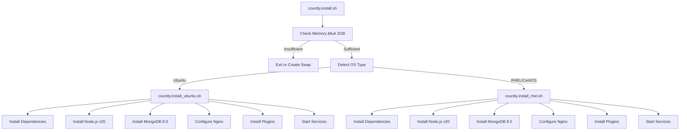
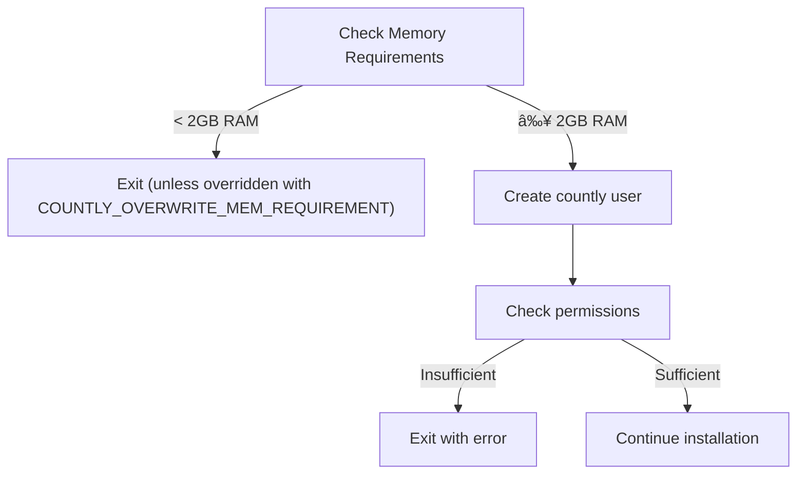
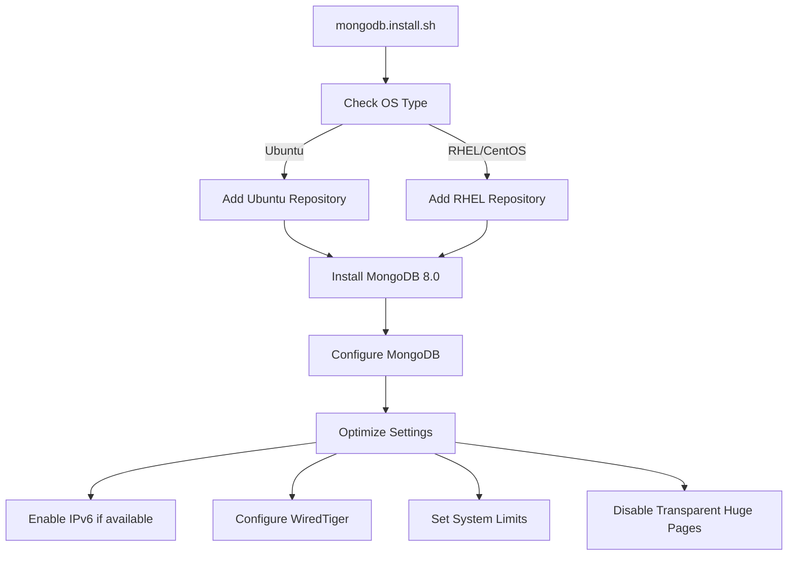
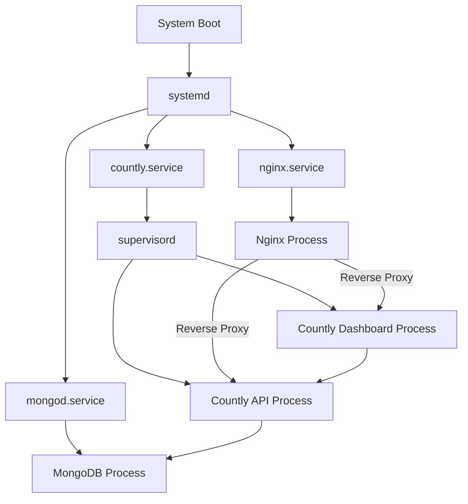
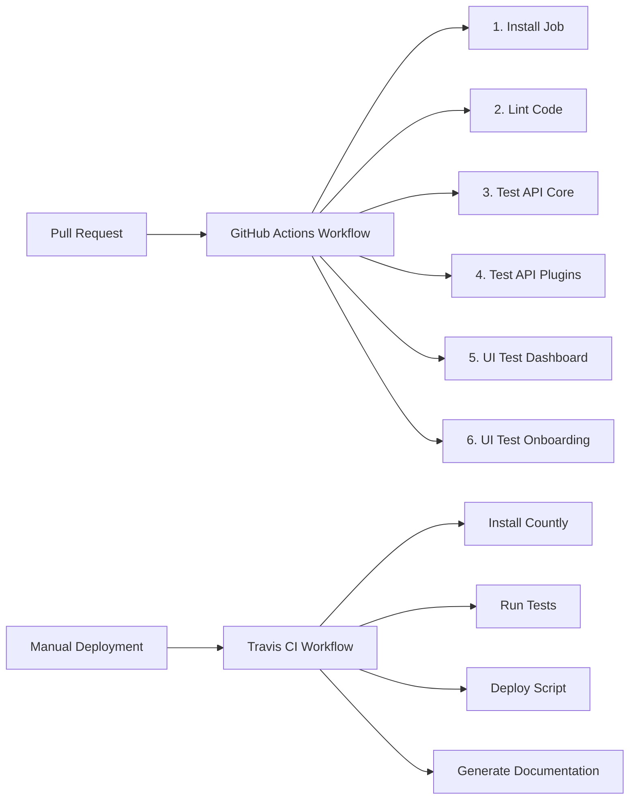

# Installation and Deployment

<details>
<summary>Relevant source files</summary>

The following files were used as context for generating this wiki page:

- [.github/workflows/main.yml](https://github.com/Countly/countly-server/blob/1527df18/.github/workflows/main.yml)
- [.travis.yml](https://github.com/Countly/countly-server/blob/1527df18/.travis.yml)
- [bin/commands/systemd/countly.service](https://github.com/Countly/countly-server/blob/1527df18/bin/commands/systemd/countly.service)
- [bin/commands/systemd/install.sh](https://github.com/Countly/countly-server/blob/1527df18/bin/commands/systemd/install.sh)
- [bin/commands/systemd/mongod.service](https://github.com/Countly/countly-server/blob/1527df18/bin/commands/systemd/mongod.service)
- [bin/commands/systemd/mongodb.sh](https://github.com/Countly/countly-server/blob/1527df18/bin/commands/systemd/mongodb.sh)
- [bin/countly.install.sh](https://github.com/Countly/countly-server/blob/1527df18/bin/countly.install.sh)
- [bin/countly.install_rhel.sh](https://github.com/Countly/countly-server/blob/1527df18/bin/countly.install_rhel.sh)
- [bin/countly.install_travis.sh](https://github.com/Countly/countly-server/blob/1527df18/bin/countly.install_travis.sh)
- [bin/countly.install_ubuntu.sh](https://github.com/Countly/countly-server/blob/1527df18/bin/countly.install_ubuntu.sh)
- [bin/scripts/countly.prepare.ce.plugins.tests.sh](https://github.com/Countly/countly-server/blob/1527df18/bin/scripts/countly.prepare.ce.plugins.tests.sh)
- [bin/scripts/countly.prepare.ce.tests.sh](https://github.com/Countly/countly-server/blob/1527df18/bin/scripts/countly.prepare.ce.tests.sh)
- [bin/scripts/deploy.sh](https://github.com/Countly/countly-server/blob/1527df18/bin/scripts/deploy.sh)
- [bin/scripts/generateDocs.sh](https://github.com/Countly/countly-server/blob/1527df18/bin/scripts/generateDocs.sh)
- [bin/scripts/init_countly_user.sh](https://github.com/Countly/countly-server/blob/1527df18/bin/scripts/init_countly_user.sh)
- [bin/scripts/install_plugins.js](https://github.com/Countly/countly-server/blob/1527df18/bin/scripts/install_plugins.js)
- [bin/scripts/mongodb.install.sh](https://github.com/Countly/countly-server/blob/1527df18/bin/scripts/mongodb.install.sh)
- [bin/upgrade/15.03/upgrade.sh](https://github.com/Countly/countly-server/blob/1527df18/bin/upgrade/15.03/upgrade.sh)
- [bin/upgrade/mongodb8/upgrade.mongo.70.sh](https://github.com/Countly/countly-server/blob/1527df18/bin/upgrade/mongodb8/upgrade.mongo.70.sh)
- [bin/upgrade/mongodb8/upgrade.mongo.80.sh](https://github.com/Countly/countly-server/blob/1527df18/bin/upgrade/mongodb8/upgrade.mongo.80.sh)
- [deploy-key.enc](https://github.com/Countly/countly-server/blob/1527df18/deploy-key.enc)
- [plugins/enterpriseinfo/tests.js](https://github.com/Countly/countly-server/blob/1527df18/plugins/enterpriseinfo/tests.js)
- [ui-tests/.gitignore](https://github.com/Countly/countly-server/blob/1527df18/ui-tests/.gitignore)
- [ui-tests/README.md](https://github.com/Countly/countly-server/blob/1527df18/ui-tests/README.md)
- [ui-tests/package-lock.json](https://github.com/Countly/countly-server/blob/1527df18/ui-tests/package-lock.json)
- [ui-tests/package.json](https://github.com/Countly/countly-server/blob/1527df18/ui-tests/package.json)

</details>


This document explains how to install and deploy Countly Server on supported operating systems. It covers system requirements, installation methods, and the setup process for both standard server deployments and containerized environments. For information about the architecture overview, see [Architecture](#1.1).

## System Requirements

Before installing Countly, ensure your system meets these requirements:

| Requirement | Specification |
|-------------|---------------|
| Memory | Minimum 2GB RAM (installation checks this) |
| Disk Space | At least 10GB free space recommended |
| Operating Systems | Ubuntu 20.04, 22.04, 24.04 LTS<br>CentOS/RHEL 8 or 9 |
| Database | MongoDB (installed automatically) |
| Web Server | Nginx (installed automatically) |
| Runtime | Node.js (installed automatically) |

## Installation Workflow

The diagram below shows the Countly installation workflow:



Sources: [bin/countly.install.sh:1-44](https://github.com/Countly/countly-server/blob/1527df18/bin/countly.install.sh#L1-L44), [bin/countly.install_ubuntu.sh:1-181](https://github.com/Countly/countly-server/blob/1527df18/bin/countly.install_ubuntu.sh#L1-L181), [bin/countly.install_rhel.sh:1-193](https://github.com/Countly/countly-server/blob/1527df18/bin/countly.install_rhel.sh#L1-L193)

## Standard Installation Method

To install Countly on a supported system:

1. Clone the repository or download it to your server
2. Navigate to the Countly directory
3. Run the installation script with superuser privileges:

```bash
sudo bash bin/countly.install.sh
```

The main installation script determines your operating system and executes the appropriate OS-specific installer script. Installation logs are saved to `log/countly-install-DATE.log`.

Sources: [bin/countly.install.sh:1-44](https://github.com/Countly/countly-server/blob/1527df18/bin/countly.install.sh#L1-L44)

### The Installation Process in Detail

#### 1. User Setup and Prerequisites

The installation starts by creating a dedicated `countly` system user and checking for sufficient permissions and memory:



Sources: [bin/countly.install.sh:9-35](https://github.com/Countly/countly-server/blob/1527df18/bin/countly.install.sh#L9-L35), [bin/scripts/init_countly_user.sh:1-20](https://github.com/Countly/countly-server/blob/1527df18/bin/scripts/init_countly_user.sh#L1-L20)

#### 2. OS-Specific Installation

Based on the OS detection, the installer runs either the Ubuntu or RHEL/CentOS-specific script:

##### Ubuntu Installation

For Ubuntu, the installation script:

1. Updates package repositories and installs essential packages
2. Sets up Nginx with Countly's configuration
3. Installs Node.js 20 (LTS version)
4. Installs MongoDB 8.0 or configures an existing installation
5. Creates configuration files from templates
6. Installs Countly plugins
7. Starts all services

Sources: [bin/countly.install_ubuntu.sh:1-181](https://github.com/Countly/countly-server/blob/1527df18/bin/countly.install_ubuntu.sh#L1-L181)

##### RHEL/CentOS Installation

For RHEL/CentOS, the installation script:

1. Verifies OS version (supports CentOS/RHEL 8 and 9)
2. Installs essential packages and dependencies
3. Sets up Nginx with Countly's configuration
4. Installs Node.js 20 (LTS version)
5. Installs MongoDB 8.0 or configures an existing installation
6. Creates configuration files from templates
7. Installs Countly plugins
8. Starts all services

Sources: [bin/countly.install_rhel.sh:1-193](https://github.com/Countly/countly-server/blob/1527df18/bin/countly.install_rhel.sh#L1-L193)

#### 3. MongoDB Installation

MongoDB installation is handled by a dedicated script that:

1. Adds the appropriate MongoDB repository for your OS
2. Installs MongoDB 8.0
3. Optimizes MongoDB configuration for Countly
4. Sets up system limits and security settings



Key MongoDB optimizations include:
- WiredTiger storage engine configuration
- IPv6 support when available
- System resource limits adjustments
- Logrotate setup for log management
- Swappiness and file handle limit configuration

Sources: [bin/scripts/mongodb.install.sh:1-383](https://github.com/Countly/countly-server/blob/1527df18/bin/scripts/mongodb.install.sh#L1-L383)

#### 4. Configuration Files Setup

During installation, several configuration files are created from templates:

| Configuration File | Template Source | Purpose |
|-------------------|-----------------|---------|
| `api/config.js` | `api/config.sample.js` | API server configuration |
| `frontend/express/config.js` | `frontend/express/config.sample.js` | Dashboard frontend configuration |
| `frontend/express/public/javascripts/countly/countly.config.js` | `countly.config.sample.js` | Frontend client configuration |
| `plugins/plugins.json` | `plugins/plugins.default.json` | Plugin configuration |
| `/etc/nginx/conf.d/default.conf` | `config/nginx.server.conf` | Nginx server configuration |
| `/etc/nginx/nginx.conf` | `config/nginx.conf` | Nginx main configuration |

Sources: [bin/countly.install_ubuntu.sh:139-150](https://github.com/Countly/countly-server/blob/1527df18/bin/countly.install_ubuntu.sh#L139-L150), [bin/countly.install_rhel.sh:138-148](https://github.com/Countly/countly-server/blob/1527df18/bin/countly.install_rhel.sh#L138-L148)

#### 5. Plugin Installation

Plugins are installed after the core system is set up:

1. The `install_plugins.js` script reads the plugin configuration
2. It installs all enabled plugins
3. Plugin files are compiled for production use

Sources: [bin/scripts/install_plugins.js:1-34](https://github.com/Countly/countly-server/blob/1527df18/bin/scripts/install_plugins.js#L1-L34), [bin/countly.install_ubuntu.sh:157](https://github.com/Countly/countly-server/blob/1527df18/bin/countly.install_ubuntu.sh#L157), [bin/countly.install_rhel.sh:155](https://github.com/Countly/countly-server/blob/1527df18/bin/countly.install_rhel.sh#L155)

## Service Management

Countly uses a combination of systemd and supervisor for service management:



The installation configures:
- systemd service files for Countly and MongoDB
- supervisord configuration for managing Countly processes
- Appropriate resource limits for each component

Sources: [bin/commands/systemd/install.sh:1-29](https://github.com/Countly/countly-server/blob/1527df18/bin/commands/systemd/install.sh#L1-L29), [bin/commands/systemd/countly.service:1-11](https://github.com/Countly/countly-server/blob/1527df18/bin/commands/systemd/countly.service#L1-L11), [bin/commands/systemd/mongod.service:1-31](https://github.com/Countly/countly-server/blob/1527df18/bin/commands/systemd/mongod.service#L1-L31)

## Deployment Options

### Docker Deployment

Countly can run in Docker containers. The installation scripts detect when running in a container environment and make appropriate adjustments.

Docker-specific adjustments include:
- MongoDB configuration changes
- Service startup modifications
- Different approaches to process management

Sources: [bin/countly.install_ubuntu.sh:110-120](https://github.com/Countly/countly-server/blob/1527df18/bin/countly.install_ubuntu.sh#L110-L120), [bin/countly.install_rhel.sh:107-110](https://github.com/Countly/countly-server/blob/1527df18/bin/countly.install_rhel.sh#L107-L110), [bin/countly.install_ubuntu.sh:172-178](https://github.com/Countly/countly-server/blob/1527df18/bin/countly.install_ubuntu.sh#L172-L178)

### CI/CD Pipeline Deployment

Countly includes configurations for automated testing and deployment workflows:



The repository includes configuration files for:
- GitHub Actions workflows for testing
- Travis CI for testing and deployment
- Automated documentation generation

Sources: [.github/workflows/main.yml:1-406](https://github.com/Countly/countly-server/blob/1527df18/.github/workflows/main.yml#L1-L406), [.travis.yml:1-42](https://github.com/Countly/countly-server/blob/1527df18/.travis.yml#L1-L42), [bin/scripts/deploy.sh:1-17](https://github.com/Countly/countly-server/blob/1527df18/bin/scripts/deploy.sh#L1-L17), [bin/scripts/generateDocs.sh:1-88](https://github.com/Countly/countly-server/blob/1527df18/bin/scripts/generateDocs.sh#L1-L88)

## Upgrading MongoDB

Countly provides scripts for upgrading MongoDB to newer versions:

| Target Version | Script Path |
|----------------|------------|
| MongoDB 7.0 | `bin/upgrade/mongodb8/upgrade.mongo.70.sh` |
| MongoDB 8.0 | `bin/upgrade/mongodb8/upgrade.mongo.80.sh` |

The upgrade process:
1. Verifies your OS is supported
2. Checks current MongoDB version and feature compatibility
3. Backs up configuration
4. Uninstalls current MongoDB version
5. Installs the new MongoDB version
6. Restores configuration
7. Updates the feature compatibility version

Sources: [bin/upgrade/mongodb8/upgrade.mongo.70.sh:1-146](https://github.com/Countly/countly-server/blob/1527df18/bin/upgrade/mongodb8/upgrade.mongo.70.sh#L1-L146), [bin/upgrade/mongodb8/upgrade.mongo.80.sh:1-138](https://github.com/Countly/countly-server/blob/1527df18/bin/upgrade/mongodb8/upgrade.mongo.80.sh#L1-L138)

## Post-Installation Tasks

After installing Countly, you should:

1. Access the dashboard at `http://your-server-ip-or-domain`
2. Create an admin account (if not already done)
3. Configure your applications in the dashboard
4. Set up SSL/TLS for secure communication (recommended for production)
5. Configure a firewall to restrict access to essential ports

## Troubleshooting

Common installation issues include:

| Issue | Solution |
|-------|----------|
| Insufficient memory | Ensure at least 2GB RAM or set `COUNTLY_OVERWRITE_MEM_REQUIREMENT=1` |
| SELinux blocking access | Disable SELinux or create appropriate policies (RHEL/CentOS) |
| Port conflicts | Ensure ports 80, 443, and 27017 are available |
| Permission issues | Verify the installer has proper permissions |
| MongoDB startup problems | Check MongoDB logs at `/var/log/mongodb/mongod.log` |

For RHEL/CentOS installations, a warning is displayed if SELinux is enabled, as it may interfere with Countly's operation.

Sources: [bin/countly.install.sh:27-35](https://github.com/Countly/countly-server/blob/1527df18/bin/countly.install.sh#L27-L35), [bin/countly.install_rhel.sh:189-192](https://github.com/Countly/countly-server/blob/1527df18/bin/countly.install_rhel.sh#L189-L192)

## Running End-to-End Tests

Countly includes UI testing capabilities using Cypress:

1. Install test dependencies: `cd ui-tests && npm install`
2. Configure test settings: `cp cypress.config.sample.js cypress.config.js`
3. Run tests using one of the predefined scripts:
   - Dashboard tests: `npm run cy:run:dashboard`
   - Onboarding tests: `npm run cy:run:onboarding`

Sources: [ui-tests/package.json:1-21](https://github.com/Countly/countly-server/blob/1527df18/ui-tests/package.json#L1-L21), [ui-tests/README.md:1-68](https://github.com/Countly/countly-server/blob/1527df18/ui-tests/README.md#L1-L68)

## Related Documentation

- For architecture information, see [Architecture](#1.1)
- For frontend system details, see [Core Frontend System](#2)
- For backend API details, see [Core Backend API](#3)
- For plugin system information, see [Plugin System](#4)