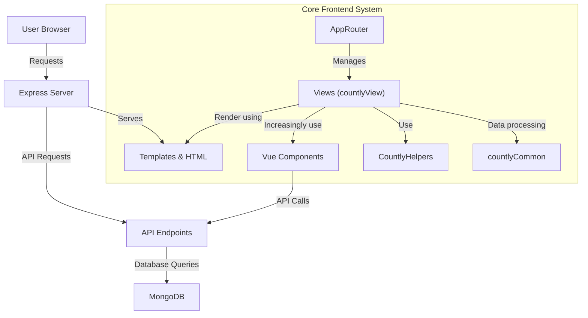
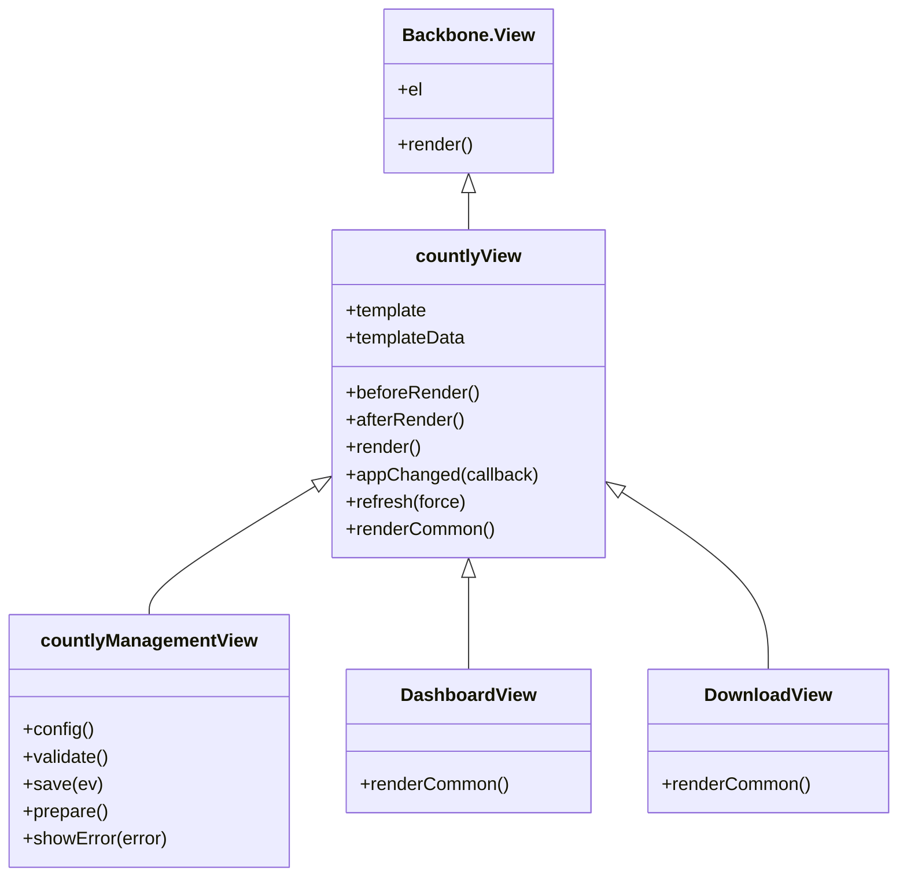
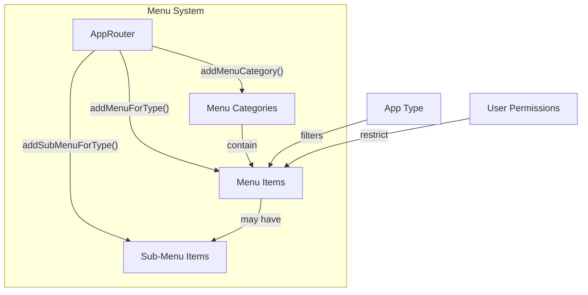
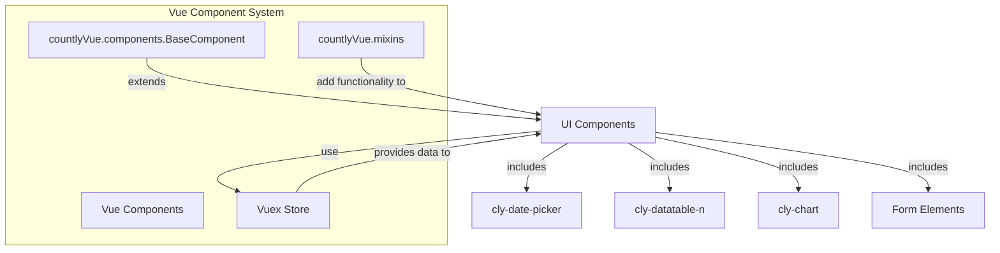
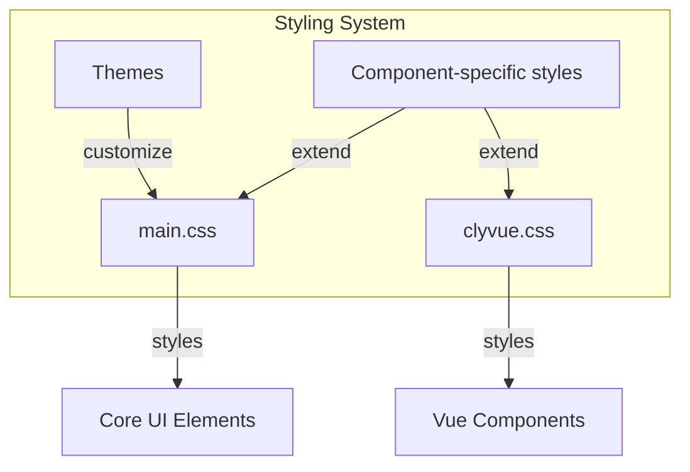
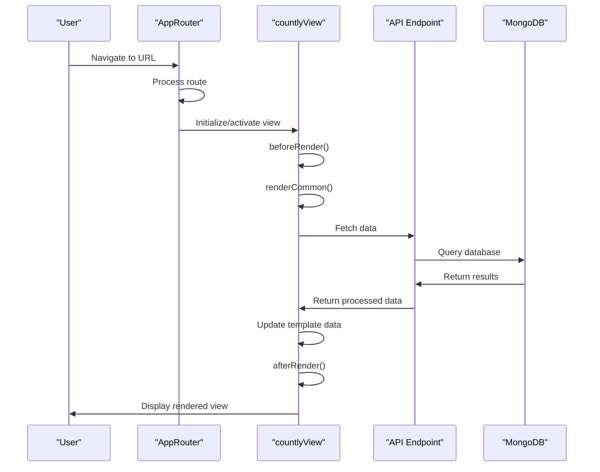
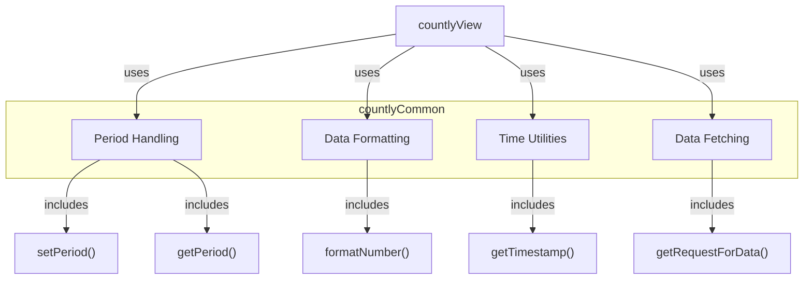
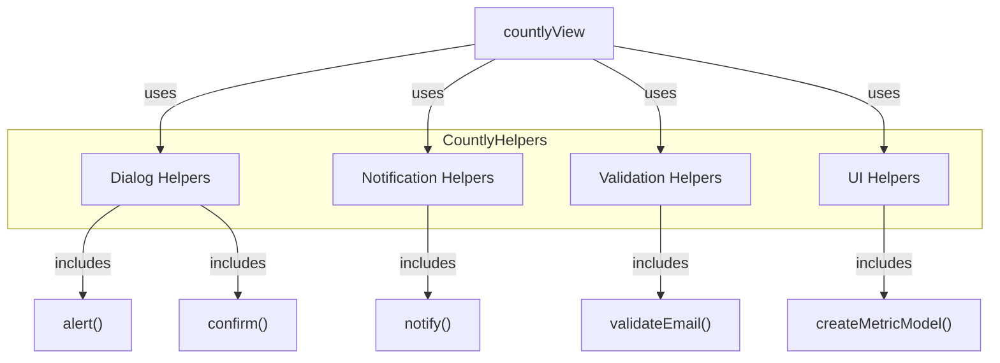
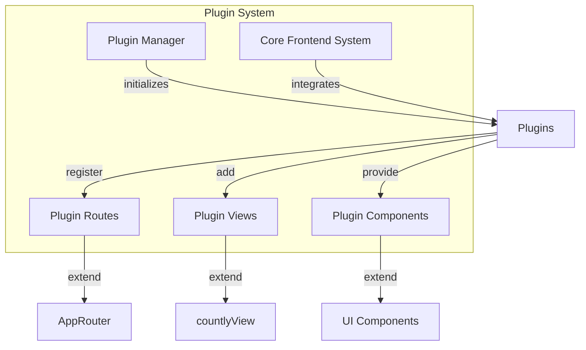
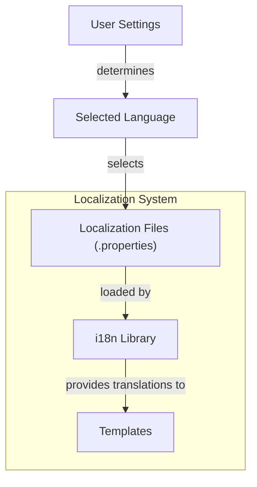

# Core Frontend System

<details>
<summary>Relevant source files</summary>

The following files were used as context for generating this wiki page:

- [api/api.js](https://github.com/Countly/countly-server/blob/1527df18/api/api.js)
- [api/lib/countly.common.js](https://github.com/Countly/countly-server/blob/1527df18/api/lib/countly.common.js)
- [api/parts/data/batcher.js](https://github.com/Countly/countly-server/blob/1527df18/api/parts/data/batcher.js)
- [api/parts/data/events.js](https://github.com/Countly/countly-server/blob/1527df18/api/parts/data/events.js)
- [api/parts/data/fetch.js](https://github.com/Countly/countly-server/blob/1527df18/api/parts/data/fetch.js)
- [api/parts/data/usage.js](https://github.com/Countly/countly-server/blob/1527df18/api/parts/data/usage.js)
- [api/utils/common.js](https://github.com/Countly/countly-server/blob/1527df18/api/utils/common.js)
- [api/utils/requestProcessor.js](https://github.com/Countly/countly-server/blob/1527df18/api/utils/requestProcessor.js)
- [frontend/express/app.js](https://github.com/Countly/countly-server/blob/1527df18/frontend/express/app.js)
- [frontend/express/public/core/session-overview/stylesheets/_main.scss](https://github.com/Countly/countly-server/blob/1527df18/frontend/express/public/core/session-overview/stylesheets/_main.scss)
- [frontend/express/public/javascripts/countly/countly.common.js](https://github.com/Countly/countly-server/blob/1527df18/frontend/express/public/javascripts/countly/countly.common.js)
- [frontend/express/public/javascripts/countly/countly.event.js](https://github.com/Countly/countly-server/blob/1527df18/frontend/express/public/javascripts/countly/countly.event.js)
- [frontend/express/public/javascripts/countly/countly.helpers.js](https://github.com/Countly/countly-server/blob/1527df18/frontend/express/public/javascripts/countly/countly.helpers.js)
- [frontend/express/public/javascripts/countly/countly.session.js](https://github.com/Countly/countly-server/blob/1527df18/frontend/express/public/javascripts/countly/countly.session.js)
- [frontend/express/public/javascripts/countly/countly.template.js](https://github.com/Countly/countly-server/blob/1527df18/frontend/express/public/javascripts/countly/countly.template.js)
- [frontend/express/public/javascripts/countly/countly.views.js](https://github.com/Countly/countly-server/blob/1527df18/frontend/express/public/javascripts/countly/countly.views.js)
- [frontend/express/public/javascripts/countly/vue/components/datatable.js](https://github.com/Countly/countly-server/blob/1527df18/frontend/express/public/javascripts/countly/vue/components/datatable.js)
- [frontend/express/public/javascripts/countly/vue/components/date.js](https://github.com/Countly/countly-server/blob/1527df18/frontend/express/public/javascripts/countly/vue/components/date.js)
- [frontend/express/public/javascripts/countly/vue/components/dropdown.js](https://github.com/Countly/countly-server/blob/1527df18/frontend/express/public/javascripts/countly/vue/components/dropdown.js)
- [frontend/express/public/javascripts/countly/vue/components/helpers.js](https://github.com/Countly/countly-server/blob/1527df18/frontend/express/public/javascripts/countly/vue/components/helpers.js)
- [frontend/express/public/javascripts/countly/vue/components/input.js](https://github.com/Countly/countly-server/blob/1527df18/frontend/express/public/javascripts/countly/vue/components/input.js)
- [frontend/express/public/javascripts/countly/vue/components/sidebar.js](https://github.com/Countly/countly-server/blob/1527df18/frontend/express/public/javascripts/countly/vue/components/sidebar.js)
- [frontend/express/public/javascripts/countly/vue/components/vis.js](https://github.com/Countly/countly-server/blob/1527df18/frontend/express/public/javascripts/countly/vue/components/vis.js)
- [frontend/express/public/javascripts/countly/vue/container.js](https://github.com/Countly/countly-server/blob/1527df18/frontend/express/public/javascripts/countly/vue/container.js)
- [frontend/express/public/javascripts/countly/vue/core.js](https://github.com/Countly/countly-server/blob/1527df18/frontend/express/public/javascripts/countly/vue/core.js)
- [frontend/express/public/javascripts/countly/vue/data/vuex.js](https://github.com/Countly/countly-server/blob/1527df18/frontend/express/public/javascripts/countly/vue/data/vuex.js)
- [frontend/express/public/javascripts/countly/vue/helpers.js](https://github.com/Countly/countly-server/blob/1527df18/frontend/express/public/javascripts/countly/vue/helpers.js)
- [frontend/express/public/javascripts/countly/vue/templates/datatable.html](https://github.com/Countly/countly-server/blob/1527df18/frontend/express/public/javascripts/countly/vue/templates/datatable.html)
- [frontend/express/public/javascripts/countly/vue/templates/datepicker.html](https://github.com/Countly/countly-server/blob/1527df18/frontend/express/public/javascripts/countly/vue/templates/datepicker.html)
- [frontend/express/public/javascripts/countly/vue/templates/selectx.html](https://github.com/Countly/countly-server/blob/1527df18/frontend/express/public/javascripts/countly/vue/templates/selectx.html)
- [frontend/express/public/javascripts/countly/vue/templates/sidebar/analytics-menu.html](https://github.com/Countly/countly-server/blob/1527df18/frontend/express/public/javascripts/countly/vue/templates/sidebar/analytics-menu.html)
- [frontend/express/public/javascripts/countly/vue/templates/sidebar/app-selector.html](https://github.com/Countly/countly-server/blob/1527df18/frontend/express/public/javascripts/countly/vue/templates/sidebar/app-selector.html)
- [frontend/express/public/javascripts/countly/vue/templates/sidebar/language-menu.html](https://github.com/Countly/countly-server/blob/1527df18/frontend/express/public/javascripts/countly/vue/templates/sidebar/language-menu.html)
- [frontend/express/public/javascripts/countly/vue/templates/sidebar/management-menu.html](https://github.com/Countly/countly-server/blob/1527df18/frontend/express/public/javascripts/countly/vue/templates/sidebar/management-menu.html)
- [frontend/express/public/javascripts/countly/vue/templates/sidebar/sidebar.html](https://github.com/Countly/countly-server/blob/1527df18/frontend/express/public/javascripts/countly/vue/templates/sidebar/sidebar.html)
- [frontend/express/public/javascripts/countly/vue/templates/sidebar/users-menu.html](https://github.com/Countly/countly-server/blob/1527df18/frontend/express/public/javascripts/countly/vue/templates/sidebar/users-menu.html)
- [frontend/express/public/javascripts/countly/vue/templates/worldmap.html](https://github.com/Countly/countly-server/blob/1527df18/frontend/express/public/javascripts/countly/vue/templates/worldmap.html)
- [frontend/express/public/localization/dashboard/dashboard.properties](https://github.com/Countly/countly-server/blob/1527df18/frontend/express/public/localization/dashboard/dashboard.properties)
- [frontend/express/public/stylesheets/main.css](https://github.com/Countly/countly-server/blob/1527df18/frontend/express/public/stylesheets/main.css)
- [frontend/express/public/stylesheets/styles/blocks/_charts.scss](https://github.com/Countly/countly-server/blob/1527df18/frontend/express/public/stylesheets/styles/blocks/_charts.scss)
- [frontend/express/public/stylesheets/styles/blocks/_dropdown.scss](https://github.com/Countly/countly-server/blob/1527df18/frontend/express/public/stylesheets/styles/blocks/_dropdown.scss)
- [frontend/express/public/stylesheets/styles/blocks/_notification-toasts.scss](https://github.com/Countly/countly-server/blob/1527df18/frontend/express/public/stylesheets/styles/blocks/_notification-toasts.scss)
- [frontend/express/public/stylesheets/styles/blocks/_select.scss](https://github.com/Countly/countly-server/blob/1527df18/frontend/express/public/stylesheets/styles/blocks/_select.scss)
- [frontend/express/public/stylesheets/styles/blocks/_sidebar.scss](https://github.com/Countly/countly-server/blob/1527df18/frontend/express/public/stylesheets/styles/blocks/_sidebar.scss)
- [frontend/express/public/stylesheets/styles/blocks/_table.scss](https://github.com/Countly/countly-server/blob/1527df18/frontend/express/public/stylesheets/styles/blocks/_table.scss)
- [frontend/express/public/stylesheets/styles/blocks/_vis.scss](https://github.com/Countly/countly-server/blob/1527df18/frontend/express/public/stylesheets/styles/blocks/_vis.scss)
- [frontend/express/public/stylesheets/vue/clyvue.scss](https://github.com/Countly/countly-server/blob/1527df18/frontend/express/public/stylesheets/vue/clyvue.scss)
- [frontend/express/views/dashboard.html](https://github.com/Countly/countly-server/blob/1527df18/frontend/express/views/dashboard.html)
- [plugins/dbviewer/tests.js](https://github.com/Countly/countly-server/blob/1527df18/plugins/dbviewer/tests.js)
- [plugins/pluginManager.js](https://github.com/Countly/countly-server/blob/1527df18/plugins/pluginManager.js)
- [plugins/plugins/api/api.js](https://github.com/Countly/countly-server/blob/1527df18/plugins/plugins/api/api.js)
- [plugins/plugins/frontend/app.js](https://github.com/Countly/countly-server/blob/1527df18/plugins/plugins/frontend/app.js)
- [plugins/plugins/frontend/public/javascripts/countly.models.js](https://github.com/Countly/countly-server/blob/1527df18/plugins/plugins/frontend/public/javascripts/countly.models.js)
- [plugins/plugins/frontend/public/javascripts/countly.views.js](https://github.com/Countly/countly-server/blob/1527df18/plugins/plugins/frontend/public/javascripts/countly.views.js)
- [plugins/plugins/frontend/public/localization/plugins.properties](https://github.com/Countly/countly-server/blob/1527df18/plugins/plugins/frontend/public/localization/plugins.properties)
- [plugins/plugins/frontend/public/stylesheets/main.scss](https://github.com/Countly/countly-server/blob/1527df18/plugins/plugins/frontend/public/stylesheets/main.scss)
- [plugins/plugins/frontend/public/templates/configurations.html](https://github.com/Countly/countly-server/blob/1527df18/plugins/plugins/frontend/public/templates/configurations.html)
- [plugins/plugins/frontend/public/templates/plugins.html](https://github.com/Countly/countly-server/blob/1527df18/plugins/plugins/frontend/public/templates/plugins.html)
- [plugins/plugins/tests.js](https://github.com/Countly/countly-server/blob/1527df18/plugins/plugins/tests.js)
- [plugins/star-rating/tests.js](https://github.com/Countly/countly-server/blob/1527df18/plugins/star-rating/tests.js)
- [plugins/vue-example/api/api.js](https://github.com/Countly/countly-server/blob/1527df18/plugins/vue-example/api/api.js)
- [plugins/vue-example/frontend/app.js](https://github.com/Countly/countly-server/blob/1527df18/plugins/vue-example/frontend/app.js)
- [plugins/vue-example/frontend/public/javascripts/countly.models.js](https://github.com/Countly/countly-server/blob/1527df18/plugins/vue-example/frontend/public/javascripts/countly.models.js)
- [plugins/vue-example/frontend/public/javascripts/countly.views.js](https://github.com/Countly/countly-server/blob/1527df18/plugins/vue-example/frontend/public/javascripts/countly.views.js)
- [plugins/vue-example/frontend/public/localization/vue-example.properties](https://github.com/Countly/countly-server/blob/1527df18/plugins/vue-example/frontend/public/localization/vue-example.properties)
- [plugins/vue-example/frontend/public/templates/date.html](https://github.com/Countly/countly-server/blob/1527df18/plugins/vue-example/frontend/public/templates/date.html)
- [plugins/vue-example/frontend/public/templates/main.html](https://github.com/Countly/countly-server/blob/1527df18/plugins/vue-example/frontend/public/templates/main.html)
- [plugins/vue-example/frontend/public/templates/table.html](https://github.com/Countly/countly-server/blob/1527df18/plugins/vue-example/frontend/public/templates/table.html)
- [plugins/vue-example/frontend/public/templates/tg.html](https://github.com/Countly/countly-server/blob/1527df18/plugins/vue-example/frontend/public/templates/tg.html)
- [plugins/vue-example/install.js](https://github.com/Countly/countly-server/blob/1527df18/plugins/vue-example/install.js)
- [plugins/vue-example/tests.js](https://github.com/Countly/countly-server/blob/1527df18/plugins/vue-example/tests.js)

</details>


The Core Frontend System of Countly is the client-side application that powers the dashboard interface. It provides the structure, routing, views, components, and user interface that administrators and users interact with when using Countly. This document covers the architecture, key components, and interaction patterns of the frontend system.

For information about the Core Backend API, see [Core Backend API](#3).

## Architecture Overview

The Countly frontend is built as a single-page application (SPA) using a combination of Backbone.js for routing and view management, and Vue.js for modern UI components. The system follows a modular architecture that allows plugins to extend functionality.



Sources: [frontend/express/app.js:358-417](https://github.com/Countly/countly-server/blob/1527df18/frontend/express/app.js:358-417#L358-L417), [frontend/express/public/javascripts/countly/countly.template.js:334-417](https://github.com/Countly/countly-server/blob/1527df18/frontend/express/public/javascripts/countly/countly.template.js:334-417#L334-L417), [frontend/express/views/dashboard.html:1-50](https://github.com/Countly/countly-server/blob/1527df18/frontend/express/views/dashboard.html:1-50#L1-L50)

## Key Components

### AppRouter

The AppRouter (defined in countly.template.js) is the backbone of the frontend system, responsible for URL routing and view management. It inherits from Backbone.Router and handles navigation between different sections of the dashboard.

```mermaid
classDiagram
    direction TB
    
    class Backbone.Router {
        +routes
        +navigate()
    }
    
    class AppRouter {
        +routes: {"/": "dashboard", "*path": "main"}
        +activeView: countlyView
        +refreshActiveView: number
        +navigate(fragment, triggerRoute)
        +switchApp(app_id, callback)
        +addMenu(category, node)
        +addSubMenu(parent_code, node)
        +main()
        +dashboard()
        +onAppSwitch(app_id)
    }
    
    Backbone.Router <|-- AppRouter
```

The AppRouter maintains the currently active view and provides methods for:
- Navigating between pages
- Switching between apps
- Adding menu items and submenu items
- Handling the main dashboard view

Sources: [frontend/express/public/javascripts/countly/countly.template.js:334-881](https://github.com/Countly/countly-server/blob/1527df18/frontend/express/public/javascripts/countly/countly.template.js:334-881#L334-L881)

### View System

Countly's view system is built on a hierarchy of Backbone views with countlyView as the base class. Specific view types inherit from countlyView and add specialized functionality.



- **countlyView**: Base view class with methods for rendering, app switching, and refresh handling
- **countlyManagementView**: Specialized view for plugin configuration management
- **Other Views**: Various specialized views for different dashboard sections

Sources: [frontend/express/public/javascripts/countly/countly.template.js:8-280](https://github.com/Countly/countly-server/blob/1527df18/frontend/express/public/javascripts/countly/countly.template.js:8-280#L8-L280), [frontend/express/public/javascripts/countly/countly.views.js:3-154](https://github.com/Countly/countly-server/blob/1527df18/frontend/express/public/javascripts/countly/countly.views.js:3-154#L3-L154)

### Menu System

The Countly dashboard uses a dynamic menu system managed by the AppRouter. Menus can be customized per app type, and visibility can be controlled by user permissions.



Menu functions include:
- **addMenuCategory**: Adds a new menu category
- **addMenuForType**: Adds a menu item for a specific app type
- **addSubMenuForType**: Adds a submenu item under a specific parent menu
- **addMenu**: Adds a menu item for all app types
- **addSubMenu**: Adds a submenu item for all app types

Sources: [frontend/express/public/javascripts/countly/countly.template.js:419-813](https://github.com/Countly/countly-server/blob/1527df18/frontend/express/public/javascripts/countly/countly.template.js:419-813#L419-L813)

## Frontend Technologies

### Vue Components

While Backbone powers the routing and view management, Countly is increasingly adopting Vue.js for UI components. These components provide a modern, reactive UI experience.



Key Vue components include:
- **Data Visualization**: Charts, graphs, and maps
- **Data Tables**: Advanced data tables with sorting, filtering, and pagination
- **Form Elements**: Input controls, dropdowns, and selectors
- **Date Picker**: Advanced date range selection

Sources: [frontend/express/public/javascripts/countly/vue/components/vis.js:11-713](https://github.com/Countly/countly-server/blob/1527df18/frontend/express/public/javascripts/countly/vue/components/vis.js:11-713#L11-L713), [frontend/express/public/javascripts/countly/vue/components/datatable.js:8-142](https://github.com/Countly/countly-server/blob/1527df18/frontend/express/public/javascripts/countly/vue/components/datatable.js:8-142#L8-L142), [frontend/express/public/javascripts/countly/vue/components/input.js:8-79](https://github.com/Countly/countly-server/blob/1527df18/frontend/express/public/javascripts/countly/vue/components/input.js:8-79#L8-L79), [frontend/express/public/javascripts/countly/vue/components/date.js:8-36](https://github.com/Countly/countly-server/blob/1527df18/frontend/express/public/javascripts/countly/vue/components/date.js:8-36#L8-L36)

### Styling and Themes

Countly's UI is styled using a combination of CSS and Sass. The main styles are defined in main.css, with Vue components using clyvue.css.



The styling system includes:
- **Global Styles**: Base styles for the entire dashboard
- **Component Styles**: Specific styles for UI components
- **Theme Support**: Ability to customize the dashboard appearance
- **Responsive Design**: Adaptation to different screen sizes

Sources: [frontend/express/public/stylesheets/main.css:1-285](https://github.com/Countly/countly-server/blob/1527df18/frontend/express/public/stylesheets/main.css:1-285#L1-L285), [frontend/express/public/stylesheets/vue/clyvue.scss:1-60](https://github.com/Countly/countly-server/blob/1527df18/frontend/express/public/stylesheets/vue/clyvue.scss:1-60#L1-L60)

## Request Flow

When a user interacts with the Countly dashboard, a typical request follows this flow:



Sources: [frontend/express/public/javascripts/countly/countly.template.js:228-281](https://github.com/Countly/countly-server/blob/1527df18/frontend/express/public/javascripts/countly/countly.template.js:228-281#L228-L281), [api/utils/requestProcessor.js:101-875](https://github.com/Countly/countly-server/blob/1527df18/api/utils/requestProcessor.js:101-875#L101-L875)

## Common Utilities

Countly provides various utility libraries to assist with frontend development:

### countlyCommon

A utility for data manipulation, period calculations, and common operations.



Sources: [frontend/express/public/javascripts/countly/countly.common.js:9-187](https://github.com/Countly/countly-server/blob/1527df18/frontend/express/public/javascripts/countly/countly.common.js:9-187#L9-L187)

### CountlyHelpers

A collection of helpers for UI operations like dialogs, notifications, and data validation.



Sources: [frontend/express/public/javascripts/countly/countly.helpers.js:13-62](https://github.com/Countly/countly-server/blob/1527df18/frontend/express/public/javascripts/countly/countly.helpers.js:13-62#L13-L62)

## Plugin Integration

The frontend system is designed to be extensible through plugins. Plugins can add new views, routes, and UI components to extend the dashboard functionality.



Plugin integration steps:
1. Plugins are loaded by the Plugin Manager
2. Plugins register routes and views
3. The frontend system integrates these extensions
4. Plugins can also add menu items and UI components

Sources: [plugins/pluginManager.js:36-384](https://github.com/Countly/countly-server/blob/1527df18/plugins/pluginManager.js:36-384#L36-L384), [plugins/vue-example/frontend/public/javascripts/countly.views.js:4-84](https://github.com/Countly/countly-server/blob/1527df18/plugins/vue-example/frontend/public/javascripts/countly.views.js:4-84#L4-L84)

## Localization

Countly supports multiple languages through a localization system. The frontend displays text according to the user's selected language.



Sources: [frontend/express/public/localization/dashboard/dashboard.properties:1-200](https://github.com/Countly/countly-server/blob/1527df18/frontend/express/public/localization/dashboard/dashboard.properties:1-200#L1-L200)

## Conclusion

The Core Frontend System provides a robust foundation for the Countly dashboard. It combines Backbone.js routing with Vue.js components to deliver a modern, extensible user interface. The system is designed to be customizable through plugins, enabling the addition of new features and functionality without modifying the core code.