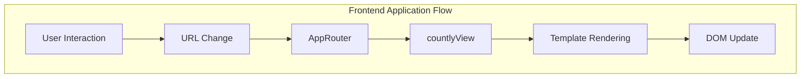
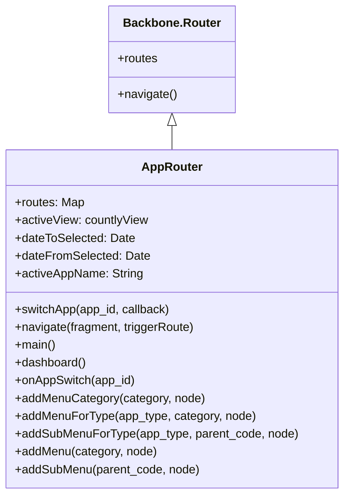
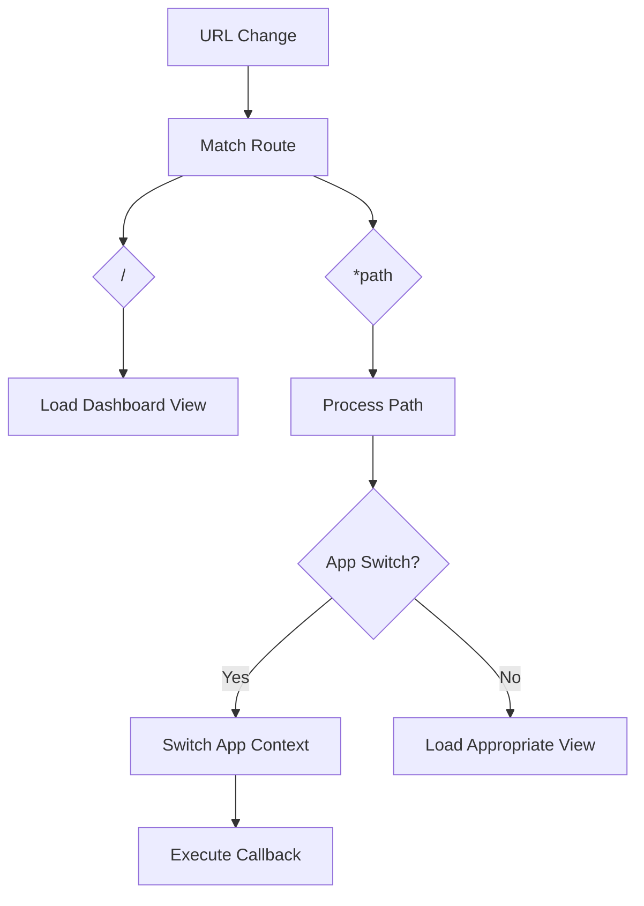
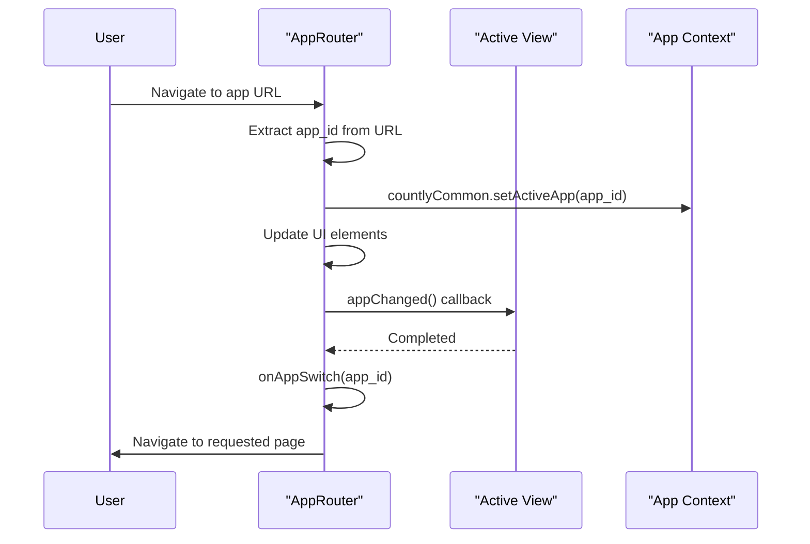
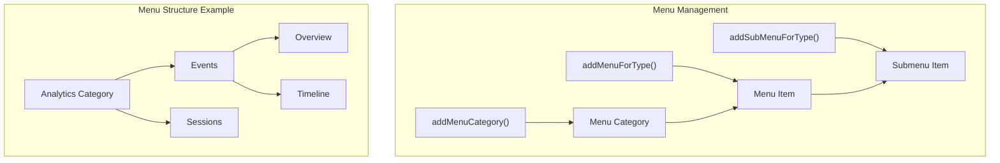
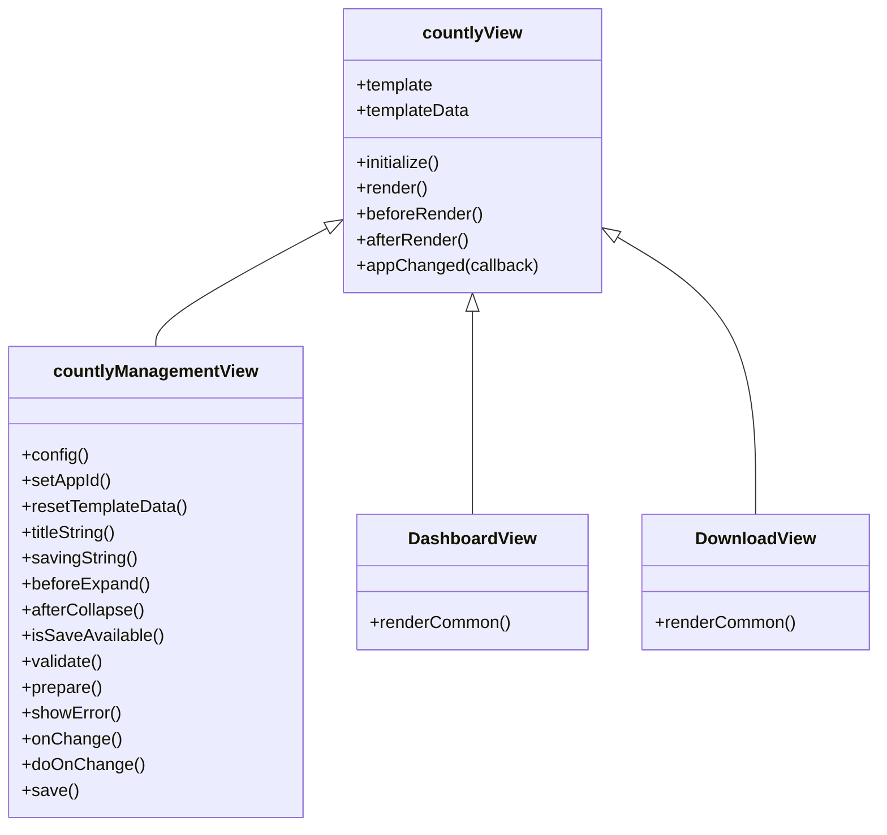
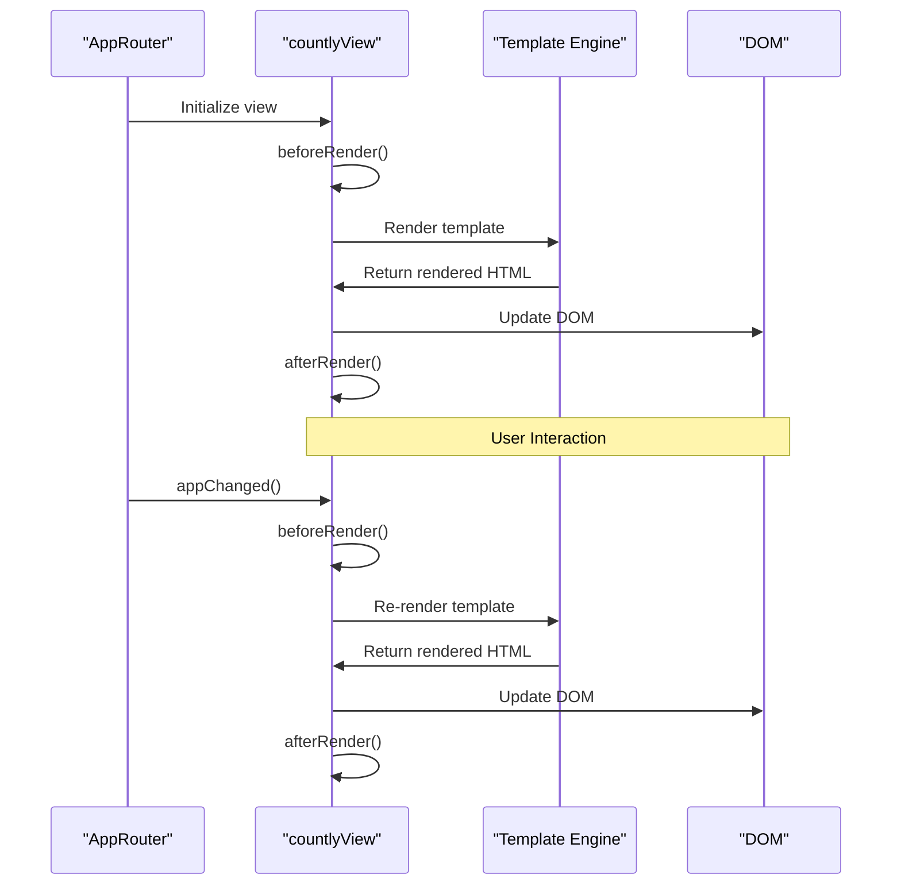
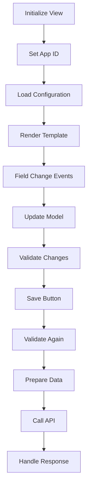
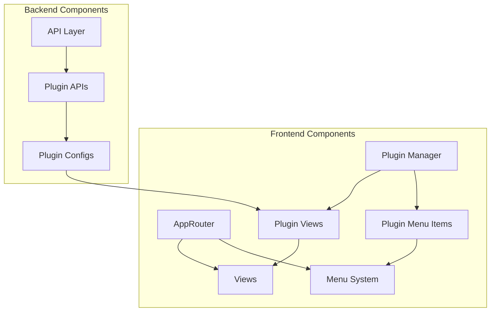
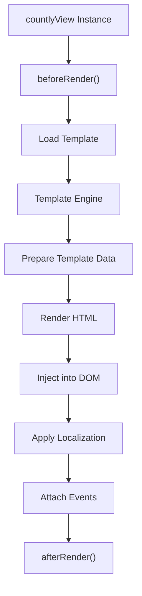

# AppRouter and Templates

<details>
<summary>Relevant source files</summary>

The following files were used as context for generating this wiki page:

- [api/api.js](https://github.com/Countly/countly-server/blob/1527df18/api/api.js)
- [api/lib/countly.common.js](https://github.com/Countly/countly-server/blob/1527df18/api/lib/countly.common.js)
- [api/parts/data/batcher.js](https://github.com/Countly/countly-server/blob/1527df18/api/parts/data/batcher.js)
- [api/parts/data/events.js](https://github.com/Countly/countly-server/blob/1527df18/api/parts/data/events.js)
- [api/parts/data/fetch.js](https://github.com/Countly/countly-server/blob/1527df18/api/parts/data/fetch.js)
- [api/parts/data/usage.js](https://github.com/Countly/countly-server/blob/1527df18/api/parts/data/usage.js)
- [api/utils/common.js](https://github.com/Countly/countly-server/blob/1527df18/api/utils/common.js)
- [api/utils/requestProcessor.js](https://github.com/Countly/countly-server/blob/1527df18/api/utils/requestProcessor.js)
- [frontend/express/app.js](https://github.com/Countly/countly-server/blob/1527df18/frontend/express/app.js)
- [frontend/express/public/javascripts/countly/countly.common.js](https://github.com/Countly/countly-server/blob/1527df18/frontend/express/public/javascripts/countly/countly.common.js)
- [frontend/express/public/javascripts/countly/countly.event.js](https://github.com/Countly/countly-server/blob/1527df18/frontend/express/public/javascripts/countly/countly.event.js)
- [frontend/express/public/javascripts/countly/countly.helpers.js](https://github.com/Countly/countly-server/blob/1527df18/frontend/express/public/javascripts/countly/countly.helpers.js)
- [frontend/express/public/javascripts/countly/countly.session.js](https://github.com/Countly/countly-server/blob/1527df18/frontend/express/public/javascripts/countly/countly.session.js)
- [frontend/express/public/javascripts/countly/countly.template.js](https://github.com/Countly/countly-server/blob/1527df18/frontend/express/public/javascripts/countly/countly.template.js)
- [frontend/express/public/javascripts/countly/countly.views.js](https://github.com/Countly/countly-server/blob/1527df18/frontend/express/public/javascripts/countly/countly.views.js)
- [frontend/express/public/localization/dashboard/dashboard.properties](https://github.com/Countly/countly-server/blob/1527df18/frontend/express/public/localization/dashboard/dashboard.properties)
- [frontend/express/public/stylesheets/main.css](https://github.com/Countly/countly-server/blob/1527df18/frontend/express/public/stylesheets/main.css)
- [frontend/express/views/dashboard.html](https://github.com/Countly/countly-server/blob/1527df18/frontend/express/views/dashboard.html)
- [plugins/dbviewer/tests.js](https://github.com/Countly/countly-server/blob/1527df18/plugins/dbviewer/tests.js)
- [plugins/pluginManager.js](https://github.com/Countly/countly-server/blob/1527df18/plugins/pluginManager.js)
- [plugins/plugins/api/api.js](https://github.com/Countly/countly-server/blob/1527df18/plugins/plugins/api/api.js)
- [plugins/plugins/frontend/app.js](https://github.com/Countly/countly-server/blob/1527df18/plugins/plugins/frontend/app.js)
- [plugins/plugins/frontend/public/javascripts/countly.models.js](https://github.com/Countly/countly-server/blob/1527df18/plugins/plugins/frontend/public/javascripts/countly.models.js)
- [plugins/plugins/frontend/public/javascripts/countly.views.js](https://github.com/Countly/countly-server/blob/1527df18/plugins/plugins/frontend/public/javascripts/countly.views.js)
- [plugins/plugins/frontend/public/localization/plugins.properties](https://github.com/Countly/countly-server/blob/1527df18/plugins/plugins/frontend/public/localization/plugins.properties)
- [plugins/plugins/frontend/public/stylesheets/main.scss](https://github.com/Countly/countly-server/blob/1527df18/plugins/plugins/frontend/public/stylesheets/main.scss)
- [plugins/plugins/frontend/public/templates/configurations.html](https://github.com/Countly/countly-server/blob/1527df18/plugins/plugins/frontend/public/templates/configurations.html)
- [plugins/plugins/frontend/public/templates/plugins.html](https://github.com/Countly/countly-server/blob/1527df18/plugins/plugins/frontend/public/templates/plugins.html)
- [plugins/plugins/tests.js](https://github.com/Countly/countly-server/blob/1527df18/plugins/plugins/tests.js)
- [plugins/star-rating/tests.js](https://github.com/Countly/countly-server/blob/1527df18/plugins/star-rating/tests.js)

</details>


The AppRouter and Templates system forms the core of Countly's frontend architecture, providing the URL routing mechanism and the view rendering framework. This page documents how the routing system directs users to different parts of the application, handles URL states, and how the template system renders views based on those routes.

## 1. Overview

The Countly frontend is built on a Backbone.js architecture with a custom AppRouter that manages navigation through the application. The template system provides base view classes that all Countly dashboard views inherit from, standardizing how views are initialized, rendered, and destroyed.



Sources: [frontend/express/public/javascripts/countly/countly.template.js:334-874](https://github.com/Countly/countly-server/blob/1527df18/frontend/express/public/javascripts/countly/countly.template.js#L334-L874)

## 2. AppRouter Architecture

### 2.1 Core Router Definition

The AppRouter is defined as a Backbone router extension in `countly.template.js` and serves as the primary navigation controller for the Countly dashboard.



Sources: [frontend/express/public/javascripts/countly/countly.template.js:334-379](https://github.com/Countly/countly-server/blob/1527df18/frontend/express/public/javascripts/countly/countly.template.js#L334-L379), [frontend/express/public/javascripts/countly/countly.template.js:380-450](https://github.com/Countly/countly-server/blob/1527df18/frontend/express/public/javascripts/countly/countly.template.js#L380-L450)

The AppRouter maintains important state information:
- Current active view (`activeView`)
- Selected date range (`dateToSelected`, `dateFromSelected`)
- Active application information (`activeAppName`, `activeAppKey`)
- Menu structure information

### 2.2 Route Handling

The AppRouter defines two main routes:
- `/`: Maps to the `dashboard` function
- `*path`: Maps to the `main` function, which is a catch-all route handler

When a URL changes, the router processes the URL path and determines which view to display:



Sources: [frontend/express/public/javascripts/countly/countly.template.js:814-836](https://github.com/Countly/countly-server/blob/1527df18/frontend/express/public/javascripts/countly/countly.template.js#L814-L836), [frontend/express/public/javascripts/countly/countly.template.js:837-873](https://github.com/Countly/countly-server/blob/1527df18/frontend/express/public/javascripts/countly/countly.template.js#L837-L873)

### 2.3 App Switching Mechanism

The AppRouter handles switching between different applications within the Countly dashboard:



Sources: [frontend/express/public/javascripts/countly/countly.template.js:384-410](https://github.com/Countly/countly-server/blob/1527df18/frontend/express/public/javascripts/countly/countly.template.js#L384-L410)

### 2.4 Menu Management System

The AppRouter provides methods to manage the dashboard's sidebar menu structure:



Sources: [frontend/express/public/javascripts/countly/countly.template.js:419-489](https://github.com/Countly/countly-server/blob/1527df18/frontend/express/public/javascripts/countly/countly.template.js#L419-L489), [frontend/express/public/javascripts/countly/countly.template.js:490-625](https://github.com/Countly/countly-server/blob/1527df18/frontend/express/public/javascripts/countly/countly.template.js#L490-L625), [frontend/express/public/javascripts/countly/countly.template.js:642-748](https://github.com/Countly/countly-server/blob/1527df18/frontend/express/public/javascripts/countly/countly.template.js#L642-L748), [frontend/express/public/javascripts/countly/countly.template.js:750-813](https://github.com/Countly/countly-server/blob/1527df18/frontend/express/public/javascripts/countly/countly.template.js#L750-L813)

The menu system supports:
- Categories (main sections)
- Menu items (first-level items)
- Submenu items (second-level items)
- App-type specific menu items
- Permission-based visibility

## 3. Templates and View System

### 3.1 View Hierarchy

The template system is built around a view hierarchy with base classes that provide common functionality:



Sources: [frontend/express/public/javascripts/countly/countly.template.js:1-282](https://github.com/Countly/countly-server/blob/1527df18/frontend/express/public/javascripts/countly/countly.template.js#L1-L282), [frontend/express/public/javascripts/countly/countly.views.js:3-14](https://github.com/Countly/countly-server/blob/1527df18/frontend/express/public/javascripts/countly/countly.views.js#L3-L14), [frontend/express/public/javascripts/countly/countly.views.js:16-58](https://github.com/Countly/countly-server/blob/1527df18/frontend/express/public/javascripts/countly/countly.views.js#L16-L58)

### 3.2 View Lifecycle

Views in Countly follow a specific lifecycle that manages rendering and state transitions:



Sources: [frontend/express/public/javascripts/countly/countly.template.js:216-282](https://github.com/Countly/countly-server/blob/1527df18/frontend/express/public/javascripts/countly/countly.template.js#L216-L282)

### 3.3 Management View for Plugin Settings

`countlyManagementView` extends the base `countlyView` to provide specialized functionality for plugin configuration screens in the management section:



Sources: [frontend/express/public/javascripts/countly/countly.template.js:8-142](https://github.com/Countly/countly-server/blob/1527df18/frontend/express/public/javascripts/countly/countly.template.js#L8-L142), [frontend/express/public/javascripts/countly/countly.template.js:143-214](https://github.com/Countly/countly-server/blob/1527df18/frontend/express/public/javascripts/countly/countly.template.js#L143-L214)

This view type:
- Maintains configuration state for plugins
- Handles change detection for configuration fields
- Provides validation for configuration changes
- Manages saving configurations to the server

## 4. Practical Usage Examples

### 4.1 Adding a New View

To create a new view in Countly:

1. Create a new view class that extends countlyView:

```javascript
window.MyNewView = countlyView.extend({
    beforeRender: function() {
        // Load any required data before rendering
    },
    renderCommon: function() {
        // Render the view
        $(this.el).html("<div>My custom view content</div>");
    },
    afterRender: function() {
        // Post-rendering operations
    }
});
```

2. Register the view with the AppRouter:

```javascript
app.route("/my/custom/path", "myCustomPath", function() {
    this.renderWhenReady(this.myNewView);
});
```

Sources: [frontend/express/public/javascripts/countly/countly.views.js:76-92](https://github.com/Countly/countly-server/blob/1527df18/frontend/express/public/javascripts/countly/countly.views.js#L76-L92)

### 4.2 Adding Menu Items

To add a new menu item to the dashboard:

```javascript
app.addMenu("explore", {
    text: "my.new.menu.title", 
    code: "my-feature",
    icon: "<div class='logo my-icon'></div>",
    priority: 30,
    url: "#/my/custom/path",
    permission: "my_feature"
});
```

To add a submenu item:

```javascript
app.addSubMenu("my-feature", {
    text: "my.submenu.title",
    code: "my-submenu",
    priority: 10,
    url: "#/my/custom/path/submenu",
    permission: "my_feature"
});
```

Sources: [frontend/express/public/javascripts/countly/countly.template.js:750-781](https://github.com/Countly/countly-server/blob/1527df18/frontend/express/public/javascripts/countly/countly.template.js#L750-L781), [frontend/express/public/javascripts/countly/countly.template.js:782-813](https://github.com/Countly/countly-server/blob/1527df18/frontend/express/public/javascripts/countly/countly.template.js#L782-L813)

### 4.3 Creating a Management Configuration View

To create a plugin configuration view:

```javascript
var MyPluginConfigView = countlyManagementView.extend({
    plugin: "my-plugin", // Plugin code
    templatePath: "/my-plugin/templates/config.html",
    resetTemplateData: function() {
        this.templateData = {
            "setting1": false,
            "setting2": "default"
        };
    },
    validate: function() {
        if (!this.templateData.setting2) {
            return "Setting 2 is required";
        }
        return null;
    }
});
```

Sources: [frontend/express/public/javascripts/countly/countly.template.js:8-282](https://github.com/Countly/countly-server/blob/1527df18/frontend/express/public/javascripts/countly/countly.template.js#L8-L282)

## 5. Integration with Other Components

### 5.1 Plugin System Integration

The AppRouter and template system tightly integrate with Countly's plugin system:



Sources: [plugins/pluginManager.js:52-90](https://github.com/Countly/countly-server/blob/1527df18/plugins/pluginManager.js#L52-L90), [plugins/plugins/frontend/public/javascripts/countly.views.js:4-125](https://github.com/Countly/countly-server/blob/1527df18/plugins/plugins/frontend/public/javascripts/countly.views.js#L4-L125)

The system allows plugins to:
- Register custom views
- Add menu items and submenu items
- Extend existing views
- Store and retrieve configuration data

### 5.2 Template Rendering Pipeline

The template rendering process incorporates several key components:



Sources: [frontend/express/public/javascripts/countly/countly.template.js:216-282](https://github.com/Countly/countly-server/blob/1527df18/frontend/express/public/javascripts/countly/countly.template.js#L216-L282)

### 5.3 Localization Integration

Templates are tightly integrated with Countly's internationalization system:

- Template HTML uses `data-localize` attributes for text that should be localized
- The `app.localize()` function is called after rendering to apply localizations
- Menu items and view titles use localization keys

Sources: [frontend/express/public/javascripts/countly/countly.template.js:228-282](https://github.com/Countly/countly-server/blob/1527df18/frontend/express/public/javascripts/countly/countly.template.js#L228-L282), [frontend/express/public/localization/dashboard/dashboard.properties:1-40](https://github.com/Countly/countly-server/blob/1527df18/frontend/express/public/localization/dashboard/dashboard.properties#L1-L40)

## 6. Best Practices

1. **View Inheritance**: Extend the appropriate base view (`countlyView` or `countlyManagementView`) based on your view's purpose.

2. **Lifecycle Methods**: Implement the view lifecycle methods correctly:
   - `beforeRender()`: Load required data
   - `renderCommon()`: Generate HTML
   - `afterRender()`: Initialize UI components and attach event handlers

3. **App Switching**: Handle app switching properly in your views by implementing the `appChanged()` method.

4. **Menu Organization**: Follow the established patterns for menu organization and naming.

5. **Localization Keys**: Use proper localization keys for all user-visible text.

By understanding the AppRouter and Templates system, developers can effectively extend and enhance the Countly dashboard with new features while maintaining a consistent user experience.