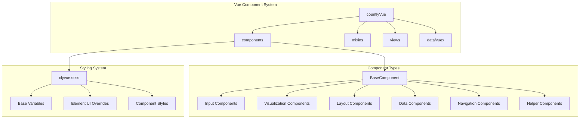
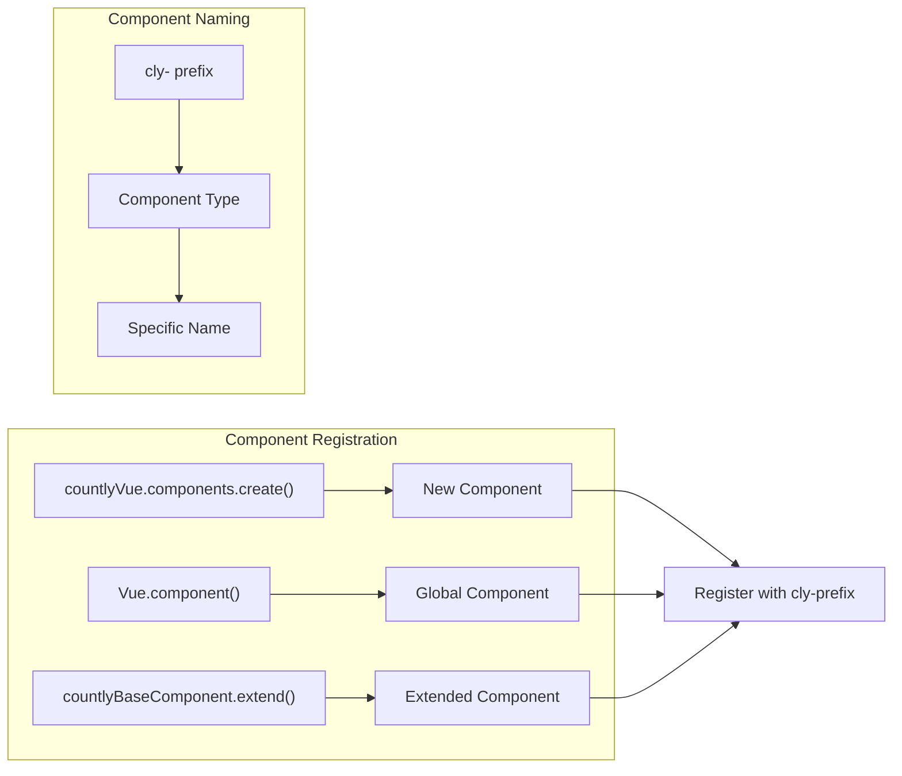
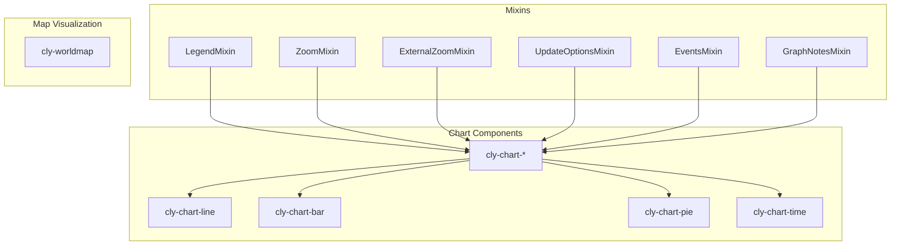
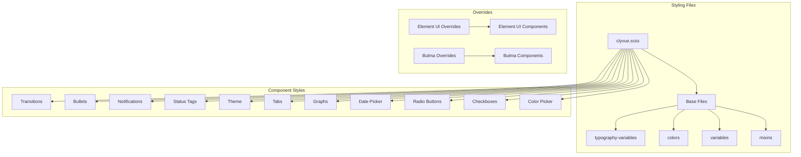
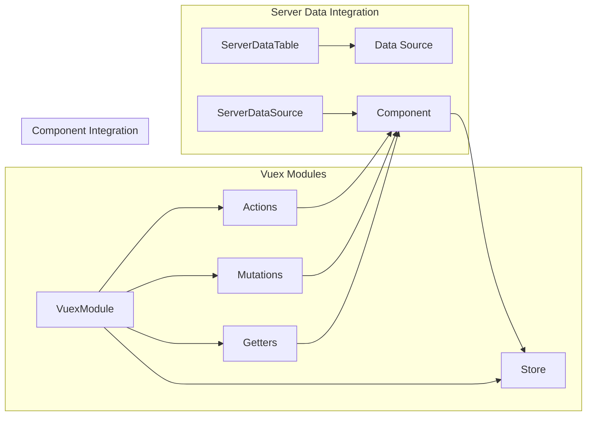

# Vue Components and Styling

<details>
<summary>Relevant source files</summary>

The following files were used as context for generating this wiki page:

- [Gruntfile.js](https://github.com/Countly/countly-server/blob/1527df18/Gruntfile.js)
- [frontend/express/public/core/session-overview/stylesheets/_main.scss](https://github.com/Countly/countly-server/blob/1527df18/frontend/express/public/core/session-overview/stylesheets/_main.scss)
- [frontend/express/public/javascripts/countly/vue/components/datatable.js](https://github.com/Countly/countly-server/blob/1527df18/frontend/express/public/javascripts/countly/vue/components/datatable.js)
- [frontend/express/public/javascripts/countly/vue/components/date.js](https://github.com/Countly/countly-server/blob/1527df18/frontend/express/public/javascripts/countly/vue/components/date.js)
- [frontend/express/public/javascripts/countly/vue/components/dropdown.js](https://github.com/Countly/countly-server/blob/1527df18/frontend/express/public/javascripts/countly/vue/components/dropdown.js)
- [frontend/express/public/javascripts/countly/vue/components/helpers.js](https://github.com/Countly/countly-server/blob/1527df18/frontend/express/public/javascripts/countly/vue/components/helpers.js)
- [frontend/express/public/javascripts/countly/vue/components/input.js](https://github.com/Countly/countly-server/blob/1527df18/frontend/express/public/javascripts/countly/vue/components/input.js)
- [frontend/express/public/javascripts/countly/vue/components/nav.js](https://github.com/Countly/countly-server/blob/1527df18/frontend/express/public/javascripts/countly/vue/components/nav.js)
- [frontend/express/public/javascripts/countly/vue/components/vis.js](https://github.com/Countly/countly-server/blob/1527df18/frontend/express/public/javascripts/countly/vue/components/vis.js)
- [frontend/express/public/javascripts/countly/vue/container.js](https://github.com/Countly/countly-server/blob/1527df18/frontend/express/public/javascripts/countly/vue/container.js)
- [frontend/express/public/javascripts/countly/vue/data/vuex.js](https://github.com/Countly/countly-server/blob/1527df18/frontend/express/public/javascripts/countly/vue/data/vuex.js)
- [frontend/express/public/javascripts/countly/vue/helpers.js](https://github.com/Countly/countly-server/blob/1527df18/frontend/express/public/javascripts/countly/vue/helpers.js)
- [frontend/express/public/javascripts/countly/vue/templates/datatable.html](https://github.com/Countly/countly-server/blob/1527df18/frontend/express/public/javascripts/countly/vue/templates/datatable.html)
- [frontend/express/public/javascripts/countly/vue/templates/datepicker.html](https://github.com/Countly/countly-server/blob/1527df18/frontend/express/public/javascripts/countly/vue/templates/datepicker.html)
- [frontend/express/public/javascripts/countly/vue/templates/selectx.html](https://github.com/Countly/countly-server/blob/1527df18/frontend/express/public/javascripts/countly/vue/templates/selectx.html)
- [frontend/express/public/javascripts/countly/vue/templates/worldmap.html](https://github.com/Countly/countly-server/blob/1527df18/frontend/express/public/javascripts/countly/vue/templates/worldmap.html)
- [frontend/express/public/javascripts/utils/vue/element-ui.js](https://github.com/Countly/countly-server/blob/1527df18/frontend/express/public/javascripts/utils/vue/element-ui.js)
- [frontend/express/public/stylesheets/styles/base/_base.scss](https://github.com/Countly/countly-server/blob/1527df18/frontend/express/public/stylesheets/styles/base/_base.scss)
- [frontend/express/public/stylesheets/styles/base/_colors.scss](https://github.com/Countly/countly-server/blob/1527df18/frontend/express/public/stylesheets/styles/base/_colors.scss)
- [frontend/express/public/stylesheets/styles/base/_element-variables.scss](https://github.com/Countly/countly-server/blob/1527df18/frontend/express/public/stylesheets/styles/base/_element-variables.scss)
- [frontend/express/public/stylesheets/styles/base/_mixins.scss](https://github.com/Countly/countly-server/blob/1527df18/frontend/express/public/stylesheets/styles/base/_mixins.scss)
- [frontend/express/public/stylesheets/styles/base/_typography-variables.scss](https://github.com/Countly/countly-server/blob/1527df18/frontend/express/public/stylesheets/styles/base/_typography-variables.scss)
- [frontend/express/public/stylesheets/styles/base/_variables.scss](https://github.com/Countly/countly-server/blob/1527df18/frontend/express/public/stylesheets/styles/base/_variables.scss)
- [frontend/express/public/stylesheets/styles/blocks/_charts.scss](https://github.com/Countly/countly-server/blob/1527df18/frontend/express/public/stylesheets/styles/blocks/_charts.scss)
- [frontend/express/public/stylesheets/styles/blocks/_dropdown.scss](https://github.com/Countly/countly-server/blob/1527df18/frontend/express/public/stylesheets/styles/blocks/_dropdown.scss)
- [frontend/express/public/stylesheets/styles/blocks/_notification-toasts.scss](https://github.com/Countly/countly-server/blob/1527df18/frontend/express/public/stylesheets/styles/blocks/_notification-toasts.scss)
- [frontend/express/public/stylesheets/styles/blocks/_select.scss](https://github.com/Countly/countly-server/blob/1527df18/frontend/express/public/stylesheets/styles/blocks/_select.scss)
- [frontend/express/public/stylesheets/styles/blocks/_table.scss](https://github.com/Countly/countly-server/blob/1527df18/frontend/express/public/stylesheets/styles/blocks/_table.scss)
- [frontend/express/public/stylesheets/styles/blocks/_vis.scss](https://github.com/Countly/countly-server/blob/1527df18/frontend/express/public/stylesheets/styles/blocks/_vis.scss)
- [frontend/express/public/stylesheets/styles/manifest.scss](https://github.com/Countly/countly-server/blob/1527df18/frontend/express/public/stylesheets/styles/manifest.scss)
- [frontend/express/public/stylesheets/styles/overrides/_element-override.scss](https://github.com/Countly/countly-server/blob/1527df18/frontend/express/public/stylesheets/styles/overrides/_element-override.scss)
- [frontend/express/public/stylesheets/styles/states/_state.scss](https://github.com/Countly/countly-server/blob/1527df18/frontend/express/public/stylesheets/styles/states/_state.scss)
- [frontend/express/public/stylesheets/vue/clyvue.scss](https://github.com/Countly/countly-server/blob/1527df18/frontend/express/public/stylesheets/vue/clyvue.scss)
- [frontend/express/public/stylesheets/vue/element-ui.css](https://github.com/Countly/countly-server/blob/1527df18/frontend/express/public/stylesheets/vue/element-ui.css)
- [frontend/express/public/stylesheets/vue/fonts/element-icons.ttf](https://github.com/Countly/countly-server/blob/1527df18/frontend/express/public/stylesheets/vue/fonts/element-icons.ttf)
- [frontend/express/public/stylesheets/vue/fonts/element-icons.woff](https://github.com/Countly/countly-server/blob/1527df18/frontend/express/public/stylesheets/vue/fonts/element-icons.woff)
- [plugins/vue-example/api/api.js](https://github.com/Countly/countly-server/blob/1527df18/plugins/vue-example/api/api.js)
- [plugins/vue-example/frontend/app.js](https://github.com/Countly/countly-server/blob/1527df18/plugins/vue-example/frontend/app.js)
- [plugins/vue-example/frontend/public/javascripts/countly.models.js](https://github.com/Countly/countly-server/blob/1527df18/plugins/vue-example/frontend/public/javascripts/countly.models.js)
- [plugins/vue-example/frontend/public/javascripts/countly.views.js](https://github.com/Countly/countly-server/blob/1527df18/plugins/vue-example/frontend/public/javascripts/countly.views.js)
- [plugins/vue-example/frontend/public/localization/vue-example.properties](https://github.com/Countly/countly-server/blob/1527df18/plugins/vue-example/frontend/public/localization/vue-example.properties)
- [plugins/vue-example/frontend/public/stylesheets/main.css](https://github.com/Countly/countly-server/blob/1527df18/plugins/vue-example/frontend/public/stylesheets/main.css)
- [plugins/vue-example/frontend/public/templates/date.html](https://github.com/Countly/countly-server/blob/1527df18/plugins/vue-example/frontend/public/templates/date.html)
- [plugins/vue-example/frontend/public/templates/form.html](https://github.com/Countly/countly-server/blob/1527df18/plugins/vue-example/frontend/public/templates/form.html)
- [plugins/vue-example/frontend/public/templates/main.html](https://github.com/Countly/countly-server/blob/1527df18/plugins/vue-example/frontend/public/templates/main.html)
- [plugins/vue-example/frontend/public/templates/table.html](https://github.com/Countly/countly-server/blob/1527df18/plugins/vue-example/frontend/public/templates/table.html)
- [plugins/vue-example/frontend/public/templates/tg.html](https://github.com/Countly/countly-server/blob/1527df18/plugins/vue-example/frontend/public/templates/tg.html)
- [plugins/vue-example/install.js](https://github.com/Countly/countly-server/blob/1527df18/plugins/vue-example/install.js)
- [plugins/vue-example/tests.js](https://github.com/Countly/countly-server/blob/1527df18/plugins/vue-example/tests.js)

</details>


This document provides a comprehensive overview of the component system and styling architecture used in Countly's Vue-based frontend. It covers the component organization, styling patterns, and customization options available for developers working with the Countly dashboard. For information about the core frontend system and layout, see [Core Frontend System](#2).

## Component Architecture

Countly's frontend uses Vue.js with a custom component system called `clyvue` that extends and customizes Element UI components. The components are organized in a modular fashion, following a consistent naming convention and styling pattern.



The component hierarchy starts with a base component class that provides common functionality. Each component category then extends this base with specialized behaviors and styling.

Sources:
- [frontend/express/public/javascripts/countly/vue/components/vis.js](https://github.com/Countly/countly-server/blob/1527df18/frontend/express/public/javascripts/countly/vue/components/vis.js)
- [frontend/express/public/stylesheets/vue/clyvue.scss](https://github.com/Countly/countly-server/blob/1527df18/frontend/express/public/stylesheets/vue/clyvue.scss)
- [frontend/express/public/javascripts/countly/vue/components/input.js](https://github.com/Countly/countly-server/blob/1527df18/frontend/express/public/javascripts/countly/vue/components/input.js)
- [frontend/express/public/javascripts/countly/vue/container.js](https://github.com/Countly/countly-server/blob/1527df18/frontend/express/public/javascripts/countly/vue/container.js)

## Component Registration and Naming

Components in Countly follow a consistent naming pattern, prefixed with `cly-`. Components are registered globally using Vue's component system or created through the `countlyVue.components.create()` method.



For example, input components are named `cly-input-*`, visualization components are named `cly-chart-*`, and so on.

Sources:
- [frontend/express/public/javascripts/countly/vue/components/input.js:8-117](https://github.com/Countly/countly-server/blob/1527df18/frontend/express/public/javascripts/countly/vue/components/input.js:8-117#L8-L117)
- [frontend/express/public/javascripts/countly/vue/components/helpers.js:10-43](https://github.com/Countly/countly-server/blob/1527df18/frontend/express/public/javascripts/countly/vue/components/helpers.js:10-43#L10-L43)

## Core Component Categories

### Input Components

Countly provides a rich set of input components to handle user interactions:

| Component | Purpose | Example Props |
|-----------|---------|---------------|
| `cly-colorpicker` | Color selection | `placement`, `resetValue`, `value` |
| `cly-dropzone` | File uploads | Vue2Dropzone props |
| `cly-listbox` | Selection from a list | `options`, `bordered`, `skin`, `searchable` |
| `cly-checklistbox` | Multi-selection from a list | `value`, `sortable`, `persistColumnOrderKey` |
| `cly-dropdown` | Dropdown selector | `disabled`, `width`, `placement` |
| `cly-input-dropdown-trigger` | Trigger for dropdowns | `focused`, `opened`, `selectedOptions` |

These components handle various input scenarios and support customization through props, slots, and events.

Sources:
- [frontend/express/public/javascripts/countly/vue/components/input.js:8-556](https://github.com/Countly/countly-server/blob/1527df18/frontend/express/public/javascripts/countly/vue/components/input.js:8-556#L8-L556)
- [frontend/express/public/javascripts/countly/vue/templates/selectx.html](https://github.com/Countly/countly-server/blob/1527df18/frontend/express/public/javascripts/countly/vue/templates/selectx.html)

### Visualization Components

The visualization components provide charting and data display capabilities:



These components use ECharts under the hood and provide additional features like legends, zooming, and graph notes.

Sources:
- [frontend/express/public/javascripts/countly/vue/components/vis.js:19-651](https://github.com/Countly/countly-server/blob/1527df18/frontend/express/public/javascripts/countly/vue/components/vis.js:19-651#L19-L651)
- [plugins/vue-example/frontend/public/templates/tg.html](https://github.com/Countly/countly-server/blob/1527df18/plugins/vue-example/frontend/public/templates/tg.html)

### Data Table Components

The `cly-datatable-n` component provides a powerful data table with features for sorting, filtering, pagination, and dynamic columns:

| Feature | Description |
|---------|-------------|
| Dynamic Columns | Configure which columns appear in the table |
| Sorting | Sort by any column with customized sorting behavior |
| Filtering | Filter data with search functionality |
| Pagination | Navigate through large datasets |
| Row Selection | Select rows for batch operations |
| Export | Export table data in various formats |
| Vuex Integration | Connect to Vuex stores for data management |

The data table can work with both local and remote data sources, providing a unified interface regardless of where the data comes from.

Sources:
- [frontend/express/public/javascripts/countly/vue/components/datatable.js:8-315](https://github.com/Countly/countly-server/blob/1527df18/frontend/express/public/javascripts/countly/vue/components/datatable.js:8-315#L8-L315)
- [plugins/vue-example/frontend/public/templates/table.html](https://github.com/Countly/countly-server/blob/1527df18/plugins/vue-example/frontend/public/templates/table.html)

### Helper Components

Helper components provide utility functionality for common UI patterns:

| Component | Purpose |
|-----------|---------|
| `cly-back-link` | Navigation back link |
| `cly-in-page-notification` | In-page notifications and alerts |
| `cly-empty-home` | Empty state display |
| `cly-status-tag` | Status indicators |
| `cly-diff-helper` | Show changes between states |
| `cly-metric-cards` | Display metric data in card format |
| `cly-tooltip-icon` | Icon with tooltip |

These components help maintain consistent UI patterns throughout the application.

Sources:
- [frontend/express/public/javascripts/countly/vue/components/helpers.js:10-313](https://github.com/Countly/countly-server/blob/1527df18/frontend/express/public/javascripts/countly/vue/components/helpers.js:10-313#L10-L313)

### Date Components

Countly provides specialized components for date selection and manipulation:

| Component | Purpose |
|-----------|---------|
| `cly-date-picker-g` | Global date selector |
| `cly-date-picker` | Date selection |
| `cly-date-range-picker` | Date range selection |

These components support various date formats, range selection, and integration with Countly's period system.

Sources:
- [frontend/express/public/javascripts/countly/vue/components/date.js:14-514](https://github.com/Countly/countly-server/blob/1527df18/frontend/express/public/javascripts/countly/vue/components/date.js:14-514#L14-L514)
- [frontend/express/public/javascripts/countly/vue/templates/datepicker.html](https://github.com/Countly/countly-server/blob/1527df18/frontend/express/public/javascripts/countly/vue/templates/datepicker.html)

## Styling System

The Countly Vue component styling is based on a comprehensive SCSS system contained primarily in `clyvue.scss`. This file provides styling for all Vue components in the Countly dashboard.

### SCSS Architecture



The styling system uses SCSS variables for consistency across components, with separate files for typography, colors, and other design elements.

Sources:
- [frontend/express/public/stylesheets/vue/clyvue.scss:1-214](https://github.com/Countly/countly-server/blob/1527df18/frontend/express/public/stylesheets/vue/clyvue.scss:1-214#L1-L214)
- [frontend/express/public/stylesheets/styles/manifest.scss:1-24](https://github.com/Countly/countly-server/blob/1527df18/frontend/express/public/stylesheets/styles/manifest.scss:1-24#L1-L24)
- [frontend/express/public/stylesheets/styles/base/_colors.scss](https://github.com/Countly/countly-server/blob/1527df18/frontend/express/public/stylesheets/styles/base/_colors.scss)

### Component Styling Patterns

Components in Countly follow a consistent styling pattern using BEM (Block, Element, Modifier) notation:

1. **Block**: The component name (e.g., `cly-vue-notification`)
2. **Element**: Child elements (e.g., `cly-vue-notification__alert-box`)
3. **Modifier**: Variations (e.g., `cly-vue-notification__alert-box--full`)

This approach provides a clear hierarchy of styles and makes it easy to target specific parts of a component.

Sources:
- [frontend/express/public/stylesheets/vue/clyvue.scss:60-143](https://github.com/Countly/countly-server/blob/1527df18/frontend/express/public/stylesheets/vue/clyvue.scss:60-143#L60-L143)
- [frontend/express/public/stylesheets/styles/blocks/_vis.scss:1-57](https://github.com/Countly/countly-server/blob/1527df18/frontend/express/public/stylesheets/styles/blocks/_vis.scss:1-57#L1-L57)
- [frontend/express/public/stylesheets/styles/blocks/_select.scss:1-20](https://github.com/Countly/countly-server/blob/1527df18/frontend/express/public/stylesheets/styles/blocks/_select.scss:1-20#L1-L20)

### Element UI Integration and Overrides

Countly uses Element UI as a foundation for its component system but heavily customizes it to match the Countly design system:

| Original Element UI Component | Countly Extension/Override |
|------------------------------|----------------------------|
| `el-table` | Custom styles for headers, cells, sorting |
| `el-button` | Custom styles, additional variants |
| `el-radio` | Extended with custom skins, layouts |
| `el-input` | Modified for adaptive layouts |
| `el-select` | Extended with custom dropdown behavior |
| `el-tabs` | Custom tab styling |

The overrides are defined in `_element-override.scss` and ensure that Element UI components match the Countly design system.

Sources:
- [frontend/express/public/stylesheets/styles/overrides/_element-override.scss:10-114](https://github.com/Countly/countly-server/blob/1527df18/frontend/express/public/stylesheets/styles/overrides/_element-override.scss:10-114#L10-L114)
- [frontend/express/public/javascripts/utils/vue/element-ui.js](https://github.com/Countly/countly-server/blob/1527df18/frontend/express/public/javascripts/utils/vue/element-ui.js)
- [frontend/express/public/stylesheets/vue/element-ui.css](https://github.com/Countly/countly-server/blob/1527df18/frontend/express/public/stylesheets/vue/element-ui.css)

## Vuex Integration

Countly Vue components integrate with Vuex for state management, with utilities to simplify common patterns:



The `getServerDataSource` method connects Vuex modules to components, providing a clean interface for data fetching and manipulation.

Sources:
- [frontend/express/public/javascripts/countly/vue/data/vuex.js:10-63](https://github.com/Countly/countly-server/blob/1527df18/frontend/express/public/javascripts/countly/vue/data/vuex.js:10-63#L10-L63)
- [plugins/vue-example/frontend/public/javascripts/countly.models.js:39-102](https://github.com/Countly/countly-server/blob/1527df18/plugins/vue-example/frontend/public/javascripts/countly.models.js:39-102#L39-L102)
- [plugins/vue-example/frontend/public/javascripts/countly.views.js:1-84](https://github.com/Countly/countly-server/blob/1527df18/plugins/vue-example/frontend/public/javascripts/countly.views.js:1-84#L1-L84)

## Using Components

### Example: Data Table

```html
<cly-datatable-n 
    :available-dynamic-cols="tableDynamicCols" 
    :tracked-fields="localTableTrackedFields"
    :rows="tableRows" 
    :resizable="false" 
    :persist-key="tablePersistKey">
    <template v-slot="scope">
        <!-- Column definitions -->
        <el-table-column fixed type="selection"></el-table-column>
        <el-table-column fixed width="200" sortable="custom" prop="_id" label="ID"></el-table-column>
        
        <!-- Dynamic columns -->
        <template v-for="(col,idx) in scope.dynamicCols">
            <el-table-column 
                v-if="col.value === 'description'" 
                width="540" 
                sortable="custom" 
                :key="idx"
                prop="description" 
                label="Description">
                Custom template content
            </el-table-column>
            <el-table-column 
                v-else 
                width="280" 
                :key="idx" 
                sortable="custom" 
                :prop="col.value" 
                :label="col.label">
            </el-table-column>
        </template>
        
        <!-- Actions column -->
        <el-table-column align="center" type="options">
            <template v-slot="rowScope">
                <cly-more-options v-if="rowScope.row.hover" @command="handleCommand($event, scope, rowScope.row)">
                    <el-dropdown-item command="edit">{{i18n('common.edit')}}</el-dropdown-item>
                    <el-dropdown-item command="remove">{{i18n('common.delete')}}</el-dropdown-item>
                </cly-more-options>
            </template>
        </el-table-column>
    </template>
    
    <!-- Bottom line with diff helper -->
    <template v-slot:bottomline="scope">
        <cly-diff-helper :diff="scope.diff" @discard="scope.unpatch()"></cly-diff-helper>
    </template>
</cly-datatable-n>
```

This example shows how to create a data table with dynamic columns, selection, and action options.

Sources:
- [plugins/vue-example/frontend/public/templates/table.html:1-45](https://github.com/Countly/countly-server/blob/1527df18/plugins/vue-example/frontend/public/templates/table.html:1-45#L1-L45)

### Example: Visualization

```html
<cly-chart-line :option="lineOptions" :legend="lineLegend" category="vue-example">
    <template v-slot:chart-left>
        <!-- Custom controls can be added here -->
    </template>
</cly-chart-line>

<cly-chart-time :option="largeScaleOptions" :bucket="selBucket" :dummy="true" category="vue-example">
    <template v-slot:chart-left="scope">
        <div class="bu-level-item">
            <el-button @click="onTimeSeriesButtonClick" size="small">Change series</el-button>
        </div>
        <div class="bu-level-item" style="width: 100px;">
            <el-select v-model="selBucket">
                <el-option :key="item" :value="item" :label="item"
                    v-for="item in ['daily', 'weekly', 'monthly', 'hourly']"></el-option>
            </el-select>
        </div>
    </template>
</cly-chart-time>
```

This example shows how to use chart components with custom options and controls.

Sources:
- [plugins/vue-example/frontend/public/templates/tg.html:1-36](https://github.com/Countly/countly-server/blob/1527df18/plugins/vue-example/frontend/public/templates/tg.html:1-36#L1-L36)

## Summary

The Countly Vue component system provides a comprehensive set of UI components with consistent styling and behavior. The system extends Element UI with custom components and styling to create a unified user experience across the Countly dashboard. Components are organized by function and follow a consistent naming pattern with the `cly-` prefix.

The styling system uses SCSS with variables for typography, colors, and other design elements, providing a consistent visual language. The BEM notation ensures that component styles are clearly organized and easy to target.