# Sidebar and Navigation

<details>
<summary>Relevant source files</summary>

The following files were used as context for generating this wiki page:

- [frontend/express/public/javascripts/countly/vue/components/sidebar.js](https://github.com/Countly/countly-server/blob/1527df18/frontend/express/public/javascripts/countly/vue/components/sidebar.js)
- [frontend/express/public/javascripts/countly/vue/core.js](https://github.com/Countly/countly-server/blob/1527df18/frontend/express/public/javascripts/countly/vue/core.js)
- [frontend/express/public/javascripts/countly/vue/templates/sidebar/analytics-menu.html](https://github.com/Countly/countly-server/blob/1527df18/frontend/express/public/javascripts/countly/vue/templates/sidebar/analytics-menu.html)
- [frontend/express/public/javascripts/countly/vue/templates/sidebar/app-selector.html](https://github.com/Countly/countly-server/blob/1527df18/frontend/express/public/javascripts/countly/vue/templates/sidebar/app-selector.html)
- [frontend/express/public/javascripts/countly/vue/templates/sidebar/language-menu.html](https://github.com/Countly/countly-server/blob/1527df18/frontend/express/public/javascripts/countly/vue/templates/sidebar/language-menu.html)
- [frontend/express/public/javascripts/countly/vue/templates/sidebar/management-menu.html](https://github.com/Countly/countly-server/blob/1527df18/frontend/express/public/javascripts/countly/vue/templates/sidebar/management-menu.html)
- [frontend/express/public/javascripts/countly/vue/templates/sidebar/sidebar.html](https://github.com/Countly/countly-server/blob/1527df18/frontend/express/public/javascripts/countly/vue/templates/sidebar/sidebar.html)
- [frontend/express/public/javascripts/countly/vue/templates/sidebar/users-menu.html](https://github.com/Countly/countly-server/blob/1527df18/frontend/express/public/javascripts/countly/vue/templates/sidebar/users-menu.html)
- [frontend/express/public/stylesheets/styles/blocks/_sidebar.scss](https://github.com/Countly/countly-server/blob/1527df18/frontend/express/public/stylesheets/styles/blocks/_sidebar.scss)

</details>


This document explains the sidebar and navigation system in the Countly server UI. The sidebar is the primary navigation interface that allows users to access different parts of the Countly dashboard, manage apps, switch languages, and access user settings. For information about the overall frontend architecture, see [Core Frontend System](#2).

## 1. Overview

The Countly sidebar is implemented as a Vue.js component system with a two-panel design:

1. **Navigation Icons Panel**: A narrow, fixed panel containing icon-based navigation options
2. **Menu Content Panel**: A wider, expandable panel showing detailed menu options

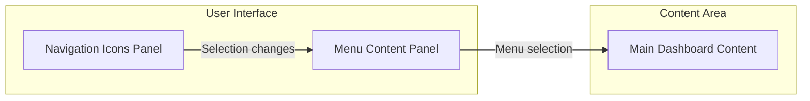

Sources: [frontend/express/public/javascripts/countly/vue/templates/sidebar/sidebar.html:1-59](https://github.com/Countly/countly-server/blob/1527df18/frontend/express/public/javascripts/countly/vue/templates/sidebar/sidebar.html#L1-L59), [frontend/express/public/javascripts/countly/vue/components/sidebar.js:558-816](https://github.com/Countly/countly-server/blob/1527df18/frontend/express/public/javascripts/countly/vue/components/sidebar.js#L558-L816)

## 2. Sidebar Architecture

The sidebar is composed of several Vue components that work together to provide a unified navigation experience:

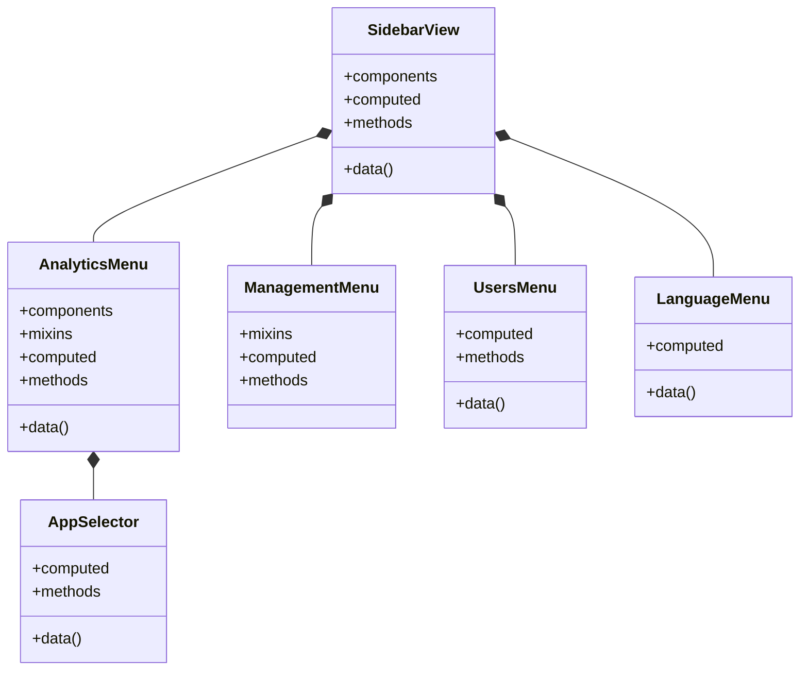

The sidebar uses a Vuex store to maintain state across components, particularly for tracking the selected menu items.

Sources: [frontend/express/public/javascripts/countly/vue/components/sidebar.js:558-816](https://github.com/Countly/countly-server/blob/1527df18/frontend/express/public/javascripts/countly/vue/components/sidebar.js#L558-L816), [frontend/express/public/javascripts/countly/vue/core.js:540-586](https://github.com/Countly/countly-server/blob/1527df18/frontend/express/public/javascripts/countly/vue/core.js#L540-L586)

## 3. Key Components

### 3.1 SidebarView

The `SidebarView` is the main component that orchestrates the entire sidebar. It's responsible for:
- Rendering the icon panel and menu content panel
- Managing the display state (expanded/collapsed)
- Handling menu selection
- Coordinating subcomponents

```javascript
var SidebarView = countlyVue.views.create({
    template: CV.T('/javascripts/countly/vue/templates/sidebar/sidebar.html'),
    components: {
        "users-menu": UsersMenu,
        "analytics-menu": AnalyticsMenu,
        "management-menu": ManagementMenu,
        "language-menu": LanguageMenu
    },
    // ... other properties
});
```

The sidebar has two main types of menu options:
1. **Main Menu Options** - Core navigation items (analytics, management)
2. **Other Menu Options** - Utility options (user profile, language, toggle, help)

#### Expandable/Collapsible Behavior

The sidebar can be toggled between expanded and collapsed states:

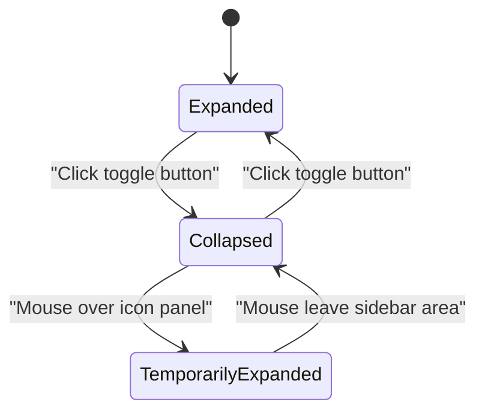

Sources: [frontend/express/public/javascripts/countly/vue/components/sidebar.js:558-816](https://github.com/Countly/countly-server/blob/1527df18/frontend/express/public/javascripts/countly/vue/components/sidebar.js#L558-L816), [frontend/express/public/javascripts/countly/vue/templates/sidebar/sidebar.html:1-59](https://github.com/Countly/countly-server/blob/1527df18/frontend/express/public/javascripts/countly/vue/templates/sidebar/sidebar.html#L1-L59)

### 3.2 AppSelector Component

The `AppSelector` allows users to switch between different apps in Countly. It displays:
- Currently selected app with icon and type
- Dialog for selecting from all available apps
- Optional "Compare Apps" feature

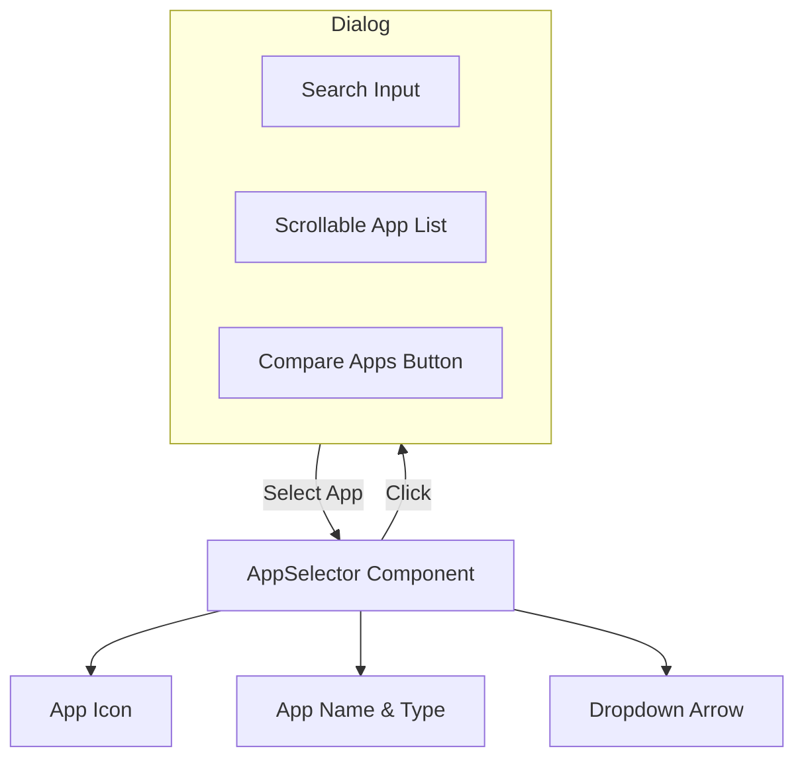

The component retrieves app data from the Vuex store and updates the active app when changed.

Sources: [frontend/express/public/javascripts/countly/vue/components/sidebar.js:72-130](https://github.com/Countly/countly-server/blob/1527df18/frontend/express/public/javascripts/countly/vue/components/sidebar.js#L72-L130), [frontend/express/public/javascripts/countly/vue/templates/sidebar/app-selector.html:1-17](https://github.com/Countly/countly-server/blob/1527df18/frontend/express/public/javascripts/countly/vue/templates/sidebar/app-selector.html#L1-L17)

### 3.3 AnalyticsMenu Component

The `AnalyticsMenu` provides navigation to analytical features organized by categories:

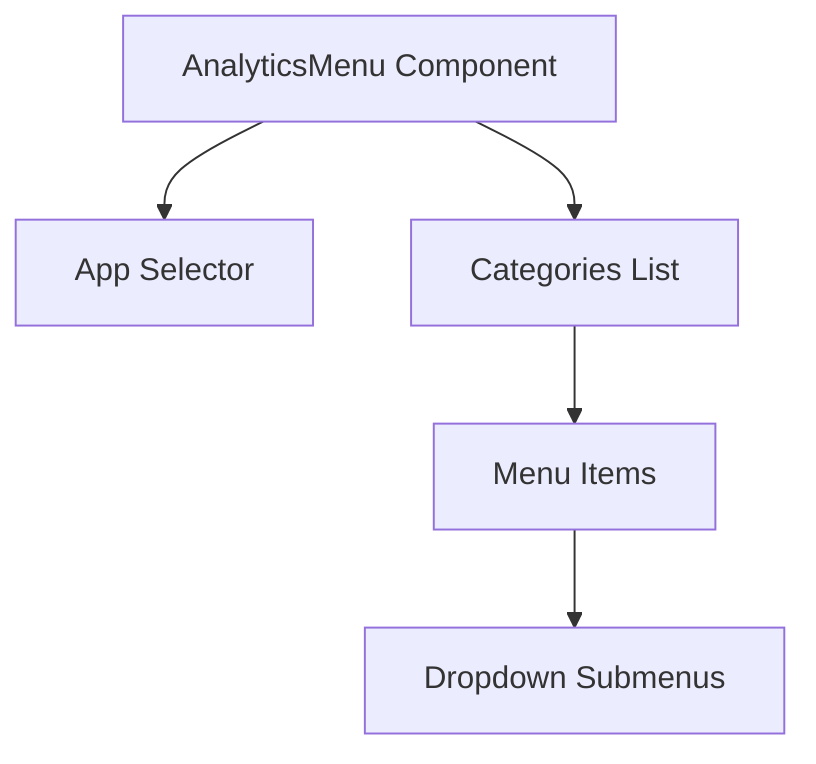

Key features of the `AnalyticsMenu`:
- Integrates the app selector
- Organizes menu items by categories
- Supports expandable submenus
- Highlights the currently selected menu item
- Dynamically filters menu items based on the active app type

Sources: [frontend/express/public/javascripts/countly/vue/components/sidebar.js:226-416](https://github.com/Countly/countly-server/blob/1527df18/frontend/express/public/javascripts/countly/vue/components/sidebar.js#L226-L416), [frontend/express/public/javascripts/countly/vue/templates/sidebar/analytics-menu.html:1-64](https://github.com/Countly/countly-server/blob/1527df18/frontend/express/public/javascripts/countly/vue/templates/sidebar/analytics-menu.html#L1-L64)

### 3.4 ManagementMenu Component

The `ManagementMenu` provides navigation to management features of Countly:

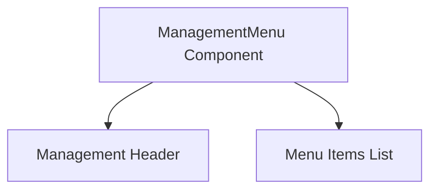

Key features of the `ManagementMenu`:
- Simple list-based navigation
- Validates menu items before display
- Highlights the currently selected menu item
- Identifies the selected item based on URL

Sources: [frontend/express/public/javascripts/countly/vue/components/sidebar.js:419-498](https://github.com/Countly/countly-server/blob/1527df18/frontend/express/public/javascripts/countly/vue/components/sidebar.js#L419-L498), [frontend/express/public/javascripts/countly/vue/templates/sidebar/management-menu.html:1-23](https://github.com/Countly/countly-server/blob/1527df18/frontend/express/public/javascripts/countly/vue/templates/sidebar/management-menu.html#L1-L23)

### 3.5 UsersMenu Component

The `UsersMenu` provides user account management features through a popover interface:

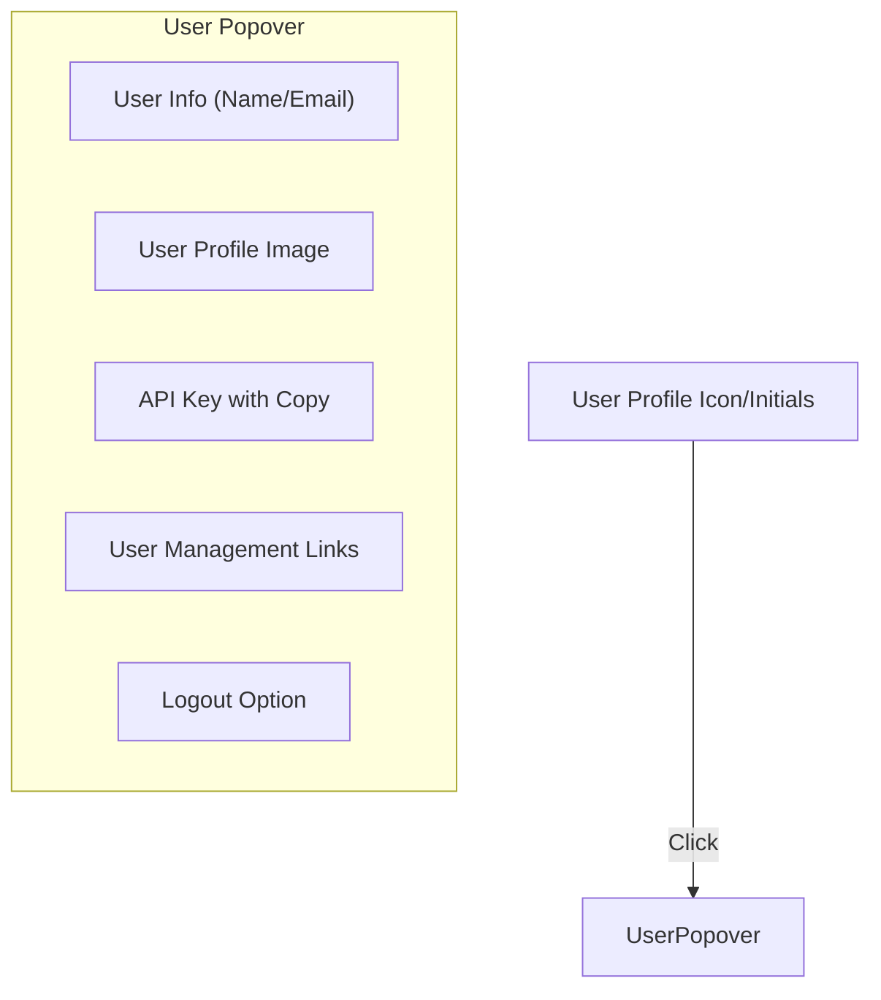

The user menu includes:
- Profile information display
- API key with copy functionality
- Navigation links to account settings
- Help center and documentation links
- Logout functionality

Sources: [frontend/express/public/javascripts/countly/vue/components/sidebar.js:132-197](https://github.com/Countly/countly-server/blob/1527df18/frontend/express/public/javascripts/countly/vue/components/sidebar.js#L132-L197), [frontend/express/public/javascripts/countly/vue/templates/sidebar/users-menu.html:1-203](https://github.com/Countly/countly-server/blob/1527df18/frontend/express/public/javascripts/countly/vue/templates/sidebar/users-menu.html#L1-L203)

### 3.6 LanguageMenu Component

The `LanguageMenu` allows users to change the interface language:

```mermaid
flowchart TD
    LanguageCode["Language Code Display"]
    
    subgraph "Language Popover"
        LanguageList["Selectable Language List"]
    end
    
    LanguageCode -- "Click" --> LanguagePopover
    LanguagePopover -- "Select Language" --> "Save and Reload Page"
```

The language selection process:
1. User clicks on language code
2. Popover shows available languages
3. User selects a language
4. System saves the preference and reloads the page

Sources: [frontend/express/public/javascripts/countly/vue/components/sidebar.js:501-556](https://github.com/Countly/countly-server/blob/1527df18/frontend/express/public/javascripts/countly/vue/components/sidebar.js#L501-L556), [frontend/express/public/javascripts/countly/vue/templates/sidebar/language-menu.html:1-14](https://github.com/Countly/countly-server/blob/1527df18/frontend/express/public/javascripts/countly/vue/templates/sidebar/language-menu.html#L1-L14)

## 4. State Management

The sidebar uses Vuex for state management, particularly through the `countlySidebar` store module:

```javascript
countlySidebar: {
    namespaced: true,
    state: {
        selectedMenuItem: {},
        guidesButton: '',
    },
    getters: {
        getSelectedMenuItem: function(state) {
            return state.selectedMenuItem;
        },
        getGuidesButton: function(state) {
            return state.guidesButton;
        }
    },
    mutations: {
        setSelectedMenuItem: function(state, payload) {
            state.selectedMenuItem = payload;
        },
        setGuidesButton: function(state, payload) {
            state.guidesButton = payload;
        }
    },
    actions: {
        updateSelectedMenuItem: function({commit}, payload) {
            commit('setSelectedMenuItem', payload);
        },
        // Additional actions for guides button states
    }
}
```

The store tracks:
1. The currently selected menu item (menu and item)
2. The state of the guides button (selected/highlighted/normal)

Components interact with this store to maintain consistent state across the sidebar:

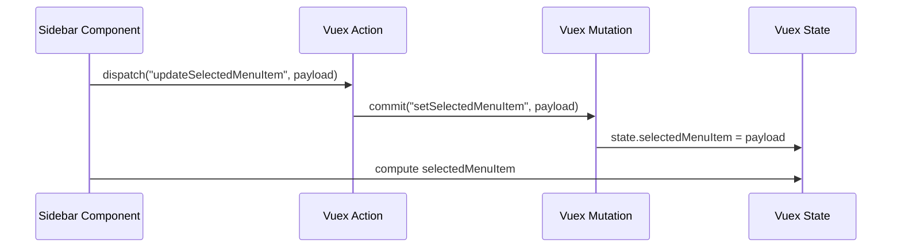

Sources: [frontend/express/public/javascripts/countly/vue/core.js:540-586](https://github.com/Countly/countly-server/blob/1527df18/frontend/express/public/javascripts/countly/vue/core.js#L540-L586)

## 5. Menu Structure and Data Flow

The sidebar dynamically builds menus from plugin-provided data through the container data mixins:

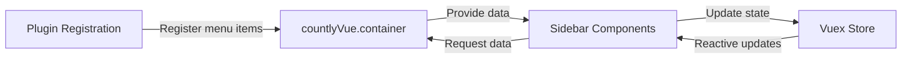

### Menu Categories and Items

The menu structure is organized into:

1. **Categories** - Groups of related features (Analytics, Management)
2. **Menu Items** - Individual features within categories
3. **Submenus** - Nested features under menu items

This data is accessed through Vue mixins:

```javascript
// For analytics menu
categorizedMenus: function() {
    var m = countlyVue.container.dataMixin({
        menus: "/sidebar/analytics/menu"
    });
    var mm = m.data().menus;
    // ... process menus
}

// For management menu
menu: function() {
    var m = countlyVue.container.dataMixin({
        menus: "/sidebar/analytics/menu"
    });
    var mm = m.data().menus;
    // ... filter for management category
}
```

Sources: [frontend/express/public/javascripts/countly/vue/components/sidebar.js:235-305](https://github.com/Countly/countly-server/blob/1527df18/frontend/express/public/javascripts/countly/vue/components/sidebar.js#L235-L305), [frontend/express/public/javascripts/countly/vue/components/sidebar.js:423-441](https://github.com/Countly/countly-server/blob/1527df18/frontend/express/public/javascripts/countly/vue/components/sidebar.js#L423-L441)

## 6. URL Routing and Menu Selection

The sidebar components implement URL-based menu selection through the `identifySelected` method. This method:

1. Gets the current URL fragment from Backbone history
2. Looks for menu items matching the URL
3. Updates the selected menu item in the Vuex store

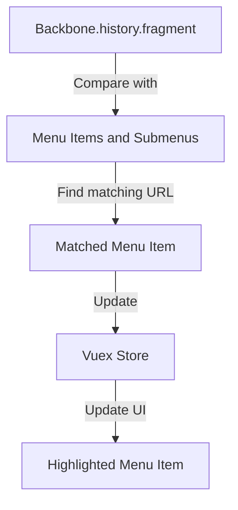

The process of identifying and highlighting the selected menu item is central to the navigation experience, ensuring users always know where they are in the interface.

Sources: [frontend/express/public/javascripts/countly/vue/components/sidebar.js:324-411](https://github.com/Countly/countly-server/blob/1527df18/frontend/express/public/javascripts/countly/vue/components/sidebar.js#L324-L411), [frontend/express/public/javascripts/countly/vue/components/sidebar.js:454-496](https://github.com/Countly/countly-server/blob/1527df18/frontend/express/public/javascripts/countly/vue/components/sidebar.js#L454-L496)

## 7. Styling and Layout

The sidebar uses SCSS for styling with a modular approach:

| CSS Class | Purpose |
|-----------|---------|
| `cly-vue-sidebar` | Main sidebar container |
| `cly-vue-sidebar__menu-options` | Icons panel |
| `cly-vue-sidebar__menu` | Content panel |
| `cly-vue-sidebar__menu-items` | Individual menu items |
| `cly-vue-sidebar__menu-items--selected` | Highlighted state for selected items |

The sidebar has a consistent color scheme with dark backgrounds and light text, providing clear visual hierarchy and navigation cues.

### Layout Structure

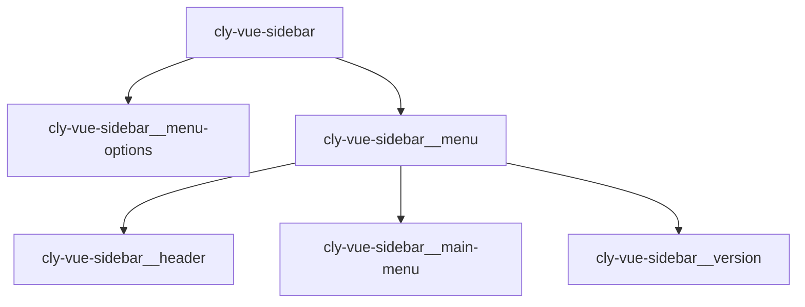

The sidebar's responsive behavior includes:
- Toggle between expanded and collapsed states
- Transitions for smooth expansion/collapse
- Floating mode for certain contexts (dashboards)

Sources: [frontend/express/public/stylesheets/styles/blocks/_sidebar.scss:1-513](https://github.com/Countly/countly-server/blob/1527df18/frontend/express/public/stylesheets/styles/blocks/_sidebar.scss#L1-L513)

## 8. Integration with the Rest of the Application

The sidebar acts as the primary navigation hub for the Countly dashboard, integrating with:

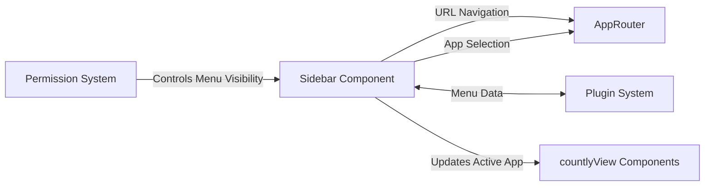

Key integration points:
1. Navigation triggers URL changes handled by the AppRouter
2. App selection updates the global app context
3. Plugins register menu items to extend the sidebar
4. User permissions determine which menu items are visible

Sources: [frontend/express/public/javascripts/countly/vue/components/sidebar.js:106-124](https://github.com/Countly/countly-server/blob/1527df18/frontend/express/public/javascripts/countly/vue/components/sidebar.js#L106-L124), [frontend/express/public/javascripts/countly/vue/core.js:589-593](https://github.com/Countly/countly-server/blob/1527df18/frontend/express/public/javascripts/countly/vue/core.js#L589-L593)

## 9. Summary

The Countly sidebar and navigation system provides a flexible, extensible interface for navigating the dashboard. Its key features include:

1. Two-panel design with icons and detailed menus
2. App selection and switching
3. Categorized menu structure
4. User profile and settings management
5. Language selection
6. Responsive layout with collapse/expand functionality