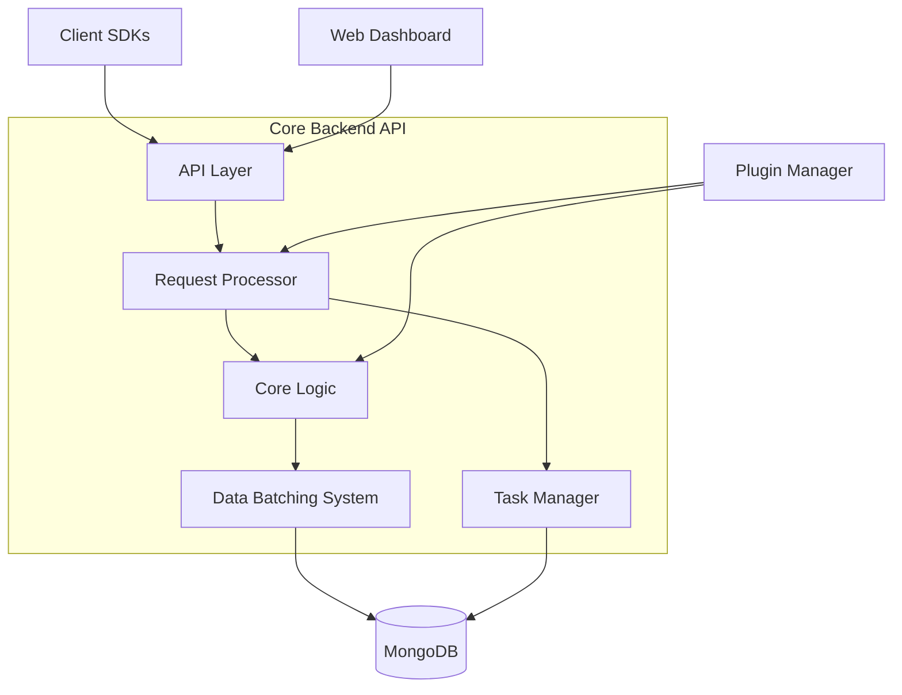
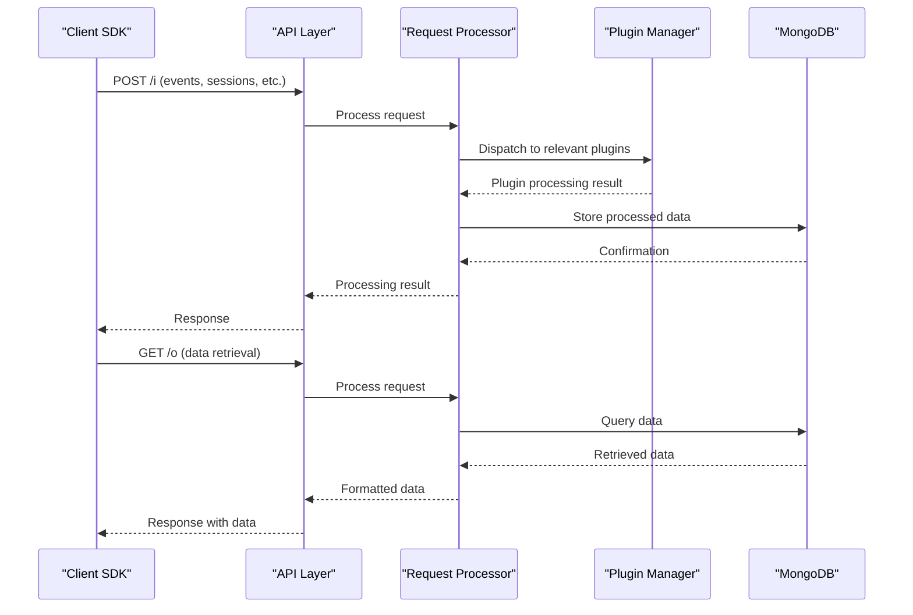
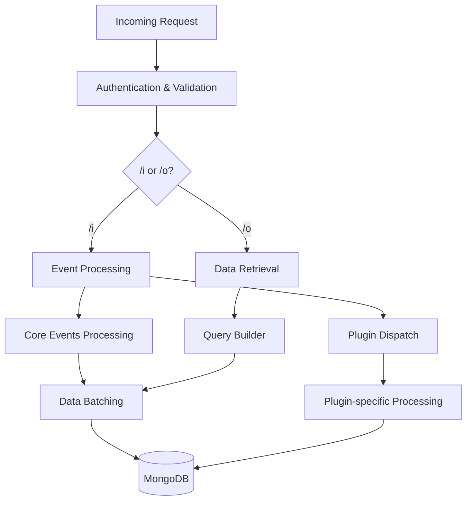
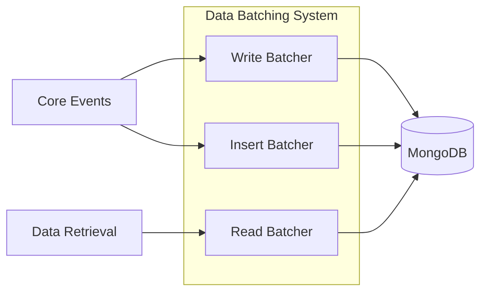
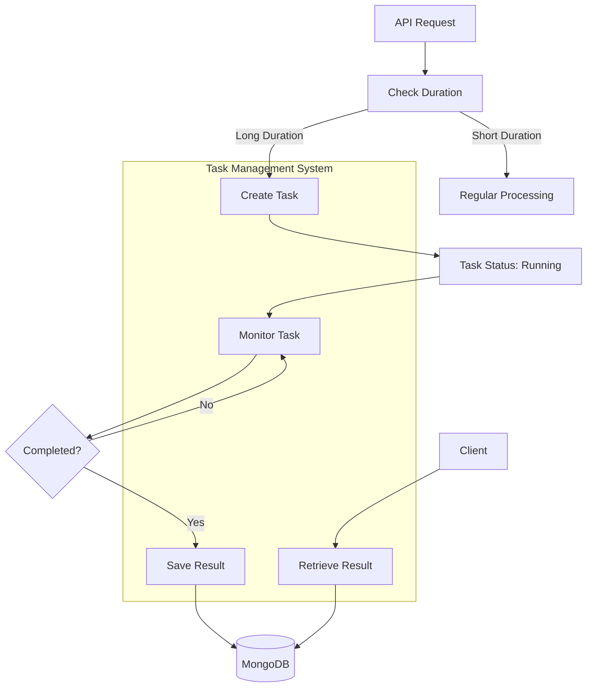
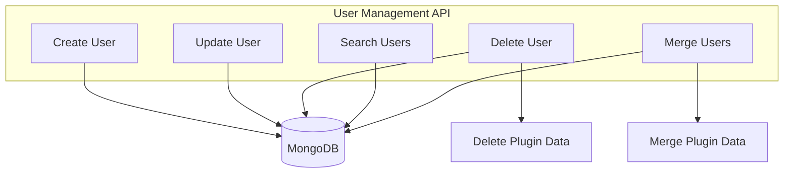
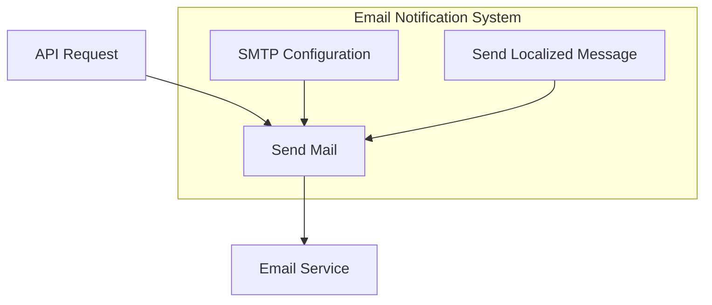
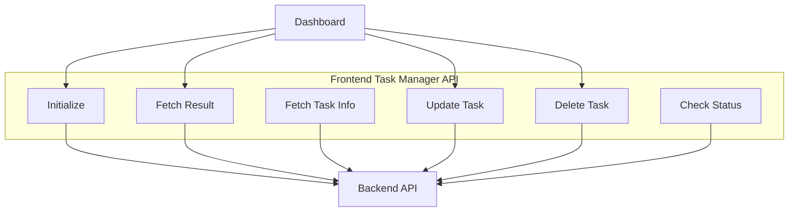

# Core Backend API

Relevant source files

The following files were used as context for generating this wiki page:

- [CHANGELOG.md](https://github.com/Countly/countly-server/blob/1527df18/CHANGELOG.md)
- [api/jobs/task.js](https://github.com/Countly/countly-server/blob/1527df18/api/jobs/task.js)
- [api/jobs/userMerge.js](https://github.com/Countly/countly-server/blob/1527df18/api/jobs/userMerge.js)
- [api/parts/data/exports.js](https://github.com/Countly/countly-server/blob/1527df18/api/parts/data/exports.js)
- [api/parts/mgmt/app_users.js](https://github.com/Countly/countly-server/blob/1527df18/api/parts/mgmt/app_users.js)
- [api/parts/mgmt/ip.js](https://github.com/Countly/countly-server/blob/1527df18/api/parts/mgmt/ip.js)
- [api/parts/mgmt/mail.js](https://github.com/Countly/countly-server/blob/1527df18/api/parts/mgmt/mail.js)
- [api/utils/taskmanager.js](https://github.com/Countly/countly-server/blob/1527df18/api/utils/taskmanager.js)
- [bin/upgrade/18.04.1/upgrade.sh](https://github.com/Countly/countly-server/blob/1527df18/bin/upgrade/18.04.1/upgrade.sh)
- [bin/upgrade/18.04/upgrade.sh](https://github.com/Countly/countly-server/blob/1527df18/bin/upgrade/18.04/upgrade.sh)
- [extend/.gitignore](https://github.com/Countly/countly-server/blob/1527df18/extend/.gitignore)
- [extend/aws_ses.example.js](https://github.com/Countly/countly-server/blob/1527df18/extend/aws_ses.example.js)
- [extend/mail.example.js](https://github.com/Countly/countly-server/blob/1527df18/extend/mail.example.js)
- [frontend/express/libs/dollar-defender.js](https://github.com/Countly/countly-server/blob/1527df18/frontend/express/libs/dollar-defender.js)
- [frontend/express/libs/express-expose.js](https://github.com/Countly/countly-server/blob/1527df18/frontend/express/libs/express-expose.js)
- [frontend/express/libs/preventBruteforce.js](https://github.com/Countly/countly-server/blob/1527df18/frontend/express/libs/preventBruteforce.js)
- [frontend/express/public/core/report-manager/javascripts/countly.views.js](https://github.com/Countly/countly-server/blob/1527df18/frontend/express/public/core/report-manager/javascripts/countly.views.js)
- [frontend/express/public/core/report-manager/stylesheets/_main.scss](https://github.com/Countly/countly-server/blob/1527df18/frontend/express/public/core/report-manager/stylesheets/_main.scss)
- [frontend/express/public/core/report-manager/templates/reportmanager-auto.html](https://github.com/Countly/countly-server/blob/1527df18/frontend/express/public/core/report-manager/templates/reportmanager-auto.html)
- [frontend/express/public/core/report-manager/templates/reportmanager-dialog.html](https://github.com/Countly/countly-server/blob/1527df18/frontend/express/public/core/report-manager/templates/reportmanager-dialog.html)
- [frontend/express/public/core/report-manager/templates/reportmanager-manual.html](https://github.com/Countly/countly-server/blob/1527df18/frontend/express/public/core/report-manager/templates/reportmanager-manual.html)
- [frontend/express/public/core/report-manager/templates/reportmanager-table.html](https://github.com/Countly/countly-server/blob/1527df18/frontend/express/public/core/report-manager/templates/reportmanager-table.html)
- [frontend/express/public/core/report-manager/templates/reportmanager.html](https://github.com/Countly/countly-server/blob/1527df18/frontend/express/public/core/report-manager/templates/reportmanager.html)
- [frontend/express/public/javascripts/countly/countly.task.manager.js](https://github.com/Countly/countly-server/blob/1527df18/frontend/express/public/javascripts/countly/countly.task.manager.js)
- [frontend/express/public/localization/mail/mail.properties](https://github.com/Countly/countly-server/blob/1527df18/frontend/express/public/localization/mail/mail.properties)
- [frontend/express/public/stylesheets/styles/overrides/_bulma-overrides.scss](https://github.com/Countly/countly-server/blob/1527df18/frontend/express/public/stylesheets/styles/overrides/_bulma-overrides.scss)
- [frontend/express/version.info.js](https://github.com/Countly/countly-server/blob/1527df18/frontend/express/version.info.js)
- [package-lock.json](https://github.com/Countly/countly-server/blob/1527df18/package-lock.json)
- [package.json](https://github.com/Countly/countly-server/blob/1527df18/package.json)

The Core Backend API is the central component of the Countly server that handles incoming data from client SDKs, processes requests, stores data, and provides endpoints for data retrieval. This document explains the architecture, request processing flow, data handling mechanisms, and task management capabilities of the Core Backend API.

For frontend components and visualization, refer to [Core Frontend System](#2). For plugin system and extensibility, see [Plugin System](#4).

## Architecture Overview

The Core Backend API consists of several key components that work together to process incoming requests, handle data, and provide responses. The following diagram illustrates the high-level architecture:

Sources: [api/utils/taskmanager.js](https://github.com/Countly/countly-server/blob/1527df18/api/utils/taskmanager.js), [frontend/express/version.info.js](https://github.com/Countly/countly-server/blob/1527df18/frontend/express/version.info.js), [api/parts/data/exports.js](https://github.com/Countly/countly-server/blob/1527df18/api/parts/data/exports.js)

## API Endpoints

The Countly Backend API provides two main types of endpoints:

| Endpoint Type | Purpose | Common Usage |
|---------------|---------|--------------|
| `/i` endpoints | Data ingestion | Receiving events, sessions, user profiles from SDK |
| `/o` endpoints | Data retrieval | Fetching analytics data for dashboard |

### Request Flow

Sources: [api/utils/taskmanager.js](https://github.com/Countly/countly-server/blob/1527df18/api/utils/taskmanager.js), [frontend/express/public/javascripts/countly/countly.task.manager.js](https://github.com/Countly/countly-server/blob/1527df18/frontend/express/public/javascripts/countly/countly.task.manager.js)

## Request Processing

The Request Processor is a critical component that handles all incoming API requests. It performs authentication, validation, and routes the request to the appropriate handler.

### Request Processing Flow

Sources: [api/parts/mgmt/app_users.js](https://github.com/Countly/countly-server/blob/1527df18/api/parts/mgmt/app_users.js), [api/parts/data/exports.js](https://github.com/Countly/countly-server/blob/1527df18/api/parts/data/exports.js)

### Authentication and Validation

Before processing any request, the system performs authentication and validation checks:

1. Validates the app key (for `/i` requests) or API key (for `/o` requests)
2. Checks permissions for the requested resource
3. Validates request parameters
4. Prevents brute force attacks and MongoDB injections through security modules

Sources: [frontend/express/libs/preventBruteforce.js](https://github.com/Countly/countly-server/blob/1527df18/frontend/express/libs/preventBruteforce.js), [frontend/express/libs/dollar-defender.js](https://github.com/Countly/countly-server/blob/1527df18/frontend/express/libs/dollar-defender.js)

## Data Handling

The Countly Backend API uses sophisticated data handling mechanisms to efficiently process and store large volumes of data.

### Data Batching System

The Data Batching System optimizes database operations by grouping multiple operations together. It has three main components:

Sources: [api/utils/taskmanager.js:431-455](https://github.com/Countly/countly-server/blob/1527df18/api/utils/taskmanager.js#L431-L455)

### Data Export

The API provides functionality for exporting data in various formats:

- JSON
- CSV
- XLS/XLSX

The data export process includes:
1. Data retrieval from MongoDB
2. Flattening nested objects
3. Transformation and formatting
4. Streaming output in the requested format

Sources: [api/parts/data/exports.js:152-185](https://github.com/Countly/countly-server/blob/1527df18/api/parts/data/exports.js#L152-L185)

## Task Management

One of the most powerful features of the Countly Backend API is its task management system, which handles potentially long-running operations.

### Task Management System

Sources: [api/utils/taskmanager.js:62-171](https://github.com/Countly/countly-server/blob/1527df18/api/utils/taskmanager.js#L62-L171), [api/jobs/task.js](https://github.com/Countly/countly-server/blob/1527df18/api/jobs/task.js)

### Task Structure

Tasks are stored with the following key properties:

| Property | Description |
|----------|-------------|
| `_id` | Unique identifier for the task |
| `type` | Type of task (e.g., "funnels", "drill", etc.) |
| `status` | Current status (running, completed, errored, etc.) |
| `start` | Timestamp when the task started |
| `end` | Timestamp when the task completed |
| `request` | The original API request that created the task |
| `app_id` | The app ID associated with the task |
| `autoRefresh` | Whether the task should automatically refresh |
| `data` | The result data of the task |

Sources: [api/utils/taskmanager.js:203-247](https://github.com/Countly/countly-server/blob/1527df18/api/utils/taskmanager.js#L203-L247), [frontend/express/public/core/report-manager/templates/reportmanager-table.html](https://github.com/Countly/countly-server/blob/1527df18/frontend/express/public/core/report-manager/templates/reportmanager-table.html)

### Task Monitoring

The system includes a dedicated job that periodically checks tasks:

1. Identifies tasks that need to be refreshed
2. Reruns tasks based on configured intervals
3. Updates task status and results
4. Handles failed tasks

Sources: [api/jobs/task.js:17-99](https://github.com/Countly/countly-server/blob/1527df18/api/jobs/task.js#L17-L99)

## User Management

The API includes functions for managing user data, an important aspect of the Countly system.

### User Operations

Sources: [api/parts/mgmt/app_users.js:33-109](https://github.com/Countly/countly-server/blob/1527df18/api/parts/mgmt/app_users.js#L33-L109), [api/parts/mgmt/app_users.js:119-157](https://github.com/Countly/countly-server/blob/1527df18/api/parts/mgmt/app_users.js#L119-L157), [api/jobs/userMerge.js](https://github.com/Countly/countly-server/blob/1527df18/api/jobs/userMerge.js)

### User Merging

The system includes a sophisticated mechanism for merging user data:

1. Identifies duplicate users
2. Merges user data into a single record
3. Updates references across all plugins
4. Maintains history of merged users

Sources: [api/parts/mgmt/app_users.js:385-479](https://github.com/Countly/countly-server/blob/1527df18/api/parts/mgmt/app_users.js#L385-L479), [api/jobs/userMerge.js:10-51](https://github.com/Countly/countly-server/blob/1527df18/api/jobs/userMerge.js#L10-L51)

## Notification System

The Core Backend API includes functionality for sending notifications via email.

### Email Notification

Sources: [api/parts/mgmt/mail.js:16-28](https://github.com/Countly/countly-server/blob/1527df18/api/parts/mgmt/mail.js#L16-L28), [api/parts/mgmt/mail.js:90-102](https://github.com/Countly/countly-server/blob/1527df18/api/parts/mgmt/mail.js#L90-L102)

### Notification Types

The system supports various types of notifications:

1. New member notifications
2. Password reset notifications
3. Task completion notifications
4. Error notifications
5. Automated message notifications

Sources: [api/parts/mgmt/mail.js:169-197](https://github.com/Countly/countly-server/blob/1527df18/api/parts/mgmt/mail.js#L169-L197), [frontend/express/public/localization/mail/mail.properties](https://github.com/Countly/countly-server/blob/1527df18/frontend/express/public/localization/mail/mail.properties)

## Security Features

The Core Backend API implements several security mechanisms to protect against common threats.

### Brute Force Prevention

The system includes a brute force prevention mechanism that:

1. Tracks failed login attempts
2. Blocks access after a configurable number of failures
3. Implements a waiting period before allowing new attempts
4. Provides a notification system for blocked users

Sources: [frontend/express/libs/preventBruteforce.js:71-106](https://github.com/Countly/countly-server/blob/1527df18/frontend/express/libs/preventBruteforce.js#L71-L106), [frontend/express/libs/preventBruteforce.js:108-201](https://github.com/Countly/countly-server/blob/1527df18/frontend/express/libs/preventBruteforce.js#L108-L201)

### MongoDB Injection Prevention

To prevent MongoDB injection attacks, the system:

1. Checks for keys starting with "$" in request objects
2. Blocks requests containing potential MongoDB operators
3. Provides hooks for logging and audit

Sources: [frontend/express/libs/dollar-defender.js:7-30](https://github.com/Countly/countly-server/blob/1527df18/frontend/express/libs/dollar-defender.js#L7-L30), [frontend/express/libs/dollar-defender.js:32-59](https://github.com/Countly/countly-server/blob/1527df18/frontend/express/libs/dollar-defender.js#L32-L59)

## API Interaction from Frontend

The frontend interacts with the Core Backend API through specific JavaScript modules.

### Task Manager API

Sources: [frontend/express/public/javascripts/countly/countly.task.manager.js:9-30](https://github.com/Countly/countly-server/blob/1527df18/frontend/express/public/javascripts/countly/countly.task.manager.js#L9-L30), [frontend/express/public/javascripts/countly/countly.task.manager.js:76-107](https://github.com/Countly/countly-server/blob/1527df18/frontend/express/public/javascripts/countly/countly.task.manager.js#L76-L107)

### Report Manager UI

The frontend provides a user interface for managing tasks and reports:

1. Displays task status and details
2. Allows filtering by various criteria
3. Provides actions for viewing, rerunning, and deleting tasks
4. Shows real-time status updates

Sources: [frontend/express/public/core/report-manager/templates/reportmanager-table.html:1-105](https://github.com/Countly/countly-server/blob/1527df18/frontend/express/public/core/report-manager/templates/reportmanager-table.html#L1-L105), [frontend/express/public/core/report-manager/javascripts/countly.views.js:90-135](https://github.com/Countly/countly-server/blob/1527df18/frontend/express/public/core/report-manager/javascripts/countly.views.js#L90-L135)

## Conclusion

The Core Backend API is a central component of the Countly server, handling all data ingestion, processing, storage, and retrieval operations. Its robust architecture, with features like request processing, data batching, task management, and security mechanisms, enables the system to efficiently handle large volumes of data while providing flexible and powerful analytics capabilities.