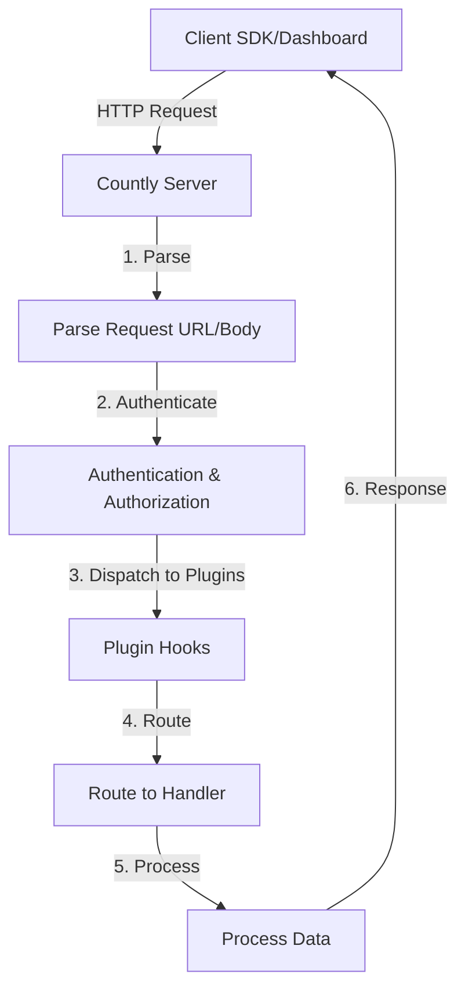
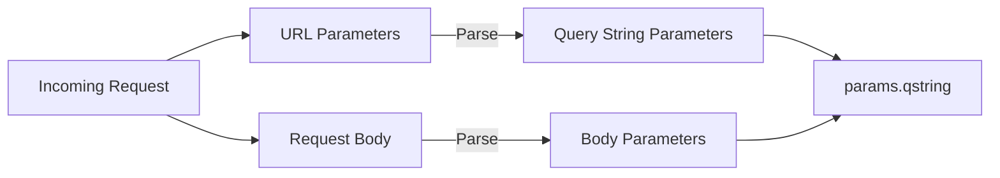
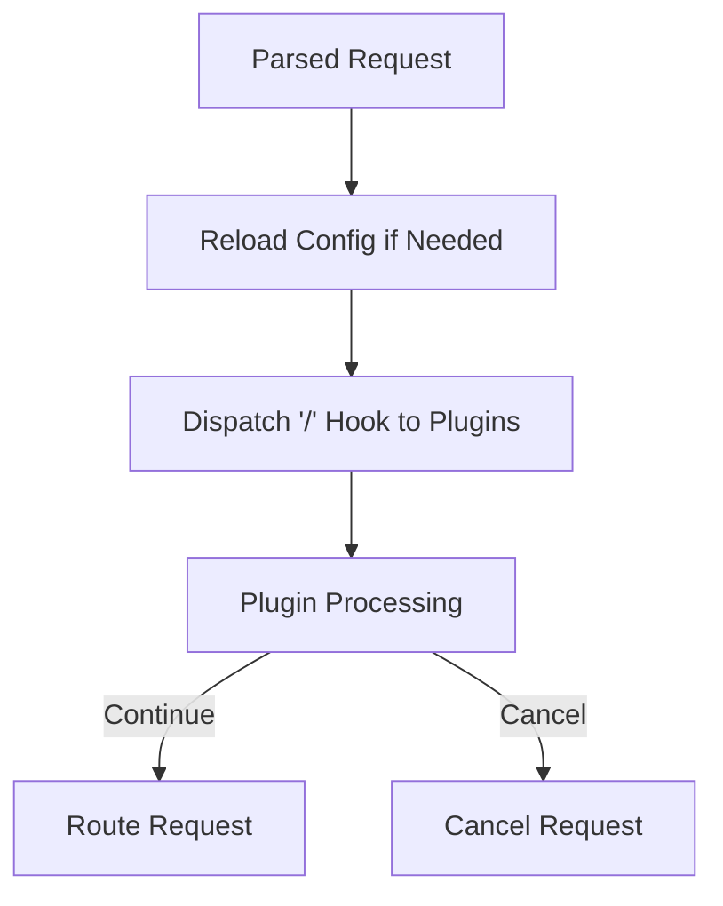
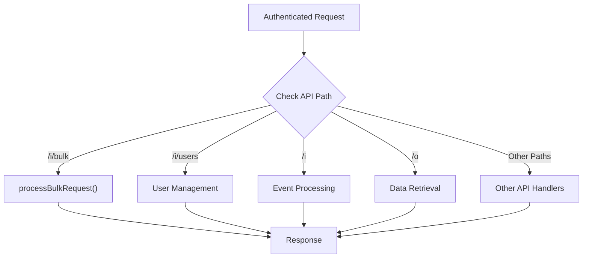
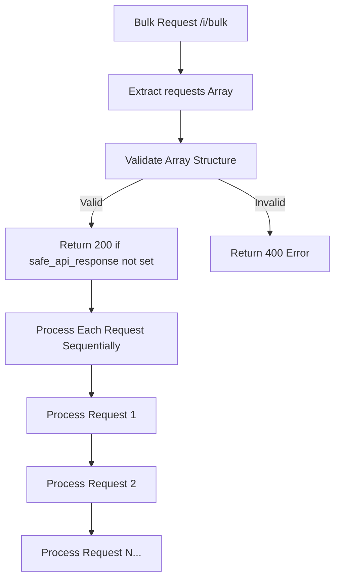
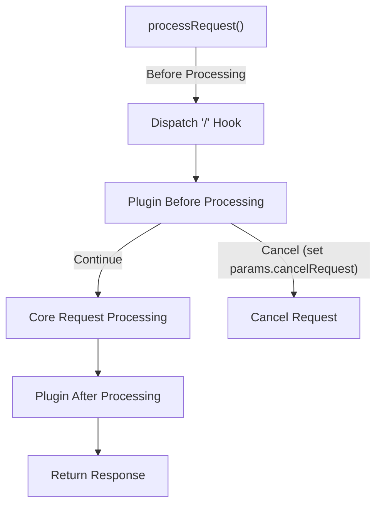
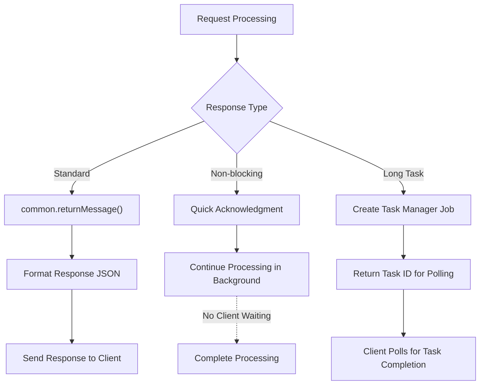

# Request Processing

Relevant source files

The following files were used as context for generating this wiki page:

- [api/api.js](https://github.com/Countly/countly-server/blob/1527df18/api/api.js)
- [api/jobs/task.js](https://github.com/Countly/countly-server/blob/1527df18/api/jobs/task.js)
- [api/jobs/userMerge.js](https://github.com/Countly/countly-server/blob/1527df18/api/jobs/userMerge.js)
- [api/lib/countly.common.js](https://github.com/Countly/countly-server/blob/1527df18/api/lib/countly.common.js)
- [api/parts/data/batcher.js](https://github.com/Countly/countly-server/blob/1527df18/api/parts/data/batcher.js)
- [api/parts/data/events.js](https://github.com/Countly/countly-server/blob/1527df18/api/parts/data/events.js)
- [api/parts/data/fetch.js](https://github.com/Countly/countly-server/blob/1527df18/api/parts/data/fetch.js)
- [api/parts/data/usage.js](https://github.com/Countly/countly-server/blob/1527df18/api/parts/data/usage.js)
- [api/parts/mgmt/app_users.js](https://github.com/Countly/countly-server/blob/1527df18/api/parts/mgmt/app_users.js)
- [api/utils/common.js](https://github.com/Countly/countly-server/blob/1527df18/api/utils/common.js)
- [api/utils/requestProcessor.js](https://github.com/Countly/countly-server/blob/1527df18/api/utils/requestProcessor.js)
- [api/utils/taskmanager.js](https://github.com/Countly/countly-server/blob/1527df18/api/utils/taskmanager.js)
- [frontend/express/app.js](https://github.com/Countly/countly-server/blob/1527df18/frontend/express/app.js)
- [frontend/express/public/core/report-manager/javascripts/countly.views.js](https://github.com/Countly/countly-server/blob/1527df18/frontend/express/public/core/report-manager/javascripts/countly.views.js)
- [frontend/express/public/core/report-manager/stylesheets/_main.scss](https://github.com/Countly/countly-server/blob/1527df18/frontend/express/public/core/report-manager/stylesheets/_main.scss)
- [frontend/express/public/core/report-manager/templates/reportmanager-auto.html](https://github.com/Countly/countly-server/blob/1527df18/frontend/express/public/core/report-manager/templates/reportmanager-auto.html)
- [frontend/express/public/core/report-manager/templates/reportmanager-dialog.html](https://github.com/Countly/countly-server/blob/1527df18/frontend/express/public/core/report-manager/templates/reportmanager-dialog.html)
- [frontend/express/public/core/report-manager/templates/reportmanager-manual.html](https://github.com/Countly/countly-server/blob/1527df18/frontend/express/public/core/report-manager/templates/reportmanager-manual.html)
- [frontend/express/public/core/report-manager/templates/reportmanager-table.html](https://github.com/Countly/countly-server/blob/1527df18/frontend/express/public/core/report-manager/templates/reportmanager-table.html)
- [frontend/express/public/core/report-manager/templates/reportmanager.html](https://github.com/Countly/countly-server/blob/1527df18/frontend/express/public/core/report-manager/templates/reportmanager.html)
- [frontend/express/public/javascripts/countly/countly.common.js](https://github.com/Countly/countly-server/blob/1527df18/frontend/express/public/javascripts/countly/countly.common.js)
- [frontend/express/public/javascripts/countly/countly.event.js](https://github.com/Countly/countly-server/blob/1527df18/frontend/express/public/javascripts/countly/countly.event.js)
- [frontend/express/public/javascripts/countly/countly.helpers.js](https://github.com/Countly/countly-server/blob/1527df18/frontend/express/public/javascripts/countly/countly.helpers.js)
- [frontend/express/public/javascripts/countly/countly.session.js](https://github.com/Countly/countly-server/blob/1527df18/frontend/express/public/javascripts/countly/countly.session.js)
- [frontend/express/public/javascripts/countly/countly.task.manager.js](https://github.com/Countly/countly-server/blob/1527df18/frontend/express/public/javascripts/countly/countly.task.manager.js)
- [frontend/express/public/javascripts/countly/countly.template.js](https://github.com/Countly/countly-server/blob/1527df18/frontend/express/public/javascripts/countly/countly.template.js)
- [frontend/express/public/javascripts/countly/countly.views.js](https://github.com/Countly/countly-server/blob/1527df18/frontend/express/public/javascripts/countly/countly.views.js)
- [frontend/express/public/localization/dashboard/dashboard.properties](https://github.com/Countly/countly-server/blob/1527df18/frontend/express/public/localization/dashboard/dashboard.properties)
- [frontend/express/public/stylesheets/main.css](https://github.com/Countly/countly-server/blob/1527df18/frontend/express/public/stylesheets/main.css)
- [frontend/express/public/stylesheets/styles/overrides/_bulma-overrides.scss](https://github.com/Countly/countly-server/blob/1527df18/frontend/express/public/stylesheets/styles/overrides/_bulma-overrides.scss)
- [frontend/express/views/dashboard.html](https://github.com/Countly/countly-server/blob/1527df18/frontend/express/views/dashboard.html)
- [plugins/dbviewer/tests.js](https://github.com/Countly/countly-server/blob/1527df18/plugins/dbviewer/tests.js)
- [plugins/pluginManager.js](https://github.com/Countly/countly-server/blob/1527df18/plugins/pluginManager.js)
- [plugins/plugins/api/api.js](https://github.com/Countly/countly-server/blob/1527df18/plugins/plugins/api/api.js)
- [plugins/plugins/frontend/app.js](https://github.com/Countly/countly-server/blob/1527df18/plugins/plugins/frontend/app.js)
- [plugins/plugins/frontend/public/javascripts/countly.models.js](https://github.com/Countly/countly-server/blob/1527df18/plugins/plugins/frontend/public/javascripts/countly.models.js)
- [plugins/plugins/frontend/public/javascripts/countly.views.js](https://github.com/Countly/countly-server/blob/1527df18/plugins/plugins/frontend/public/javascripts/countly.views.js)
- [plugins/plugins/frontend/public/localization/plugins.properties](https://github.com/Countly/countly-server/blob/1527df18/plugins/plugins/frontend/public/localization/plugins.properties)
- [plugins/plugins/frontend/public/stylesheets/main.scss](https://github.com/Countly/countly-server/blob/1527df18/plugins/plugins/frontend/public/stylesheets/main.scss)
- [plugins/plugins/frontend/public/templates/configurations.html](https://github.com/Countly/countly-server/blob/1527df18/plugins/plugins/frontend/public/templates/configurations.html)
- [plugins/plugins/frontend/public/templates/plugins.html](https://github.com/Countly/countly-server/blob/1527df18/plugins/plugins/frontend/public/templates/plugins.html)
- [plugins/plugins/tests.js](https://github.com/Countly/countly-server/blob/1527df18/plugins/plugins/tests.js)
- [plugins/star-rating/tests.js](https://github.com/Countly/countly-server/blob/1527df18/plugins/star-rating/tests.js)

This document details how Countly processes incoming API requests from SDKs and frontend applications, routing them to appropriate handlers. This is a core component of Countly's backend architecture, responsible for receiving, parsing, validating, and processing all incoming requests. For information about data batching and storage which happens after processing, see [Data Batching and Storage](#3.2).

## Request Processing Overview

Countly's request processing system handles all incoming HTTP requests and routes them to appropriate handlers. The system supports various API endpoints with two primary types of requests:

1. **Read requests** (`/o/*`): Used to fetch analytics data from the server
2. **Write requests** (`/i/*`): Used to record events, sessions, and other analytics data

These requests are processed through a pipeline that includes parsing, validation, authentication, and routing.

Sources: [api/utils/requestProcessor.js:101-175](https://github.com/Countly/countly-server/blob/1527df18/api/utils/requestProcessor.js#L101-L175), [api/api.js:198-234](https://github.com/Countly/countly-server/blob/1527df18/api/api.js#L198-L234)

## Core Request Processing Components

The request processing system is centered around the `processRequest` function in the requestProcessor module. This function coordinates the entire request handling flow.

### Request Parsing and Parameter Extraction

When a request is received, Countly first parses the URL and extracts all parameters from both the URL query string and request body. These parameters are combined into a unified object called `params.qstring`.

Key steps in parameter parsing:
1. Parse the URL and extract path components
2. Extract query string parameters
3. Extract and merge body parameters
4. Validate critical parameters like `app_id` and `user_id`
5. Set up the API path for routing

Sources: [api/utils/requestProcessor.js:101-160](https://github.com/Countly/countly-server/blob/1527df18/api/utils/requestProcessor.js#L101-L160)

### Request Authentication and Plugin Dispatch

After parsing, the system reloads configuration if needed and dispatches the request to plugins via the dispatch hook system. Plugins can intercept requests at this stage to perform custom processing or validation.

Authentication is performed through various validation functions:
- `validateAppForWriteAPI` - Validates the app for write operations
- `validateUserForDataReadAPI` - Validates user permissions for data reading
- `validateUserForDataWriteAPI` - Validates user permissions for data writing
- `validateUserForGlobalAdmin` - Validates if user is a global admin

Sources: [api/utils/requestProcessor.js:161-175](https://github.com/Countly/countly-server/blob/1527df18/api/utils/requestProcessor.js#L161-L175), [api/utils/rights.js](https://github.com/Countly/countly-server/blob/1527df18/api/utils/rights.js)

### Request Routing and Handling

After authentication and plugin processing, the request is routed to the appropriate handler based on the API path:

Common API paths include:
- `/i/bulk` - For processing multiple requests in a single call
- `/i/users` - For user management operations
- `/i` - For recording events and analytics data
- `/o` - For retrieving analytics data

Sources: [api/utils/requestProcessor.js:176-2092](https://github.com/Countly/countly-server/blob/1527df18/api/utils/requestProcessor.js#L176-L2092)

## Bulk Request Processing

Countly supports bulk processing of multiple requests in a single HTTP call via the `/i/bulk` endpoint. This is especially useful for clients that need to send batched data to reduce network overhead.

When a bulk request is received, the system:
1. Extracts the array of requests from the `requests` parameter
2. Validates the requests array structure
3. Optionally returns a quick success response to the client (non-blocking)
4. Processes each request in the array sequentially

The bulk request processing is implemented in the `processBulkRequest` function, which recursively processes each request in the array.

Sources: [api/utils/requestProcessor.js:178-204](https://github.com/Countly/countly-server/blob/1527df18/api/utils/requestProcessor.js#L178-L204), [api/utils/requestProcessor.js:2108-2131](https://github.com/Countly/countly-server/blob/1527df18/api/utils/requestProcessor.js#L2108-L2131)

## Plugin Integration in Request Processing

Plugins can integrate with the request processing pipeline through Countly's plugin system. Plugins can register hooks that get triggered at various points in the request lifecycle.

Plugins can:
1. Intercept requests before core processing
2. Modify request parameters
3. Cancel requests by setting `params.cancelRequest = true`
4. Process requests after core processing
5. Register handlers for specific API paths

This plugin architecture allows Countly to be highly extensible without modifying the core code.

Sources: [api/utils/requestProcessor.js:164-175](https://github.com/Countly/countly-server/blob/1527df18/api/utils/requestProcessor.js#L164-L175), [plugins/pluginManager.js:1131-1206](https://github.com/Countly/countly-server/blob/1527df18/plugins/pluginManager.js#L1131-L1206)

## Request Context (params object)

All request processing functions use a `params` object that contains the context of the request. This object is initialized by the `processRequest` function and passed through the entire processing pipeline.

Key properties of the `params` object:

| Property | Description |
|----------|-------------|
| `req` | The original request object |
| `res` | The response object for sending responses |
| `qstring` | Combined query string and body parameters |
| `paths` | Array of URL path components |
| `apiPath` | The API path (e.g., "/i/bulk") |
| `fullPath` | The complete URL path |
| `href` | The complete URL including query string |
| `urlParts` | Parsed URL object |
| `app_id` | The application ID for the request |
| `app` | The application object loaded from the database |
| `time` | Time-related properties for the request |
| `member` | The authenticated user if applicable |

This context object is essential for all request processing functions as it contains all the information needed to process the request correctly.

Sources: [api/utils/requestProcessor.js:101-162](https://github.com/Countly/countly-server/blob/1527df18/api/utils/requestProcessor.js#L101-L162)

## Response Handling

After processing a request, Countly sends a response back to the client. Responses can be:

1. **Success responses** - Standard success responses with optional data
2. **Error responses** - Error messages with appropriate HTTP status codes
3. **Chunked responses** - For long-running operations or large data sets
4. **Non-blocking responses** - Return immediately while processing continues in the background

Most API responses use the `common.returnMessage` utility function, which formats the response appropriately based on the request type and parameters.

For non-blocking bulk operations, Countly can return an immediate success response while continuing to process the data in the background.

Sources: [api/utils/requestProcessor.js:2132-2171](https://github.com/Countly/countly-server/blob/1527df18/api/utils/requestProcessor.js#L2132-L2171), [api/utils/common.js:1120-1158](https://github.com/Countly/countly-server/blob/1527df18/api/utils/common.js#L1120-L1158)

## Error Handling

Countly implements comprehensive error handling throughout the request processing pipeline. Common error scenarios include:

1. Missing or invalid parameters
2. Authentication failures
3. Authorization failures (insufficient permissions)
4. Internal processing errors
5. Database errors

Errors are typically returned to the client with appropriate HTTP status codes and error messages using the `common.returnMessage` function.

For bulk requests, errors in individual requests don't affect processing of other requests in the batch. Each error is logged and processing continues with the next request.

Sources: [api/utils/requestProcessor.js:135-143](https://github.com/Countly/countly-server/blob/1527df18/api/utils/requestProcessor.js#L135-L143), [api/utils/common.js:1134-1158](https://github.com/Countly/countly-server/blob/1527df18/api/utils/common.js#L1134-L1158)

## Conclusion

The request processing system is a critical component of Countly's architecture, handling all incoming requests from SDKs and frontend applications. The system provides a flexible and extensible pipeline for parsing, validating, authenticating, and processing requests, with integration points for plugins to extend functionality.