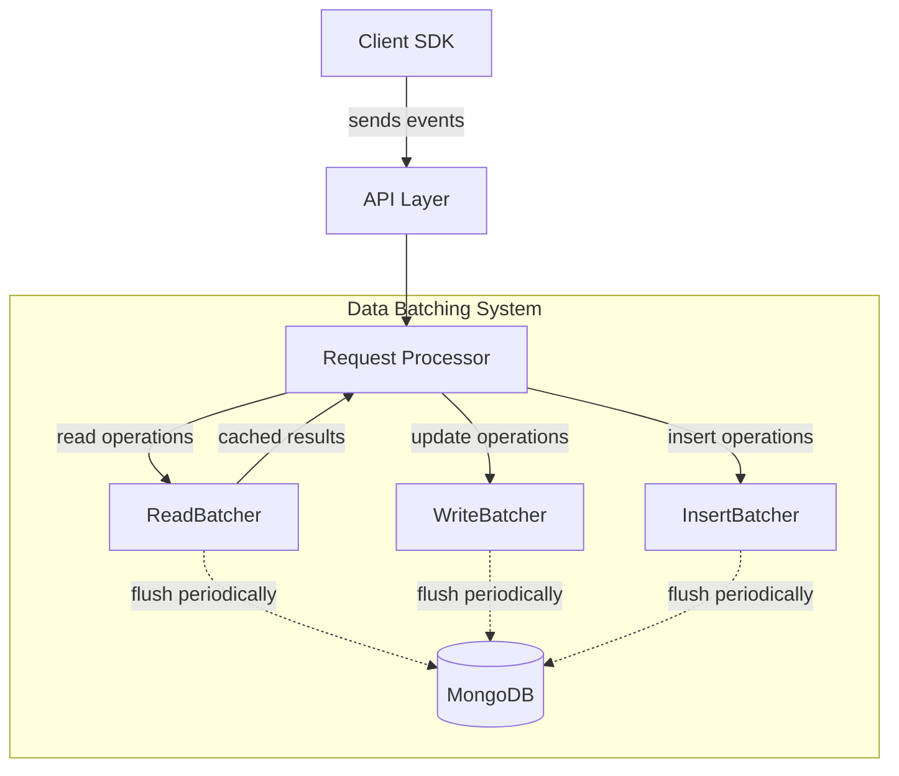
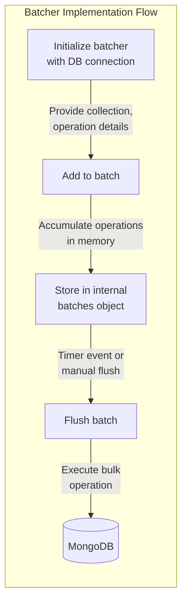
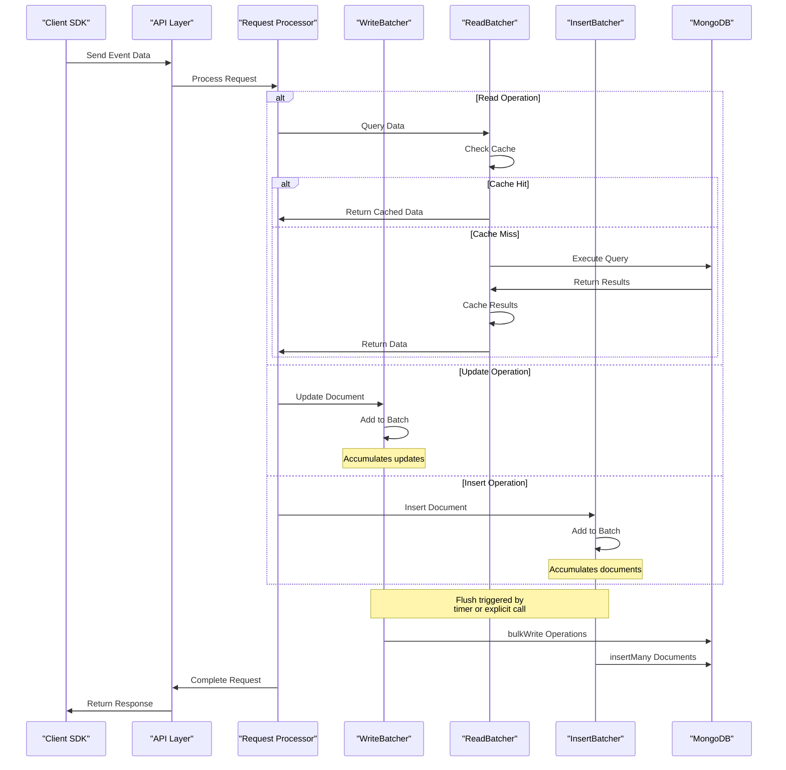
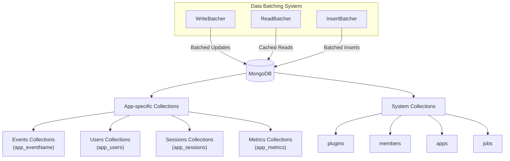

# Data Batching and Storage

<details>
<summary>Relevant source files</summary>

The following files were used as context for generating this wiki page:

- [api/api.js](https://github.com/Countly/countly-server/blob/1527df18/api/api.js)
- [api/jobs/task.js](https://github.com/Countly/countly-server/blob/1527df18/api/jobs/task.js)
- [api/jobs/userMerge.js](https://github.com/Countly/countly-server/blob/1527df18/api/jobs/userMerge.js)
- [api/lib/countly.common.js](https://github.com/Countly/countly-server/blob/1527df18/api/lib/countly.common.js)
- [api/parts/data/batcher.js](https://github.com/Countly/countly-server/blob/1527df18/api/parts/data/batcher.js)
- [api/parts/data/events.js](https://github.com/Countly/countly-server/blob/1527df18/api/parts/data/events.js)
- [api/parts/data/fetch.js](https://github.com/Countly/countly-server/blob/1527df18/api/parts/data/fetch.js)
- [api/parts/data/usage.js](https://github.com/Countly/countly-server/blob/1527df18/api/parts/data/usage.js)
- [api/parts/mgmt/app_users.js](https://github.com/Countly/countly-server/blob/1527df18/api/parts/mgmt/app_users.js)
- [api/utils/common.js](https://github.com/Countly/countly-server/blob/1527df18/api/utils/common.js)
- [api/utils/requestProcessor.js](https://github.com/Countly/countly-server/blob/1527df18/api/utils/requestProcessor.js)
- [api/utils/taskmanager.js](https://github.com/Countly/countly-server/blob/1527df18/api/utils/taskmanager.js)
- [frontend/express/app.js](https://github.com/Countly/countly-server/blob/1527df18/frontend/express/app.js)
- [frontend/express/public/core/report-manager/javascripts/countly.views.js](https://github.com/Countly/countly-server/blob/1527df18/frontend/express/public/core/report-manager/javascripts/countly.views.js)
- [frontend/express/public/core/report-manager/stylesheets/_main.scss](https://github.com/Countly/countly-server/blob/1527df18/frontend/express/public/core/report-manager/stylesheets/_main.scss)
- [frontend/express/public/core/report-manager/templates/reportmanager-auto.html](https://github.com/Countly/countly-server/blob/1527df18/frontend/express/public/core/report-manager/templates/reportmanager-auto.html)
- [frontend/express/public/core/report-manager/templates/reportmanager-dialog.html](https://github.com/Countly/countly-server/blob/1527df18/frontend/express/public/core/report-manager/templates/reportmanager-dialog.html)
- [frontend/express/public/core/report-manager/templates/reportmanager-manual.html](https://github.com/Countly/countly-server/blob/1527df18/frontend/express/public/core/report-manager/templates/reportmanager-manual.html)
- [frontend/express/public/core/report-manager/templates/reportmanager-table.html](https://github.com/Countly/countly-server/blob/1527df18/frontend/express/public/core/report-manager/templates/reportmanager-table.html)
- [frontend/express/public/core/report-manager/templates/reportmanager.html](https://github.com/Countly/countly-server/blob/1527df18/frontend/express/public/core/report-manager/templates/reportmanager.html)
- [frontend/express/public/javascripts/countly/countly.common.js](https://github.com/Countly/countly-server/blob/1527df18/frontend/express/public/javascripts/countly/countly.common.js)
- [frontend/express/public/javascripts/countly/countly.event.js](https://github.com/Countly/countly-server/blob/1527df18/frontend/express/public/javascripts/countly/countly.event.js)
- [frontend/express/public/javascripts/countly/countly.helpers.js](https://github.com/Countly/countly-server/blob/1527df18/frontend/express/public/javascripts/countly/countly.helpers.js)
- [frontend/express/public/javascripts/countly/countly.session.js](https://github.com/Countly/countly-server/blob/1527df18/frontend/express/public/javascripts/countly/countly.session.js)
- [frontend/express/public/javascripts/countly/countly.task.manager.js](https://github.com/Countly/countly-server/blob/1527df18/frontend/express/public/javascripts/countly/countly.task.manager.js)
- [frontend/express/public/javascripts/countly/countly.template.js](https://github.com/Countly/countly-server/blob/1527df18/frontend/express/public/javascripts/countly/countly.template.js)
- [frontend/express/public/javascripts/countly/countly.views.js](https://github.com/Countly/countly-server/blob/1527df18/frontend/express/public/javascripts/countly/countly.views.js)
- [frontend/express/public/localization/dashboard/dashboard.properties](https://github.com/Countly/countly-server/blob/1527df18/frontend/express/public/localization/dashboard/dashboard.properties)
- [frontend/express/public/stylesheets/main.css](https://github.com/Countly/countly-server/blob/1527df18/frontend/express/public/stylesheets/main.css)
- [frontend/express/public/stylesheets/styles/overrides/_bulma-overrides.scss](https://github.com/Countly/countly-server/blob/1527df18/frontend/express/public/stylesheets/styles/overrides/_bulma-overrides.scss)
- [frontend/express/views/dashboard.html](https://github.com/Countly/countly-server/blob/1527df18/frontend/express/views/dashboard.html)
- [plugins/dbviewer/tests.js](https://github.com/Countly/countly-server/blob/1527df18/plugins/dbviewer/tests.js)
- [plugins/pluginManager.js](https://github.com/Countly/countly-server/blob/1527df18/plugins/pluginManager.js)
- [plugins/plugins/api/api.js](https://github.com/Countly/countly-server/blob/1527df18/plugins/plugins/api/api.js)
- [plugins/plugins/frontend/app.js](https://github.com/Countly/countly-server/blob/1527df18/plugins/plugins/frontend/app.js)
- [plugins/plugins/frontend/public/javascripts/countly.models.js](https://github.com/Countly/countly-server/blob/1527df18/plugins/plugins/frontend/public/javascripts/countly.models.js)
- [plugins/plugins/frontend/public/javascripts/countly.views.js](https://github.com/Countly/countly-server/blob/1527df18/plugins/plugins/frontend/public/javascripts/countly.views.js)
- [plugins/plugins/frontend/public/localization/plugins.properties](https://github.com/Countly/countly-server/blob/1527df18/plugins/plugins/frontend/public/localization/plugins.properties)
- [plugins/plugins/frontend/public/stylesheets/main.scss](https://github.com/Countly/countly-server/blob/1527df18/plugins/plugins/frontend/public/stylesheets/main.scss)
- [plugins/plugins/frontend/public/templates/configurations.html](https://github.com/Countly/countly-server/blob/1527df18/plugins/plugins/frontend/public/templates/configurations.html)
- [plugins/plugins/frontend/public/templates/plugins.html](https://github.com/Countly/countly-server/blob/1527df18/plugins/plugins/frontend/public/templates/plugins.html)
- [plugins/plugins/tests.js](https://github.com/Countly/countly-server/blob/1527df18/plugins/plugins/tests.js)
- [plugins/star-rating/tests.js](https://github.com/Countly/countly-server/blob/1527df18/plugins/star-rating/tests.js)

</details>


This document explains Countly's data batching and storage system, which optimizes database operations by grouping multiple operations together and executing them as batches. This approach significantly improves performance, particularly for high-volume analytics data collection, by reducing the number of database operations and leveraging MongoDB's bulk operation capabilities.

For information about handling user data, see [User Management](#4.7). For information about data exports, see [Export System](#3.4.2).

## Overview

The Countly batching system consists of three specialized batcher types that handle different database operation types:

1. **WriteBatcher**: Optimizes update operations
2. **ReadBatcher**: Handles read operations with caching
3. **InsertBatcher**: Optimizes document insertions

Each batcher operates independently, collecting operations in memory and flushing them to the database at configured intervals or when explicitly triggered.

## Batching Architecture



Sources: [api/api.js:38-44](https://github.com/Countly/countly-server/blob/1527df18/api/api.js#L38-L44), [api/parts/data/batcher.js:1-9](https://github.com/Countly/countly-server/blob/1527df18/api/parts/data/batcher.js#L1-L9)

The batching system is initialized during application startup in the API process. The batchers are created and attached to the common utility object, making them accessible throughout the application.

## Batcher Types

### WriteBatcher

The WriteBatcher collects document update operations, grouping them by collection and document ID. When flushed, it executes all updates as a single batch operation using MongoDB's bulkWrite capability.

Key features:
- Batches updates by collection and document ID 
- Combines multiple updates to the same document
- Uses MongoDB's bulkWrite for efficient updates
- Optimizes throughput for write-heavy workloads

### ReadBatcher

The ReadBatcher implements a caching layer for database read operations. It stores query results in memory, allowing the system to retrieve data from the cache instead of repeatedly querying the database for the same information.

Key features:
- Caches query results by collection, query parameters, and options
- Implements Time-To-Live (TTL) for cache entries
- Checks cache before accessing the database
- Automatically expires cache entries after the configured TTL

### InsertBatcher

The InsertBatcher accumulates document insert operations by collection. When flushed, it inserts all documents in a single batch using MongoDB's insertMany method.

Key features:
- Batches inserts by collection
- Uses MongoDB's insertMany for efficient batch inserts
- Optimizes throughput for high-volume data ingestion



Sources: [api/parts/data/batcher.js](https://github.com/Countly/countly-server/blob/1527df18/api/parts/data/batcher.js)

## Configuration

The batching system can be configured through Countly API settings. Key configuration options include:

| Configuration Option | Description | Default |
|----------------------|-------------|---------|
| batch_processing | Enable/disable batch processing | true |
| batch_period | Time in seconds between flush operations for write/insert batchers | 10 |
| batch_read_processing | Enable/disable batch processing for read operations | true |
| batch_read_ttl | Time to live (in seconds) for read cache entries | 600 |
| batch_read_period | Time in seconds between read batcher operations | 60 |

These settings can be adjusted based on application needs, trading off between performance and data freshness.

Sources: [api/api.js:76-86](https://github.com/Countly/countly-server/blob/1527df18/api/api.js#L76-L86)

## Data Flow Through Batchers



Sources: [api/parts/data/batcher.js](https://github.com/Countly/countly-server/blob/1527df18/api/parts/data/batcher.js), [api/utils/requestProcessor.js](https://github.com/Countly/countly-server/blob/1527df18/api/utils/requestProcessor.js)

### Operation Batching

1. **Read Operations**:
   - When a read operation is requested, the system first checks the ReadBatcher's cache
   - If the data exists in cache and hasn't expired, it's returned immediately
   - If not found, the system queries MongoDB and caches the result for future use

2. **Write Operations**:
   - Update operations are added to the WriteBatcher
   - The batcher groups operations by collection and document ID
   - Multiple updates to the same document are combined when possible
   - Updates are executed as a bulk operation when flushed

3. **Insert Operations**:
   - Insert operations are added to the InsertBatcher
   - The batcher groups documents by collection
   - Documents are inserted in bulk when flushed

### Batch Flushing

Batches are flushed to the database in two ways:

1. **Automatically**: At regular intervals based on the configuration (batch_period and batch_read_period)
2. **Manually**: When explicitly called, such as during application shutdown

During a flush operation:
- WriteBatcher uses MongoDB's bulkWrite capability to execute multiple updates efficiently
- InsertBatcher uses insertMany to perform bulk inserts
- ReadBatcher may expire cache entries based on TTL

Sources: [api/api.js:152-169](https://github.com/Countly/countly-server/blob/1527df18/api/api.js#L152-L169)

## Graceful Shutdown

The system implements graceful shutdown handling to ensure data isn't lost when the application stops:

```javascript
async function storeBatchedData(code) {
    try {
        await common.writeBatcher.flushAll();
        await common.insertBatcher.flushAll();
        console.log("Successfully stored batch state");
    }
    catch (ex) {
        console.log("Could not store batch state", ex);
    }
    process.exit(typeof code === "number" ? code : 1);
}
```

This function is called during application shutdown to flush all pending batches before exiting.

Sources: [api/api.js:152-169](https://github.com/Countly/countly-server/blob/1527df18/api/api.js#L152-L169), [api/api.js:175-195](https://github.com/Countly/countly-server/blob/1527df18/api/api.js#L175-L195)

## Storage Structure



Sources: [api/api.js:38-44](https://github.com/Countly/countly-server/blob/1527df18/api/api.js#L38-L44), [api/parts/data/batcher.js](https://github.com/Countly/countly-server/blob/1527df18/api/parts/data/batcher.js)

After batching, data is stored in MongoDB using a collection-based approach:

- Each app in Countly has its own set of collections for storing various types of data
- Collections are organized by data type (events, users, sessions, metrics)
- The batching system optimizes operations across all these collections

## Performance Considerations

The batching system significantly improves performance by:

1. **Reducing Database Operations**: Combining multiple operations into batches
2. **Caching**: Storing frequently accessed data in memory
3. **Operation Optimization**: Combining updates to the same document
4. **Bulk Operations**: Leveraging MongoDB's bulk operation capabilities

However, there are trade-offs:

| Benefit | Trade-off |
|---------|-----------|
| Improved throughput | Data is not immediately persisted |
| Reduced database load | Slight delay in data availability |
| Better resource utilization | Increased memory usage for batches |
| Optimized operation patterns | Potential data loss on unexpected failures |

Countly addresses these trade-offs through:
- Configurable batch periods to balance performance and data freshness
- Graceful shutdown procedures that flush all batches
- Error handling and recovery mechanisms

Sources: [api/api.js:76-86](https://github.com/Countly/countly-server/blob/1527df18/api/api.js#L76-L86), [api/api.js:152-169](https://github.com/Countly/countly-server/blob/1527df18/api/api.js#L152-L169)

## Batch Statistics and Monitoring

The batching system maintains statistics about its operations, which can be useful for monitoring and troubleshooting:

```javascript
var batcherStats = {
    key: 'BATCHER_STATS',
    pid: process.pid,
    worker: cluster.isMaster ? 'master' : 'worker',
    write: {},
    read: {},
    insert: {}
};
```

These statistics include information about batch sizes, processing times, and error rates, allowing administrators to optimize the batching configuration.

Sources: [api/parts/data/batcher.js:7-15](https://github.com/Countly/countly-server/blob/1527df18/api/parts/data/batcher.js#L7-L15)

## Conclusion

The Data Batching and Storage system is a critical component of Countly's architecture that enables efficient handling of large volumes of analytics data. By batching database operations and implementing intelligent caching, it optimizes performance while maintaining data integrity and reliability.