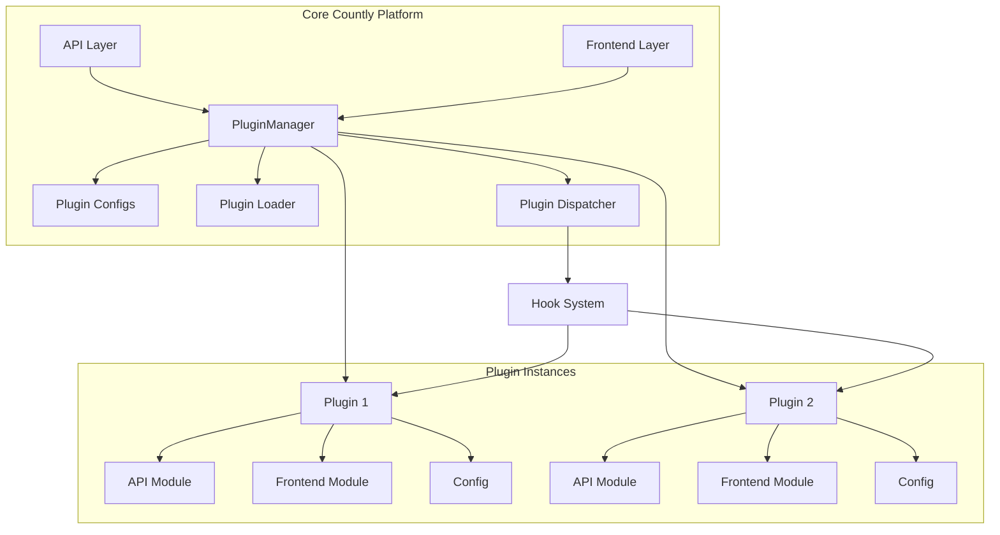
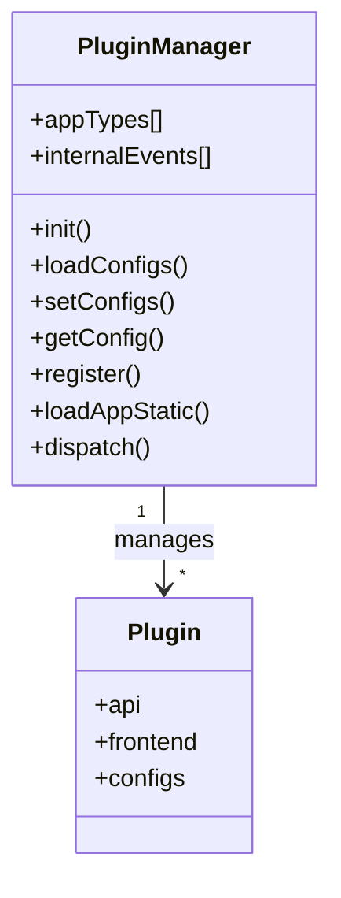
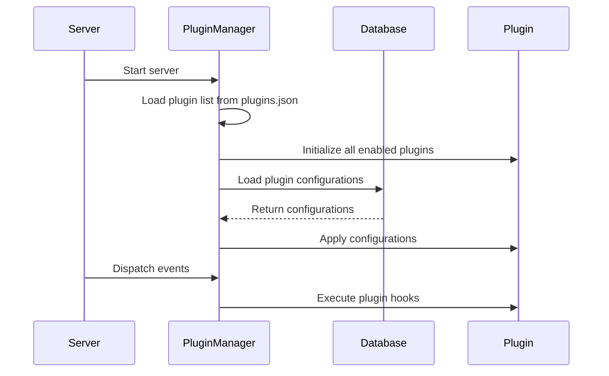
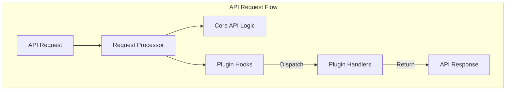
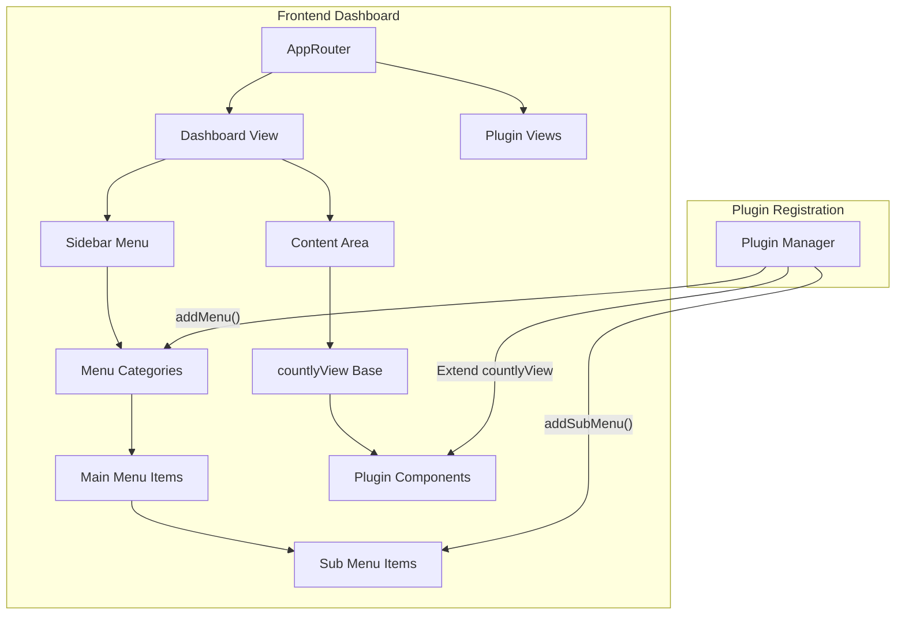
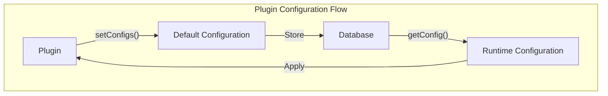
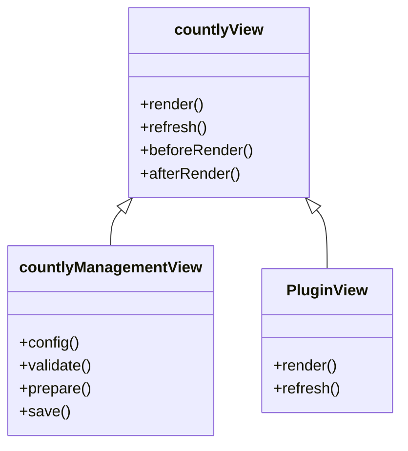
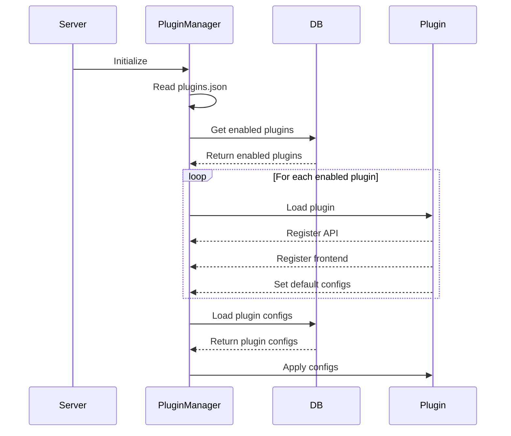
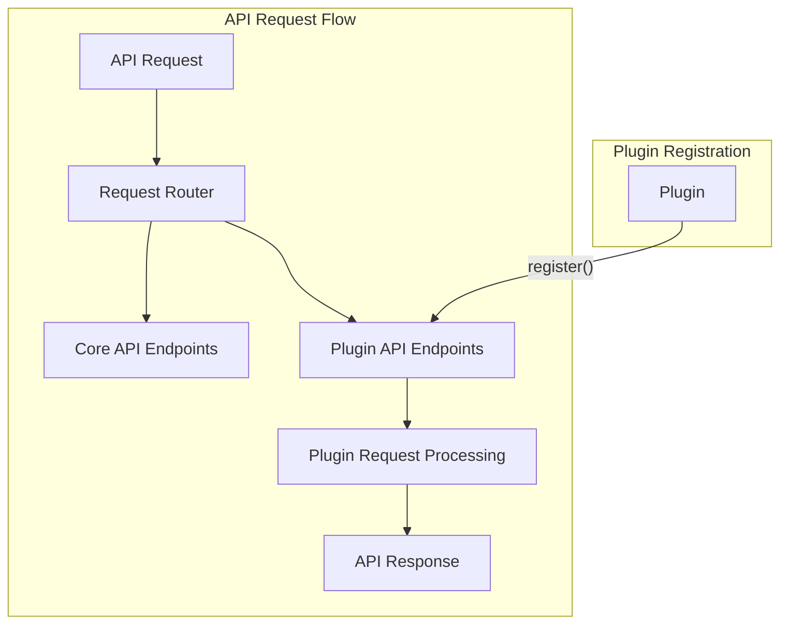
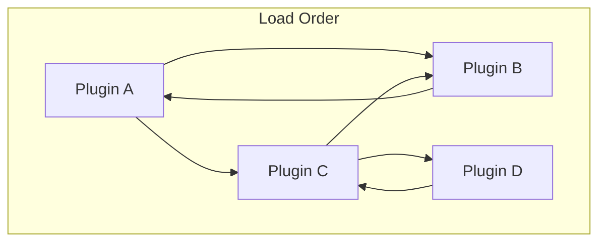

# Plugin System

<details>
<summary>Relevant source files</summary>

The following files were used as context for generating this wiki page:

- [api/api.js](https://github.com/Countly/countly-server/blob/1527df18/api/api.js)
- [api/lib/countly.common.js](https://github.com/Countly/countly-server/blob/1527df18/api/lib/countly.common.js)
- [api/parts/data/batcher.js](https://github.com/Countly/countly-server/blob/1527df18/api/parts/data/batcher.js)
- [api/parts/data/events.js](https://github.com/Countly/countly-server/blob/1527df18/api/parts/data/events.js)
- [api/parts/data/fetch.js](https://github.com/Countly/countly-server/blob/1527df18/api/parts/data/fetch.js)
- [api/parts/data/usage.js](https://github.com/Countly/countly-server/blob/1527df18/api/parts/data/usage.js)
- [api/utils/common.js](https://github.com/Countly/countly-server/blob/1527df18/api/utils/common.js)
- [api/utils/requestProcessor.js](https://github.com/Countly/countly-server/blob/1527df18/api/utils/requestProcessor.js)
- [frontend/express/app.js](https://github.com/Countly/countly-server/blob/1527df18/frontend/express/app.js)
- [frontend/express/public/javascripts/countly/countly.common.js](https://github.com/Countly/countly-server/blob/1527df18/frontend/express/public/javascripts/countly/countly.common.js)
- [frontend/express/public/javascripts/countly/countly.event.js](https://github.com/Countly/countly-server/blob/1527df18/frontend/express/public/javascripts/countly/countly.event.js)
- [frontend/express/public/javascripts/countly/countly.helpers.js](https://github.com/Countly/countly-server/blob/1527df18/frontend/express/public/javascripts/countly/countly.helpers.js)
- [frontend/express/public/javascripts/countly/countly.session.js](https://github.com/Countly/countly-server/blob/1527df18/frontend/express/public/javascripts/countly/countly.session.js)
- [frontend/express/public/javascripts/countly/countly.template.js](https://github.com/Countly/countly-server/blob/1527df18/frontend/express/public/javascripts/countly/countly.template.js)
- [frontend/express/public/javascripts/countly/countly.views.js](https://github.com/Countly/countly-server/blob/1527df18/frontend/express/public/javascripts/countly/countly.views.js)
- [frontend/express/public/localization/dashboard/dashboard.properties](https://github.com/Countly/countly-server/blob/1527df18/frontend/express/public/localization/dashboard/dashboard.properties)
- [frontend/express/public/stylesheets/main.css](https://github.com/Countly/countly-server/blob/1527df18/frontend/express/public/stylesheets/main.css)
- [frontend/express/views/dashboard.html](https://github.com/Countly/countly-server/blob/1527df18/frontend/express/views/dashboard.html)
- [plugins/crashes/api/api.js](https://github.com/Countly/countly-server/blob/1527df18/plugins/crashes/api/api.js)
- [plugins/crashes/api/parts/stacktrace.js](https://github.com/Countly/countly-server/blob/1527df18/plugins/crashes/api/parts/stacktrace.js)
- [plugins/crashes/frontend/app.js](https://github.com/Countly/countly-server/blob/1527df18/plugins/crashes/frontend/app.js)
- [plugins/crashes/frontend/public/javascripts/countly.common.components.js](https://github.com/Countly/countly-server/blob/1527df18/plugins/crashes/frontend/public/javascripts/countly.common.components.js)
- [plugins/crashes/frontend/public/javascripts/countly.models.js](https://github.com/Countly/countly-server/blob/1527df18/plugins/crashes/frontend/public/javascripts/countly.models.js)
- [plugins/crashes/frontend/public/javascripts/countly.views.js](https://github.com/Countly/countly-server/blob/1527df18/plugins/crashes/frontend/public/javascripts/countly.views.js)
- [plugins/crashes/frontend/public/localization/crashes.properties](https://github.com/Countly/countly-server/blob/1527df18/plugins/crashes/frontend/public/localization/crashes.properties)
- [plugins/crashes/frontend/public/stylesheets/crashes.scss](https://github.com/Countly/countly-server/blob/1527df18/plugins/crashes/frontend/public/stylesheets/crashes.scss)
- [plugins/crashes/frontend/public/templates/crashgroup.html](https://github.com/Countly/countly-server/blob/1527df18/plugins/crashes/frontend/public/templates/crashgroup.html)
- [plugins/crashes/frontend/public/templates/overview.html](https://github.com/Countly/countly-server/blob/1527df18/plugins/crashes/frontend/public/templates/overview.html)
- [plugins/crashes/frontend/public/templates/stacktrace.html](https://github.com/Countly/countly-server/blob/1527df18/plugins/crashes/frontend/public/templates/stacktrace.html)
- [plugins/dbviewer/tests.js](https://github.com/Countly/countly-server/blob/1527df18/plugins/dbviewer/tests.js)
- [plugins/pluginManager.js](https://github.com/Countly/countly-server/blob/1527df18/plugins/pluginManager.js)
- [plugins/plugins/api/api.js](https://github.com/Countly/countly-server/blob/1527df18/plugins/plugins/api/api.js)
- [plugins/plugins/frontend/app.js](https://github.com/Countly/countly-server/blob/1527df18/plugins/plugins/frontend/app.js)
- [plugins/plugins/frontend/public/javascripts/countly.models.js](https://github.com/Countly/countly-server/blob/1527df18/plugins/plugins/frontend/public/javascripts/countly.models.js)
- [plugins/plugins/frontend/public/javascripts/countly.views.js](https://github.com/Countly/countly-server/blob/1527df18/plugins/plugins/frontend/public/javascripts/countly.views.js)
- [plugins/plugins/frontend/public/localization/plugins.properties](https://github.com/Countly/countly-server/blob/1527df18/plugins/plugins/frontend/public/localization/plugins.properties)
- [plugins/plugins/frontend/public/stylesheets/main.scss](https://github.com/Countly/countly-server/blob/1527df18/plugins/plugins/frontend/public/stylesheets/main.scss)
- [plugins/plugins/frontend/public/templates/configurations.html](https://github.com/Countly/countly-server/blob/1527df18/plugins/plugins/frontend/public/templates/configurations.html)
- [plugins/plugins/frontend/public/templates/plugins.html](https://github.com/Countly/countly-server/blob/1527df18/plugins/plugins/frontend/public/templates/plugins.html)
- [plugins/plugins/tests.js](https://github.com/Countly/countly-server/blob/1527df18/plugins/plugins/tests.js)
- [plugins/push/frontend/public/javascripts/countly.models.js](https://github.com/Countly/countly-server/blob/1527df18/plugins/push/frontend/public/javascripts/countly.models.js)
- [plugins/push/frontend/public/javascripts/countly.views.component.common.js](https://github.com/Countly/countly-server/blob/1527df18/plugins/push/frontend/public/javascripts/countly.views.component.common.js)
- [plugins/push/frontend/public/javascripts/countly.views.js](https://github.com/Countly/countly-server/blob/1527df18/plugins/push/frontend/public/javascripts/countly.views.js)
- [plugins/push/frontend/public/stylesheets/main.scss](https://github.com/Countly/countly-server/blob/1527df18/plugins/push/frontend/public/stylesheets/main.scss)
- [plugins/push/frontend/public/templates/common-components.html](https://github.com/Countly/countly-server/blob/1527df18/plugins/push/frontend/public/templates/common-components.html)
- [plugins/push/frontend/public/templates/push-notification-app-config.html](https://github.com/Countly/countly-server/blob/1527df18/plugins/push/frontend/public/templates/push-notification-app-config.html)
- [plugins/push/frontend/public/templates/push-notification-details.html](https://github.com/Countly/countly-server/blob/1527df18/plugins/push/frontend/public/templates/push-notification-details.html)
- [plugins/push/frontend/public/templates/push-notification-drawer.html](https://github.com/Countly/countly-server/blob/1527df18/plugins/push/frontend/public/templates/push-notification-drawer.html)
- [plugins/push/frontend/public/templates/push-notification-tab.html](https://github.com/Countly/countly-server/blob/1527df18/plugins/push/frontend/public/templates/push-notification-tab.html)
- [plugins/push/frontend/public/templates/push-notification.html](https://github.com/Countly/countly-server/blob/1527df18/plugins/push/frontend/public/templates/push-notification.html)
- [plugins/star-rating/tests.js](https://github.com/Countly/countly-server/blob/1527df18/plugins/star-rating/tests.js)

</details>


The Countly Plugin System is a robust framework that allows the Countly analytics platform to be extended with custom functionality. It provides a structured way to integrate new features into both the server-side API and the frontend dashboard without modifying the core codebase. This document covers the architecture of the plugin system, how plugins are managed, and how to leverage the plugin integration points.

For information on developing specific plugins, see [Development Guide](#5).

## Plugin Architecture

The Countly Plugin System is built around a central Plugin Manager that handles plugin registration, initialization, and interaction with the core platform. Plugins can extend virtually any part of the Countly platform through a series of extension points, hooks, and APIs.



Sources: [plugins/pluginManager.js:35-81](https://github.com/Countly/countly-server/blob/1527df18/plugins/pluginManager.js#L35-L81). This shows the core components of the Plugin Manager, including its relationship with configurations, the plugin loader, and dispatcher.

### Plugin Manager

The Plugin Manager (`pluginManager.js`) is the central component responsible for:

1. Loading and initializing plugins
2. Managing plugin configurations
3. Dispatching events to plugins
4. Registering plugin hooks
5. Handling plugin dependencies



Sources: [plugins/pluginManager.js:36-766](https://github.com/Countly/countly-server/blob/1527df18/plugins/pluginManager.js#L36-L766)

The Plugin Manager maintains a list of all available plugins and their enabled/disabled state. It loads this information from a configuration file (`plugins.json`) and can also sync it with the database.

### Plugin Lifecycle

Plugins go through several stages in their lifecycle:

1. **Registration**: Plugins are registered when the server starts
2. **Initialization**: The Plugin Manager initializes each enabled plugin
3. **Configuration**: Plugin configurations are loaded from the database
4. **Integration**: Plugins integrate with the platform through hooks and extension points
5. **Execution**: Plugin code is executed in response to events



Sources: [plugins/pluginManager.js:106-234](https://github.com/Countly/countly-server/blob/1527df18/plugins/pluginManager.js#L106-L234), [api/api.js:146-147](https://github.com/Countly/countly-server/blob/1527df18/api/api.js#L146-L147), [frontend/express/app.js:419-427](https://github.com/Countly/countly-server/blob/1527df18/frontend/express/app.js#L419-L427)

## Hook System

The Plugin System uses hooks to allow plugins to extend or modify core functionality. Hooks are specific points in the code execution where plugins can register callbacks.



Sources: [api/utils/requestProcessor.js:164-173](https://github.com/Countly/countly-server/blob/1527df18/api/utils/requestProcessor.js#L164-L173), [plugins/pluginManager.js:1017-1081](https://github.com/Countly/countly-server/blob/1527df18/plugins/pluginManager.js#L1017-L1081)

Hooks are triggered at various stages of request processing, allowing plugins to:

1. Modify incoming requests
2. Extend the API with new endpoints
3. Process data before or after core logic
4. Modify the response before it's sent back to the client

The Plugin Manager provides a `dispatch` method that core components use to notify plugins about events. Plugins can register handlers for specific hooks using the `register` method.

## Frontend Integration

Plugins can extend the Countly dashboard by adding new UI elements, such as menu items, views, and widgets.



Sources: [frontend/express/public/javascripts/countly/countly.template.js:419-489](https://github.com/Countly/countly-server/blob/1527df18/frontend/express/public/javascripts/countly/countly.template.js#L419-L489), [frontend/express/public/javascripts/countly/countly.template.js:490-614](https://github.com/Countly/countly-server/blob/1527df18/frontend/express/public/javascripts/countly/countly.template.js#L490-L614), [frontend/express/public/javascripts/countly/countly.template.js:764-813](https://github.com/Countly/countly-server/blob/1527df18/frontend/express/public/javascripts/countly/countly.template.js#L764-L813)

The frontend integration includes methods like:

- `addMenu()`: Add top-level menu items
- `addSubMenu()`: Add submenu items
- Extending `countlyView` to create plugin-specific views

## Plugin Structure

A typical plugin has the following structure:

```
plugins/[plugin-name]/
├── api/
│   └── api.js           # Server-side logic
├── frontend/
│   ├── public/
│   │   ├── javascripts/ # Client-side logic
│   │   ├── stylesheets/ # CSS styles
│   │   ├── templates/   # HTML templates
│   │   └── localization/ # Translation files
│   └── app.js           # Frontend initialization
├── install.js           # Installation script
└── uninstall.js         # Uninstallation script
```

This structure separates server-side code (API) from client-side code (frontend), making it easy to maintain and understand the plugin's functionality.

### Plugin Configuration

Plugins can define their own configuration options, which are stored in the database and can be modified through the dashboard.



Sources: [plugins/pluginManager.js:343-394](https://github.com/Countly/countly-server/blob/1527df18/plugins/pluginManager.js#L343-L394), [plugins/pluginManager.js:402-452](https://github.com/Countly/countly-server/blob/1527df18/plugins/pluginManager.js#L402-L452)

The Plugin Manager provides methods for managing configurations:

- `setConfigs()`: Define default configuration values
- `getConfig()`: Retrieve configuration values
- `updateConfigs()`: Update configuration values in the database

Example of setting plugin configurations:

```javascript
plugins.setConfigs("myPlugin", {
    feature_enabled: true,
    max_items: 100,
    custom_setting: "default"
});
```

### Frontend Views for Plugins

Plugins can add custom views to the dashboard by extending `countlyView` or `countlyManagementView`.



Sources: [frontend/express/public/javascripts/countly/countly.template.js:1-282](https://github.com/Countly/countly-server/blob/1527df18/frontend/express/public/javascripts/countly/countly.template.js#L1-L282), [frontend/express/public/javascripts/countly/countly.views.js:3-154](https://github.com/Countly/countly-server/blob/1527df18/frontend/express/public/javascripts/countly/countly.views.js#L3-L154)

The `countlyManagementView` is specifically designed for plugin configuration views that appear in the Management > Applications section.

## Plugin Registration and Loading

The Plugin Manager loads plugins during server startup and handles their registration. Plugins are loaded based on the `plugins.json` file and their enabled/disabled state stored in the database.



Sources: [plugins/pluginManager.js:106-147](https://github.com/Countly/countly-server/blob/1527df18/plugins/pluginManager.js#L106-L147), [plugins/pluginManager.js:262-334](https://github.com/Countly/countly-server/blob/1527df18/plugins/pluginManager.js#L262-L334)

## API Integration

Plugins can extend the API by registering new endpoints and handling requests.



Sources: [api/utils/requestProcessor.js:100-175](https://github.com/Countly/countly-server/blob/1527df18/api/utils/requestProcessor.js#L100-L175), [plugins/pluginManager.js:2079-2097](https://github.com/Countly/countly-server/blob/1527df18/plugins/pluginManager.js#L2079-L2097), [api/api.js:146-147](https://github.com/Countly/countly-server/blob/1527df18/api/api.js#L146-L147)

Plugins can register handlers for specific API endpoints or extend existing endpoints with additional functionality. They do this by registering hooks for specific API paths or by dispatching events at certain points in the request processing flow.

## Plugin Dependencies

The Plugin System supports dependencies between plugins, ensuring that plugins are loaded in the correct order and that all required dependencies are available.



Sources: [plugins/pluginManager.js:91-102](https://github.com/Countly/countly-server/blob/1527df18/plugins/pluginManager.js#L91-L102), [plugins/pluginDependencies.js:1-4](https://github.com/Countly/countly-server/blob/1527df18/plugins/pluginDependencies.js#L1-L4)

The dependency information is maintained by the Plugin Manager and used during plugin initialization to ensure the correct loading order.

## Conclusion

The Countly Plugin System provides a comprehensive framework for extending the platform with custom functionality. It offers a structured way to integrate with both the server-side API and the frontend dashboard, with a focus on modularity and maintainability.

Key components of the system include:

1. The Plugin Manager for handling plugin lifecycle
2. The Hook System for extending core functionality
3. Frontend integration points for adding UI elements
4. Configuration management for plugin settings