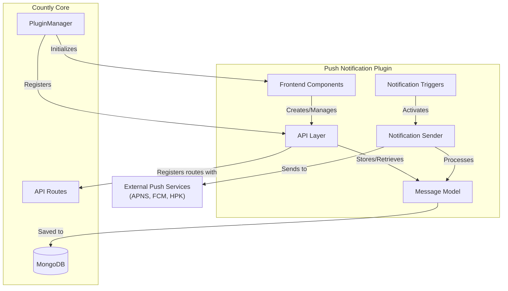
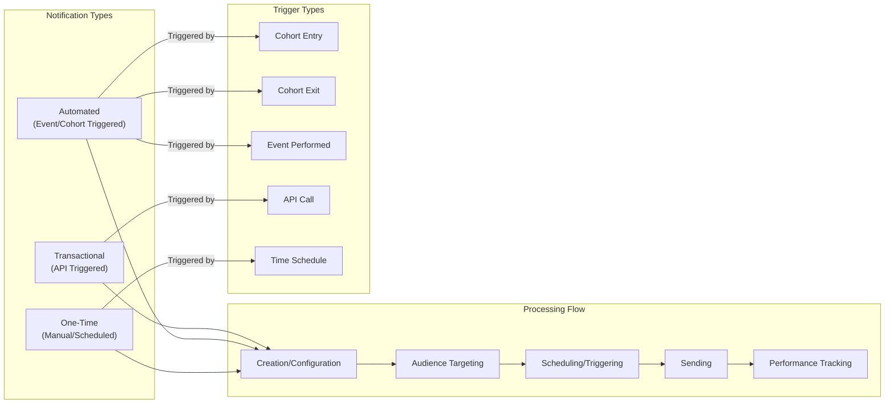
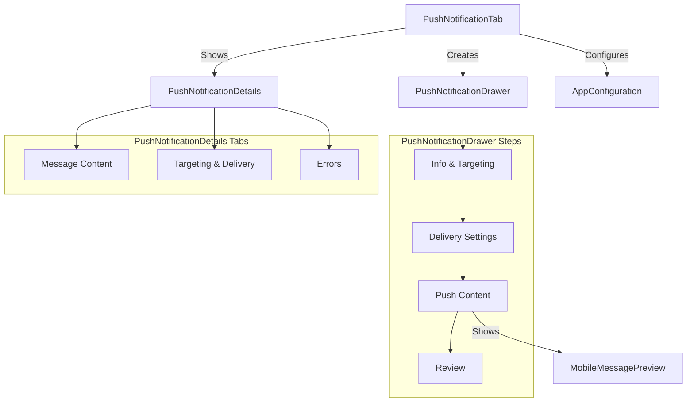
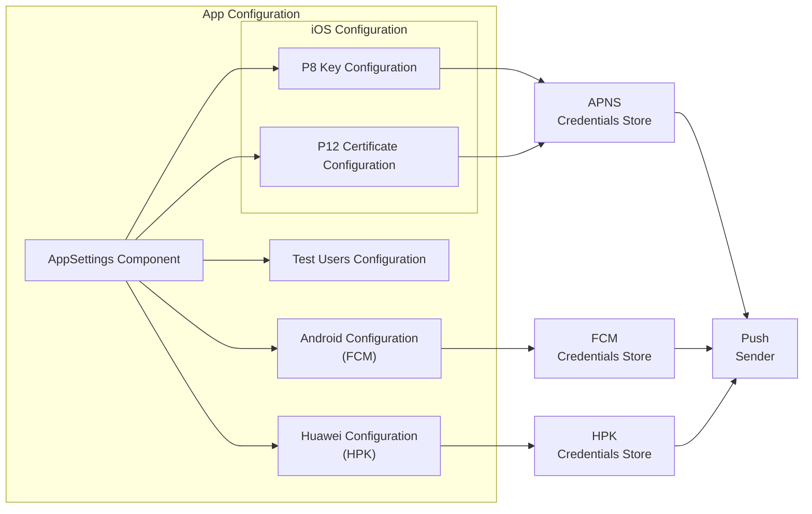
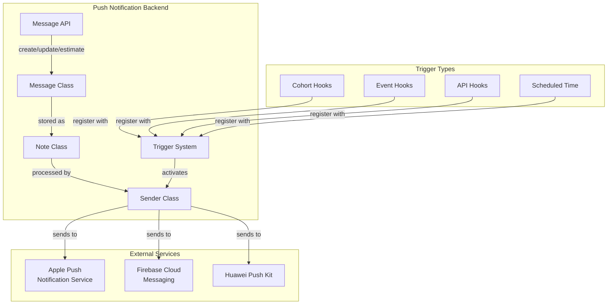

# Push Notifications Plugin

Relevant source files

The following files were used as context for generating this wiki page:

- [plugins/push/api/api.js](https://github.com/Countly/countly-server/blob/1527df18/plugins/push/api/api.js)
- [plugins/push/api/parts/note.js](https://github.com/Countly/countly-server/blob/1527df18/plugins/push/api/parts/note.js)
- [plugins/push/frontend/public/javascripts/countly.models.js](https://github.com/Countly/countly-server/blob/1527df18/plugins/push/frontend/public/javascripts/countly.models.js)
- [plugins/push/frontend/public/javascripts/countly.views.component.common.js](https://github.com/Countly/countly-server/blob/1527df18/plugins/push/frontend/public/javascripts/countly.views.component.common.js)
- [plugins/push/frontend/public/javascripts/countly.views.js](https://github.com/Countly/countly-server/blob/1527df18/plugins/push/frontend/public/javascripts/countly.views.js)
- [plugins/push/frontend/public/localization/push.properties](https://github.com/Countly/countly-server/blob/1527df18/plugins/push/frontend/public/localization/push.properties)
- [plugins/push/frontend/public/stylesheets/main.scss](https://github.com/Countly/countly-server/blob/1527df18/plugins/push/frontend/public/stylesheets/main.scss)
- [plugins/push/frontend/public/templates/common-components.html](https://github.com/Countly/countly-server/blob/1527df18/plugins/push/frontend/public/templates/common-components.html)
- [plugins/push/frontend/public/templates/push-notification-app-config.html](https://github.com/Countly/countly-server/blob/1527df18/plugins/push/frontend/public/templates/push-notification-app-config.html)
- [plugins/push/frontend/public/templates/push-notification-details.html](https://github.com/Countly/countly-server/blob/1527df18/plugins/push/frontend/public/templates/push-notification-details.html)
- [plugins/push/frontend/public/templates/push-notification-drawer.html](https://github.com/Countly/countly-server/blob/1527df18/plugins/push/frontend/public/templates/push-notification-drawer.html)
- [plugins/push/frontend/public/templates/push-notification-tab.html](https://github.com/Countly/countly-server/blob/1527df18/plugins/push/frontend/public/templates/push-notification-tab.html)
- [plugins/push/frontend/public/templates/push-notification.html](https://github.com/Countly/countly-server/blob/1527df18/plugins/push/frontend/public/templates/push-notification.html)

The Push Notifications Plugin provides a comprehensive solution for sending and managing push notifications to mobile devices within the Countly platform. This plugin supports various notification types including one-time, automated, and transactional (API-triggered) notifications across multiple platforms (iOS, Android, and Huawei).

For information about user targeting using Cohorts, see [Cohorts System](#4.3). For details on handling geolocation targeting, see [Location Tracking](#4.5).

## Architecture Overview

The Push Notifications plugin integrates with Countly's core architecture through the Plugin Manager system. It consists of both frontend and backend components that work together to create, send, and track push notifications.

Sources:
- [plugins/push/api/api.js:43-126](https://github.com/Countly/countly-server/blob/1527df18/plugins/push/api/api.js#L43-L126)
- [plugins/push/api/parts/note.js:60-270](https://github.com/Countly/countly-server/blob/1527df18/plugins/push/api/parts/note.js#L60-L270)
- [plugins/push/frontend/public/javascripts/countly.models.js:4-180](https://github.com/Countly/countly-server/blob/1527df18/plugins/push/frontend/public/javascripts/countly.models.js#L4-L180)

## Push Notification Types and Flow

The plugin supports three distinct types of push notifications, each with its own purpose and triggering mechanism:

Sources:
- [plugins/push/frontend/public/javascripts/countly.models.js:19-99](https://github.com/Countly/countly-server/blob/1527df18/plugins/push/frontend/public/javascripts/countly.models.js#L19-L99)
- [plugins/push/api/api.js:4-16](https://github.com/Countly/countly-server/blob/1527df18/plugins/push/api/api.js#L4-L16)

## Database Structure

The Push Notification plugin utilizes several collections in MongoDB to store and manage notification data:

| Collection | Purpose |
|------------|---------|
| `messages` | Stores push notification definitions and metadata |
| `push_${app_id}` | Stores per-app push notification user data |
| `app_users${app_id}` | Contains user information including push tokens |
| `push_stats` | Optional collection for detailed push analytics |

When a message is created, it's stored in the `messages` collection with properties defined by the `Message` class. The notification may include platform-specific settings, targeting criteria, content, and scheduling parameters.

Sources:
- [plugins/push/api/parts/note.js:144-197](https://github.com/Countly/countly-server/blob/1527df18/plugins/push/api/parts/note.js#L144-L197)
- [plugins/push/api/api.js:324-338](https://github.com/Countly/countly-server/blob/1527df18/plugins/push/api/api.js#L324-L338)

## User Interface Components

The plugin provides a comprehensive set of UI components for creating, managing, and analyzing push notifications:

Sources:
- [plugins/push/frontend/public/javascripts/countly.views.js:70-2070](https://github.com/Countly/countly-server/blob/1527df18/plugins/push/frontend/public/javascripts/countly.views.js#L70-L2070)
- [plugins/push/frontend/public/templates/push-notification-drawer.html:1-200](https://github.com/Countly/countly-server/blob/1527df18/plugins/push/frontend/public/templates/push-notification-drawer.html#L1-L200)
- [plugins/push/frontend/public/templates/push-notification-details.html:1-108](https://github.com/Countly/countly-server/blob/1527df18/plugins/push/frontend/public/templates/push-notification-details.html#L1-L108)

## Creating Push Notifications

The creation process involves several steps, handled through the `PushNotificationDrawer` component:

1. **Info & Targeting**: Define basic information and targeting criteria
   - Notification name
   - Platform selection (iOS, Android)
   - Targeting options (all users or segmented)
   - Optional cohort and location targeting
   - Audience determination timing

2. **Delivery Settings**: Configure when and how notifications will be delivered
   - Delivery type (immediate or scheduled)
   - Scheduling options and timezone settings
   - Expiration settings
   - For automated notifications: triggers and delivery logic

3. **Push Content**: Define the notification content
   - Message type (content or silent)
   - Title and message content
   - Optional media URL
   - Optional buttons and actions
   - Platform-specific settings
   - Support for personalization with user properties

4. **Review**: Final review of the notification before saving or sending
   - Preview of notification appearance
   - Summary of targeting and delivery settings
   - Option to save as draft or send immediately

The UI adapts based on the notification type (one-time, automated, or transactional) to show relevant options.

Sources:
- [plugins/push/frontend/public/templates/push-notification-drawer.html:28-653](https://github.com/Countly/countly-server/blob/1527df18/plugins/push/frontend/public/templates/push-notification-drawer.html#L28-L653)
- [plugins/push/frontend/public/javascripts/countly.views.js:128-460](https://github.com/Countly/countly-server/blob/1527df18/plugins/push/frontend/public/javascripts/countly.views.js#L128-L460)

## Platform-Specific Configuration

The plugin requires platform-specific credentials to send push notifications to different platforms:

### iOS (Apple Push Notification Service)
- Authentication options: P8 key file or P12 certificate
- For P8: Key ID, Team ID, and Bundle ID
- For P12: Certificate file and optional passphrase

### Android (Firebase Cloud Messaging)
- Firebase service account JSON file

### Huawei (Huawei Push Kit)
- App ID and App Secret

These configurations are managed through the app settings interface and stored securely.

Sources:
- [plugins/push/frontend/public/templates/push-notification-app-config.html:1-178](https://github.com/Countly/countly-server/blob/1527df18/plugins/push/frontend/public/templates/push-notification-app-config.html#L1-L178)
- [plugins/push/frontend/public/javascripts/countly.models.js:104-168](https://github.com/Countly/countly-server/blob/1527df18/plugins/push/frontend/public/javascripts/countly.models.js#L104-L168)

## Test Users Feature

The plugin includes a test user feature that allows sending test notifications before targeting real users:

- Test users can be defined by user ID or cohort
- Test notifications use the same content as the actual notification
- This feature helps validate notification appearance and behavior

Sources:
- [plugins/push/frontend/public/templates/push-notification-app-config.html:96-176](https://github.com/Countly/countly-server/blob/1527df18/plugins/push/frontend/public/templates/push-notification-app-config.html#L96-L176)
- [plugins/push/frontend/public/javascripts/countly.models.js:115-118](https://github.com/Countly/countly-server/blob/1527df18/plugins/push/frontend/public/javascripts/countly.models.js#L115-L118)

## Push Notification Analytics

The plugin provides analytics on notification performance:

- Total users targeted
- Total notifications sent
- Notification open/action rate
- Error statistics
- Localization performance

These metrics are available both in aggregated form on the main dashboard and for individual notifications in the details view.

Sources:
- [plugins/push/frontend/public/templates/push-notification-details.html:65-107](https://github.com/Countly/countly-server/blob/1527df18/plugins/push/frontend/public/templates/push-notification-details.html#L65-L107)
- [plugins/push/frontend/public/templates/push-notification-tab.html:5-71](https://github.com/Countly/countly-server/blob/1527df18/plugins/push/frontend/public/templates/push-notification-tab.html#L5-L71)

## Backend Processing

The backend processing is managed by several key components:

1. **Message Class**: Handles the validation and creation of push notification messages
2. **Note Class**: Represents the stored notification with all its properties
3. **Sender Class**: Manages the actual sending of notifications to external services
4. **Trigger System**: Monitors for conditions that should trigger automated notifications

Sources:
- [plugins/push/api/api.js:92-111](https://github.com/Countly/countly-server/blob/1527df18/plugins/push/api/api.js#L92-L111)
- [plugins/push/api/parts/note.js:60-270](https://github.com/Countly/countly-server/blob/1527df18/plugins/push/api/parts/note.js#L60-L270)

## API Endpoints

The plugin exposes several API endpoints for programmatic interaction:

### Read Endpoints (o)
- `/o/push/dashboard`: Get dashboard metrics
- `/o/push/mime`: Get MIME type for a media URL
- `/o/push/message/all`: List all messages
- `/o/push/message/GET`: Get a specific message by ID
- `/o/push/user`: Get user information

### Write Endpoints (i)
- `/i/push/message/test`: Send a test notification
- `/i/push/message/create`: Create a new notification
- `/i/push/message/update`: Update an existing notification
- `/i/push/message/toggle`: Toggle notification status (start/stop)
- `/i/push/message/remove`: Delete a notification

Sources:
- [plugins/push/api/api.js:20-44](https://github.com/Countly/countly-server/blob/1527df18/plugins/push/api/api.js#L20-L44)
- [plugins/push/api/api.js:296-319](https://github.com/Countly/countly-server/blob/1527df18/plugins/push/api/api.js#L296-L319)

## Status Flow and Message Lifecycle

Push notifications go through several states during their lifecycle:

| Status | Description |
|--------|-------------|
| DRAFT | Saved but not ready to send |
| CREATED | Created and ready for sending |
| SCHEDULED | Scheduled for future delivery |
| SENDING | Currently being processed and sent |
| SENT | Successfully completed sending |
| FAILED | Encountered errors during sending |
| STOPPED | Manually stopped by a user |
| PENDING_APPROVAL | Waiting for approval (when approver plugin is enabled) |
| REJECT | Rejected by an approver |

The status transitions follow a logical flow based on user actions and system processing.

Sources:
- [plugins/push/frontend/public/javascripts/countly.models.js:35-45](https://github.com/Countly/countly-server/blob/1527df18/plugins/push/frontend/public/javascripts/countly.models.js#L35-L45)
- [plugins/push/frontend/public/templates/push-notification-tab.html:121-122](https://github.com/Countly/countly-server/blob/1527df18/plugins/push/frontend/public/templates/push-notification-tab.html#L121-L122)

## Localization Support

The plugin supports sending notifications in multiple languages:

- Configure different content for different locales
- View performance metrics broken down by locale
- Default localization is always required
- Locale-specific overrides can be added as needed

This feature is particularly valuable for applications with an international user base.

Sources:
- [plugins/push/frontend/public/javascripts/countly.views.js:232-238](https://github.com/Countly/countly-server/blob/1527df18/plugins/push/frontend/public/javascripts/countly.views.js#L232-L238)
- [plugins/push/frontend/public/javascripts/countly.models.js:272-287](https://github.com/Countly/countly-server/blob/1527df18/plugins/push/frontend/public/javascripts/countly.models.js#L272-L287)

## Personalization Features

Push notifications can be personalized using user properties:

- Insert dynamic user property values in title and content
- Support for different types of properties (user, event, custom)
- Fallback values for when properties are not available
- Preview how personalized content will appear

This allows for more engaging and relevant notifications tailored to individual users.

Sources:
- [plugins/push/frontend/public/templates/common-components.html:58-119](https://github.com/Countly/countly-server/blob/1527df18/plugins/push/frontend/public/templates/common-components.html#L58-L119)
- [plugins/push/frontend/public/javascripts/countly.models.js:356-380](https://github.com/Countly/countly-server/blob/1527df18/plugins/push/frontend/public/javascripts/countly.models.js#L356-L380)

## Conclusion