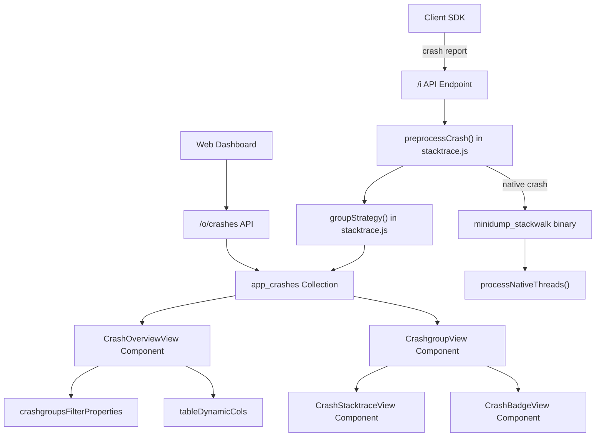
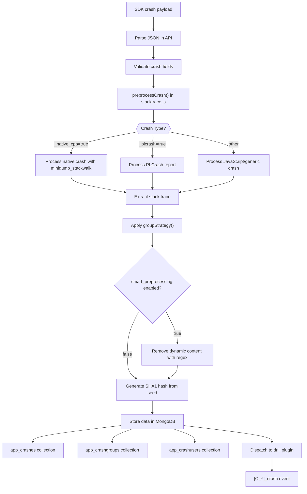
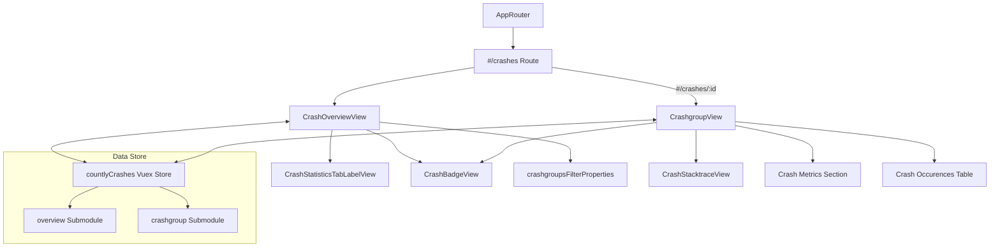

# Crash Reporting Plugin

<details>
<summary>Relevant source files</summary>

The following files were used as context for generating this wiki page:

- [plugins/crashes/api/api.js](https://github.com/Countly/countly-server/blob/1527df18/plugins/crashes/api/api.js)
- [plugins/crashes/api/parts/stacktrace.js](https://github.com/Countly/countly-server/blob/1527df18/plugins/crashes/api/parts/stacktrace.js)
- [plugins/crashes/frontend/app.js](https://github.com/Countly/countly-server/blob/1527df18/plugins/crashes/frontend/app.js)
- [plugins/crashes/frontend/public/javascripts/countly.common.components.js](https://github.com/Countly/countly-server/blob/1527df18/plugins/crashes/frontend/public/javascripts/countly.common.components.js)
- [plugins/crashes/frontend/public/javascripts/countly.models.js](https://github.com/Countly/countly-server/blob/1527df18/plugins/crashes/frontend/public/javascripts/countly.models.js)
- [plugins/crashes/frontend/public/javascripts/countly.views.js](https://github.com/Countly/countly-server/blob/1527df18/plugins/crashes/frontend/public/javascripts/countly.views.js)
- [plugins/crashes/frontend/public/localization/crashes.properties](https://github.com/Countly/countly-server/blob/1527df18/plugins/crashes/frontend/public/localization/crashes.properties)
- [plugins/crashes/frontend/public/stylesheets/crashes.scss](https://github.com/Countly/countly-server/blob/1527df18/plugins/crashes/frontend/public/stylesheets/crashes.scss)
- [plugins/crashes/frontend/public/templates/crashgroup.html](https://github.com/Countly/countly-server/blob/1527df18/plugins/crashes/frontend/public/templates/crashgroup.html)
- [plugins/crashes/frontend/public/templates/overview.html](https://github.com/Countly/countly-server/blob/1527df18/plugins/crashes/frontend/public/templates/overview.html)
- [plugins/crashes/frontend/public/templates/stacktrace.html](https://github.com/Countly/countly-server/blob/1527df18/plugins/crashes/frontend/public/templates/stacktrace.html)

</details>


The Crash Reporting Plugin is an essential component of the Countly analytics platform that collects, processes, and visualizes application crash data from mobile and web applications. This plugin helps developers identify, prioritize, and resolve crashes by providing detailed crash reports, comprehensive statistics, and user impact analysis.

This document explains the architecture, data flow, and key components of the Crash Reporting Plugin. For information about integrating crash reporting in client applications, see the Client SDKs documentation.

## Architecture Overview

The Crash Reporting Plugin consists of backend components for processing and storing crash data, and frontend components for visualizing and managing crashes.

### Crash Reporting System Architecture



Sources: [plugins/crashes/api/api.js](https://github.com/Countly/countly-server/blob/1527df18/plugins/crashes/api/api.js), [plugins/crashes/api/parts/stacktrace.js](https://github.com/Countly/countly-server/blob/1527df18/plugins/crashes/api/parts/stacktrace.js), [plugins/crashes/frontend/public/javascripts/countly.views.js](https://github.com/Countly/countly-server/blob/1527df18/plugins/crashes/frontend/public/javascripts/countly.views.js)

## Data Flow and Processing

Crash data follows a sophisticated flow from client applications to the dashboard, with several processing steps in between.

### Crash Data Processing Flow



Sources: [plugins/crashes/api/api.js:334-565](https://github.com/Countly/countly-server/blob/1527df18/plugins/crashes/api/api.js#L334-L565), [plugins/crashes/api/parts/stacktrace.js:128-281](https://github.com/Countly/countly-server/blob/1527df18/plugins/crashes/api/parts/stacktrace.js#L128-L281)

## Key Components

### Backend Components

#### 1. Crash Data Processor

The crash processor is responsible for preprocessing incoming crash reports, grouping similar crashes, and handling symbolication for native crashes.

Core functionality:
- `preprocessCrash()`: Main entry point for processing crashes
- `groupStrategy()`: Applies configurable strategies to group similar crashes
- `processNativeThreads()`: Extracts thread information from native crashes
- `processPLCrashThreads()`: Processes iOS crash reports

Sources: [plugins/crashes/api/parts/stacktrace.js:9-283](https://github.com/Countly/countly-server/blob/1527df18/plugins/crashes/api/parts/stacktrace.js#L9-L283)

#### 2. Data Storage

Crash data is stored in multiple MongoDB collections:

- `app_crashes{APP_ID}`: Stores individual crash occurrences
- `app_crashgroups{APP_ID}`: Stores grouped crashes with statistics
- `app_crashusers{APP_ID}`: Tracks user-specific crash data

Sources: [plugins/crashes/api/api.js:76-147](https://github.com/Countly/countly-server/blob/1527df18/plugins/crashes/api/api.js#L76-L147), [plugins/crashes/api/api.js:499-560](https://github.com/Countly/countly-server/blob/1527df18/plugins/crashes/api/api.js#L499-L560)

#### 3. API Endpoints

The plugin exposes several API endpoints:
- Receiving crash reports: `/i` with `crash` parameter
- Crash data retrieval: `/o/crashes/`
- Crash management: endpoints for resolving, hiding, and deleting crashes

Sources: [plugins/crashes/api/api.js:320-336](https://github.com/Countly/countly-server/blob/1527df18/plugins/crashes/api/api.js#L320-L336), [plugins/crashes/frontend/app.js:14-68](https://github.com/Countly/countly-server/blob/1527df18/plugins/crashes/frontend/app.js#L14-L68)

### Frontend Components

#### 1. Vue Components

The plugin uses several Vue.js components for the user interface:



Sources: [plugins/crashes/frontend/public/javascripts/countly.views.js:8-711](https://github.com/Countly/countly-server/blob/1527df18/plugins/crashes/frontend/public/javascripts/countly.views.js#L8-L711), [plugins/crashes/frontend/public/javascripts/countly.views.js:729-753](https://github.com/Countly/countly-server/blob/1527df18/plugins/crashes/frontend/public/javascripts/countly.views.js#L729-L753)

#### 2. Main View Components

- **CrashOverviewView**: Displays crash statistics and crash group list
- **CrashgroupView**: Shows detailed information about a specific crash group
- **CrashStacktraceView**: Renders formatted stacktraces with line numbers

Sources: [plugins/crashes/frontend/public/javascripts/countly.views.js:38-711](https://github.com/Countly/countly-server/blob/1527df18/plugins/crashes/frontend/public/javascripts/countly.views.js#L38-L711), [plugins/crashes/frontend/public/javascripts/countly.views.js:729-753](https://github.com/Countly/countly-server/blob/1527df18/plugins/crashes/frontend/public/javascripts/countly.views.js#L729-L753), [plugins/crashes/frontend/public/javascripts/countly.views.js:755-5520](https://github.com/Countly/countly-server/blob/1527df18/plugins/crashes/frontend/public/javascripts/countly.views.js#L755-L5520)

#### 3. Vuex Store

The plugin uses a Vuex store (`countlyCrashes`) with two main submodules:
- `overview`: Manages crash statistics and crash group lists
- `crashgroup`: Manages detailed crash information for a specific group

Sources: [plugins/crashes/frontend/public/javascripts/countly.models.js:87-577](https://github.com/Countly/countly-server/blob/1527df18/plugins/crashes/frontend/public/javascripts/countly.models.js#L87-L577)

## Crash Grouping Strategies

The plugin employs sophisticated crash grouping to help developers focus on distinct issues rather than individual occurrences.

### Grouping Configuration

The following grouping strategies are supported:

| Strategy | Description | Configuration Key |
|----------|-------------|------------------|
| Error and File (default) | Groups by error message and file name | `"error_and_file"` |
| Full Stack Trace | Groups crashes with identical stack traces | `"stacktrace"` |

Additional options enhance grouping precision:

| Option | Description | Default |
|--------|-------------|---------|
| Smart Preprocessing | Removes dynamic content from stacktraces | `true` |
| Smart Regexes | Custom regex patterns to remove from stacktraces | `"{.*?}\n/.*?/"` |

Sources: [plugins/crashes/api/parts/stacktrace.js:52-121](https://github.com/Countly/countly-server/blob/1527df18/plugins/crashes/api/parts/stacktrace.js#L52-L121), [plugins/crashes/api/api.js:17-25](https://github.com/Countly/countly-server/blob/1527df18/plugins/crashes/api/api.js#L17-L25)

### Smart Preprocessing

Smart preprocessing applies several techniques to normalize crash data before grouping:

1. Removes standalone numbers like IDs
2. Removes content between regex-like patterns (`/.../`)
3. Removes object contents (`{...}`)
4. Normalizes file paths, protocols, and parameters
5. Removes memory addresses, IPs, and UUIDs
6. Applies custom regex patterns from configuration

Sources: [plugins/crashes/api/parts/stacktrace.js:71-118](https://github.com/Countly/countly-server/blob/1527df18/plugins/crashes/api/parts/stacktrace.js#L71-L118)

## Handling Different Crash Types

The plugin processes various types of crashes differently based on their source and format.

### Native Crashes (C/C++)

For native crashes, the plugin:
1. Processes binary crash dumps using the `minidump_stackwalk` tool
2. Extracts thread information and identifies the crashed thread
3. Applies the grouping strategy to the resulting stacktrace

Sources: [plugins/crashes/api/parts/stacktrace.js:129-146](https://github.com/Countly/countly-server/blob/1527df18/plugins/crashes/api/parts/stacktrace.js#L129-L146)

### PLCrash Reports (iOS)

For iOS PLCrash reports, the plugin:
1. Parses the PLCrash format to extract crash information
2. Extracts binary images, device, and OS information
3. Identifies the crashed thread and related information

Sources: [plugins/crashes/api/parts/stacktrace.js:148-221](https://github.com/Countly/countly-server/blob/1527df18/plugins/crashes/api/parts/stacktrace.js#L148-L221)

### JavaScript/Other Crashes

For JavaScript and other crash types, the plugin:
1. Normalizes line endings and whitespace
2. Filters out irrelevant internal calls
3. Normalizes file paths and line numbers for consistent grouping

Sources: [plugins/crashes/api/parts/stacktrace.js:222-281](https://github.com/Countly/countly-server/blob/1527df18/plugins/crashes/api/parts/stacktrace.js#L222-L281)

## Crash Metrics and Analytics

The plugin collects and calculates various metrics to provide insights into crash patterns and user impact.

### Key Metrics

| Metric | Code | Description |
|--------|------|-------------|
| Total Occurrences | `cr`, `crf`, `crnf` | Total crashes, fatal crashes, non-fatal crashes |
| Unique Crashes | `cru`, `cruf`, `crunf` | Unique crash groups (fatal/non-fatal) |
| Crash Frequency | `cr-session` | Crashes per session ratio |
| Crash-free Users | `crau`, `crauf`, `craunf` | Users without crashes (total/fatal/non-fatal) |
| Crash-free Sessions | `crses`, `crfses`, `crnfses` | Sessions without crashes |

Sources: [plugins/crashes/api/api.js:28-48](https://github.com/Countly/countly-server/blob/1527df18/plugins/crashes/api/api.js#L28-L48), [plugins/crashes/frontend/public/javascripts/countly.models.js:93-253](https://github.com/Countly/countly-server/blob/1527df18/plugins/crashes/frontend/public/javascripts/countly.models.js#L93-L253)

### Dashboard Analytics

The dashboard provides several analytical views:
- Crash statistics (affected users, resolved crashes, crash fatality)
- Platform distribution
- New vs. reoccurring crashes
- Revenue loss estimation

Sources: [plugins/crashes/frontend/public/javascripts/countly.models.js:375-436](https://github.com/Countly/countly-server/blob/1527df18/plugins/crashes/frontend/public/javascripts/countly.models.js#L375-L436), [plugins/crashes/frontend/public/templates/overview.html:121-180](https://github.com/Countly/countly-server/blob/1527df18/plugins/crashes/frontend/public/templates/overview.html#L121-L180)

## User Interface Elements

### Crash Overview

The crash overview page contains:
1. A statistics dashboard with key metrics
2. Filtering options by platform, version, and fatality
3. A list of crash groups with expandable details
4. Bulk actions for managing multiple crashes

Sources: [plugins/crashes/frontend/public/templates/overview.html:1-244](https://github.com/Countly/countly-server/blob/1527df18/plugins/crashes/frontend/public/templates/overview.html#L1-L244)

### Crash Group View

The crash group detail page includes:
1. Crash summary with badges indicating status
2. Detailed device metrics and diagnostics
3. Stacktrace viewer with symbolication support
4. Comments and collaboration tools
5. Crash occurrences listing with device details

Sources: [plugins/crashes/frontend/public/templates/crashgroup.html:1-400](https://github.com/Countly/countly-server/blob/1527df18/plugins/crashes/frontend/public/templates/crashgroup.html#L1-L400)

### Stacktrace Visualization

The stacktrace viewer features:
- Line numbers
- Syntax highlighting via `hljs.highlightAuto()`
- Toggle between symbolicated and unsymbolicated views
- Thread information display

Sources: [plugins/crashes/frontend/public/javascripts/countly.views.js:729-753](https://github.com/Countly/countly-server/blob/1527df18/plugins/crashes/frontend/public/javascripts/countly.views.js#L729-L753), [plugins/crashes/frontend/public/templates/stacktrace.html:1-7](https://github.com/Countly/countly-server/blob/1527df18/plugins/crashes/frontend/public/templates/stacktrace.html#L1-L7)

## Configuration Options

The plugin supports several configuration options defined in `plugins/crashes/api/api.js`:

```javascript
plugins.setConfigs("crashes", {
    report_limit: 100,
    grouping_strategy: "error_and_file",
    smart_preprocessing: true,
    smart_regexes: "{.*?}\n/.*?/",
    same_app_version_crash_update: false,
    max_custom_field_keys: DEFAULT_MAX_CUSTOM_FIELD_KEYS,
    activate_custom_field_cleanup_job: false,
});
```

Sources: [plugins/crashes/api/api.js:17-25](https://github.com/Countly/countly-server/blob/1527df18/plugins/crashes/api/api.js#L17-L25)

| Option | Description | Default |
|--------|-------------|---------|
| `report_limit` | Maximum number of reports to display for a crash group | 100 |
| `grouping_strategy` | Strategy for grouping similar crashes | `"error_and_file"` |
| `smart_preprocessing` | Enable/disable smart preprocessing | `true` |
| `smart_regexes` | Custom regex patterns for preprocessing | `"{.*?}\n/.*?/"` |
| `same_app_version_crash_update` | Update latest crash in group even with same app version | `false` |
| `max_custom_field_keys` | Maximum number of custom field keys to store | From constant |
| `activate_custom_field_cleanup_job` | Enable cleanup job for custom fields | `false` |

## Integration with Other Countly Systems

The Crash Reporting Plugin integrates with several other Countly systems:

1. **User Profiles**: Links crashes to specific user profiles through the `uid` field
2. **Drill**: Exposes crash data for custom segmentation via the `[CLY]_crash` event
3. **Symbolication**: Integrates with the Symbol Upload plugin for native crash symbolication
4. **Permission System**: Uses the `crashes` feature name for access control

Sources: [plugins/crashes/api/api.js:51-53](https://github.com/Countly/countly-server/blob/1527df18/plugins/crashes/api/api.js#L51-L53), [plugins/crashes/api/api.js:68-69](https://github.com/Countly/countly-server/blob/1527df18/plugins/crashes/api/api.js#L68-L69), [plugins/crashes/frontend/public/javascripts/countly.views.js:6](https://github.com/Countly/countly-server/blob/1527df18/plugins/crashes/frontend/public/javascripts/countly.views.js#L6)

## Performance Considerations

The plugin includes several optimizations for performance:

1. Indexes on MongoDB collections for efficient querying
2. Batch operations for processing multiple crashes
3. Configurable limits for custom fields to prevent excessive data storage
4. On-demand symbolication of native crashes

Sources: [plugins/crashes/api/api.js:22-24](https://github.com/Countly/countly-server/blob/1527df18/plugins/crashes/api/api.js#L22-L24)

## Conclusion