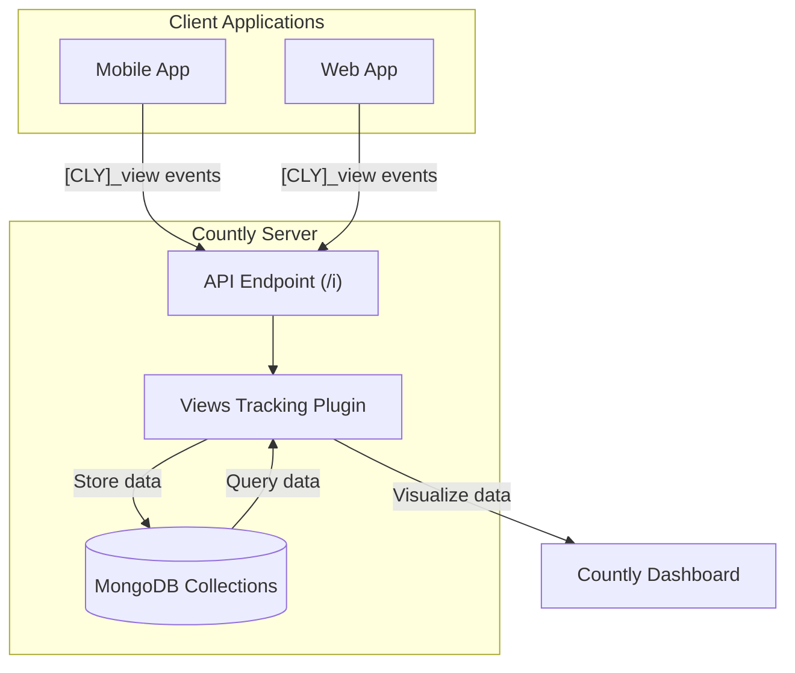
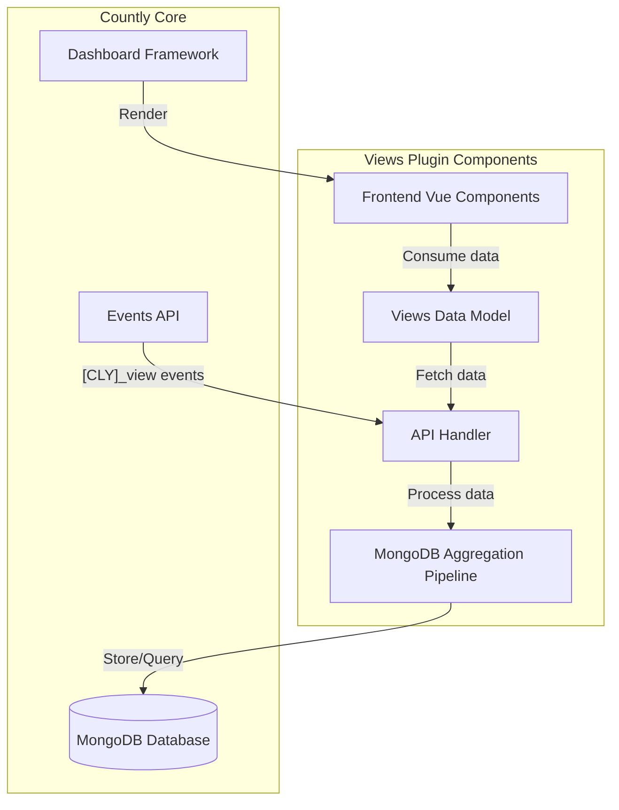
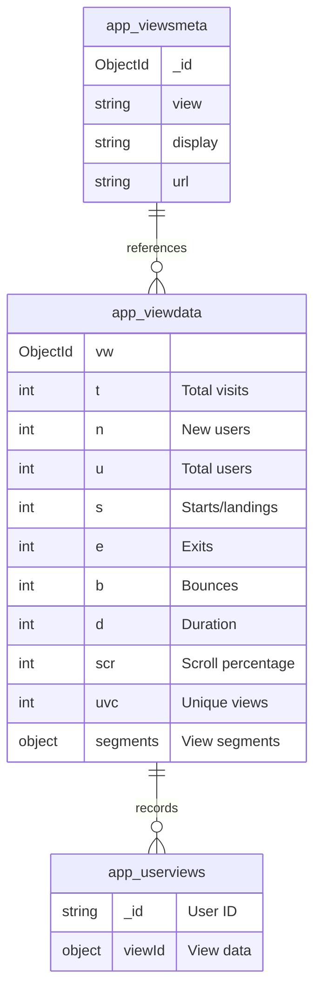
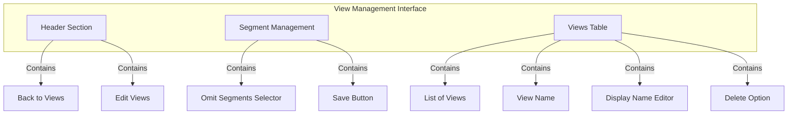

# Views Tracking Plugin

<details>
<summary>Relevant source files</summary>

The following files were used as context for generating this wiki page:

- [plugins/logger/api/helpers/automaticStateManager.js](https://github.com/Countly/countly-server/blob/1527df18/plugins/logger/api/helpers/automaticStateManager.js)
- [plugins/logger/api/helpers/requestWatcher.js](https://github.com/Countly/countly-server/blob/1527df18/plugins/logger/api/helpers/requestWatcher.js)
- [plugins/logger/tests.js](https://github.com/Countly/countly-server/blob/1527df18/plugins/logger/tests.js)
- [plugins/populator/tests.js](https://github.com/Countly/countly-server/blob/1527df18/plugins/populator/tests.js)
- [plugins/push/tests.js](https://github.com/Countly/countly-server/blob/1527df18/plugins/push/tests.js)
- [plugins/systemlogs/tests.js](https://github.com/Countly/countly-server/blob/1527df18/plugins/systemlogs/tests.js)
- [plugins/views/api/api.js](https://github.com/Countly/countly-server/blob/1527df18/plugins/views/api/api.js)
- [plugins/views/frontend/public/javascripts/countly.models.js](https://github.com/Countly/countly-server/blob/1527df18/plugins/views/frontend/public/javascripts/countly.models.js)
- [plugins/views/frontend/public/javascripts/countly.views.js](https://github.com/Countly/countly-server/blob/1527df18/plugins/views/frontend/public/javascripts/countly.views.js)
- [plugins/views/frontend/public/localization/views.properties](https://github.com/Countly/countly-server/blob/1527df18/plugins/views/frontend/public/localization/views.properties)
- [plugins/views/frontend/public/stylesheets/main.css](https://github.com/Countly/countly-server/blob/1527df18/plugins/views/frontend/public/stylesheets/main.css)
- [plugins/views/frontend/public/templates/actionmap.html](https://github.com/Countly/countly-server/blob/1527df18/plugins/views/frontend/public/templates/actionmap.html)
- [plugins/views/frontend/public/templates/manageViews.html](https://github.com/Countly/countly-server/blob/1527df18/plugins/views/frontend/public/templates/manageViews.html)
- [plugins/views/frontend/public/templates/views.html](https://github.com/Countly/countly-server/blob/1527df18/plugins/views/frontend/public/templates/views.html)
- [plugins/views/frontend/public/templates/widget.html](https://github.com/Countly/countly-server/blob/1527df18/plugins/views/frontend/public/templates/widget.html)
- [plugins/views/tests.js](https://github.com/Countly/countly-server/blob/1527df18/plugins/views/tests.js)
- [test/2.api/14.authorize.token.js](https://github.com/Countly/countly-server/blob/1527df18/test/2.api/14.authorize.token.js)
- [test/2.api/15.event.managment.js](https://github.com/Countly/countly-server/blob/1527df18/test/2.api/15.event.managment.js)
- [test/2.api/16.token.manager.js](https://github.com/Countly/countly-server/blob/1527df18/test/2.api/16.token.manager.js)
- [test/3.api.write/7.user.merge.js](https://github.com/Countly/countly-server/blob/1527df18/test/3.api.write/7.user.merge.js)

</details>


The Views Tracking Plugin is a core component of the Countly analytics platform that tracks and analyzes screen/page views within web and mobile applications. This plugin captures detailed metrics about user interactions with different views, including visit counts, duration, bounces, and scroll depth, enabling comprehensive user experience analysis.

For information about action tracking within views, see [Action Maps](#4.7).

## Table of Contents

- [Overview](#overview)
- [Architecture](#architecture)
- [Data Model](#data-model)
- [Frontend Interface](#frontend-interface)
- [API Endpoints](#api-endpoints)
- [Key Metrics](#key-metrics)
- [View Management](#view-management)
- [Configuration Options](#configuration-options)

## Overview

The Views Tracking Plugin captures and analyzes when users view specific screens or pages within applications. It provides comprehensive metrics about these interactions, allowing developers and analysts to understand how users navigate through their applications, which screens are most frequently viewed, and how users interact with content.



Sources: [plugins/views/api/api.js](https://github.com/Countly/countly-server/blob/1527df18/plugins/views/api/api.js), [plugins/views/frontend/public/javascripts/countly.views.js](https://github.com/Countly/countly-server/blob/1527df18/plugins/views/frontend/public/javascripts/countly.views.js)

## Architecture

The Views Tracking Plugin integrates with Countly's core systems while maintaining its specialized data processing and visualization capabilities.



Sources: [plugins/views/api/api.js](https://github.com/Countly/countly-server/blob/1527df18/plugins/views/api/api.js), [plugins/views/frontend/public/javascripts/countly.models.js](https://github.com/Countly/countly-server/blob/1527df18/plugins/views/frontend/public/javascripts/countly.models.js)

### Plugin Registration

The Views Tracking Plugin registers with Countly's plugin system and sets up event handlers for various hooks:

```javascript
// Register the plugin feature
plugins.register("/permissions/features", function(ob) {
    ob.features.push(FEATURE_NAME);
});

// Set default configuration options
plugins.setConfigs("views", {
    view_limit: 50000,
    view_name_limit: 128,
    segment_value_limit: 10,
    segment_limit: 100
});

// Register internal drill events
plugins.internalDrillEvents.push("[CLY]_view");
plugins.internalDrillEvents.push("[CLY]_action");
```

Sources: [plugins/views/api/api.js:17-31](https://github.com/Countly/countly-server/blob/1527df18/plugins/views/api/api.js#L17-L31)

## Data Model

The Views Tracking Plugin stores data across several MongoDB collections:



Sources: [plugins/views/api/api.js:238-295](https://github.com/Countly/countly-server/blob/1527df18/plugins/views/api/api.js#L238-L295), [plugins/views/api/api.js:721-800](https://github.com/Countly/countly-server/blob/1527df18/plugins/views/api/api.js#L721-L800)

### Collections

1. **app_viewsmeta{appId}**: Stores metadata about each view, including its name, display name, and URL
2. **app_viewdata{hash}**: Stores aggregated metrics for views, potentially segmented by different dimensions
3. **app_userviews{appId}**: Tracks which views each user has seen and when

The plugin uses hashing to create collection names for segmented data:

```javascript
var colName = "app_viewdata" + crypto.createHash('sha1').update(appId).digest('hex');
```

Sources: [plugins/views/api/api.js:143](https://github.com/Countly/countly-server/blob/1527df18/plugins/views/api/api.js#L143)

## Frontend Interface

The Views Tracking Plugin provides a rich user interface for analyzing view data through the Countly dashboard.

### Main Dashboard

The main dashboard shows key metrics and trends for application views:

```mermaid
graph TB
    subgraph "Views Dashboard Structure"
        Header["Header Section"]
        MetricCards["Metric Cards"]
        GraphSection["Graph Section"]
        FilterSection["Filter Section"]
        ViewsTable["Views Data Table"]
    end
    
    Header -->|"Contains"| Title["Views Title"]
    Header -->|"Contains"| DatePicker["Date Range Picker"]
    Header -->|"Contains"| DrillButton["Drill Button"]
    
    MetricCards -->|"Shows"| TotalViews["Total Views"]
    MetricCards -->|"Shows"| UniqueViews["Unique Views"]
    MetricCards -->|"Shows"| BounceRate["Bounce Rate"]
    
    GraphSection -->|"Visualizes"| ViewTrends["View Trends Over Time"]
    
    FilterSection -->|"Contains"| MetricDropdown["Metric Selector"]
    FilterSection -->|"Contains"| SegmentFilter["Segment Filter"]
    
    ViewsTable -->|"Displays"| ViewsList["List of Views"]
    ViewsTable -->|"Contains"| ViewMetrics["View Metrics"]
    ViewsTable -->|"Contains"| SelectionOptions["View Selection"]
```



Sources: [plugins/views/frontend/public/templates/views.html](https://github.com/Countly/countly-server/blob/1527df18/plugins/views/frontend/public/templates/views.html), [plugins/views/frontend/public/javascripts/countly.views.js:242-665](https://github.com/Countly/countly-server/blob/1527df18/plugins/views/frontend/public/javascripts/countly.views.js#L242-L665)

### Management Interface

The plugin provides a management interface for editing view names and omitting segments:



Sources: [plugins/views/frontend/public/templates/manageViews.html](https://github.com/Countly/countly-server/blob/1527df18/plugins/views/frontend/public/templates/manageViews.html), [plugins/views/frontend/public/javascripts/countly.views.js:6-145](https://github.com/Countly/countly-server/blob/1527df18/plugins/views/frontend/public/javascripts/countly.views.js#L6-L145)

## API Endpoints

The Views Tracking Plugin exposes several API endpoints for interacting with view data:

### Write APIs

| Endpoint | Method | Description |
|----------|--------|-------------|
| `/i/views/rename_views` | POST | Rename views (update display names) |
| `/i/views/delete_view` | POST | Delete one or more views |
| `/i/views/omit_segments` | POST | Omit segments from view data |

Sources: [plugins/views/api/api.js:60-226](https://github.com/Countly/countly-server/blob/1527df18/plugins/views/api/api.js#L60-L226)

### Read APIs

| Endpoint | Query Parameter | Description |
|----------|-----------------|-------------|
| `/o/analytics/dashboard` | `app_id` | Get overview dashboard data |
| `/o/views` | Various | Get view data with filtering and segmentation |
| `/o/views/get_view_segments` | `app_id` | Get available segments for views |

Sources: [plugins/views/frontend/public/javascripts/countly.models.js:27-92](https://github.com/Countly/countly-server/blob/1527df18/plugins/views/frontend/public/javascripts/countly.models.js#L27-L92)

## Key Metrics

The Views Tracking Plugin collects and analyzes several key metrics:

| Metric | Code | Description |
|--------|------|-------------|
| Total Visits | `t` | Total number of times the view was accessed |
| Total Users | `u` | Number of unique users who accessed the view |
| New Users | `n` | First-time visitors to the view |
| Duration | `d` | Average time spent on the view |
| Landings | `s` | Number of sessions that started with this view |
| Exits | `e` | Number of sessions that ended with this view |
| Bounces | `b` | Number of sessions with only this view |
| Bounce Rate | `br` | Percentage of sessions that bounced (viewed only this page) |
| Unique Views | `uvc` | Number of unique view occurrences |
| Scroll Depth | `scr` | Average scroll depth percentage |

Sources: [plugins/views/frontend/public/javascripts/countly.views.js:257-320](https://github.com/Countly/countly-server/blob/1527df18/plugins/views/frontend/public/javascripts/countly.views.js#L257-L320), [plugins/views/frontend/public/localization/views.properties:8-14](https://github.com/Countly/countly-server/blob/1527df18/plugins/views/frontend/public/localization/views.properties#L8-L14)

## View Management

The plugin provides several features for managing views:

### Renaming Views

Views can be given custom display names to make them more readable in the dashboard:

```javascript
// From countly.views.js - updateManyViews method
updateManyViews: function() {
    var changes = [];
    var self = this;
    var rows = this.$refs.editViewsTable.sourceRows;
    for (var k = 0; k < rows.length; k++) {
        if (rows[k].editedDisplay !== rows[k].display) {
            if (rows[k].editedDisplay === rows[k].view) {
                changes.push({"key": rows[k]._id, "value": ""});
            }
            else {
                changes.push({"key": rows[k]._id, "value": rows[k].editedDisplay});
            }
        }
    }
    if (changes.length > 0) {
        this.$store.dispatch("countlyViews/updateViews", changes)
        // ... rest of method
    }
}
```

Sources: [plugins/views/frontend/public/javascripts/countly.views.js:119-143](https://github.com/Countly/countly-server/blob/1527df18/plugins/views/frontend/public/javascripts/countly.views.js#L119-L143)

### Deleting Views

Views can be deleted from the system:

```javascript
// From countly.views.js - submitDeleteForm method
submitDeleteForm: function() {
    var self = this;
    this.showDeleteDialog = false;

    if (this.selectedViews && this.selectedViews.length > 0) {
        var ids = [];
        for (var k = 0; k < this.selectedViews.length; k++) {
            ids.push(this.selectedViews[k]._id);
        }
        this.$store.dispatch("countlyViews/deleteViews", ids.join(","))
        // ... rest of method
    }
}
```

Sources: [plugins/views/frontend/public/javascripts/countly.views.js:97-114](https://github.com/Countly/countly-server/blob/1527df18/plugins/views/frontend/public/javascripts/countly.views.js#L97-L114)

### Omitting Segments

To manage data volume and relevance, segments can be omitted from view tracking:

```javascript
// From countly.views.js - omitSegments method
omitSegments: function() {
    var self = this;
    CountlyHelpers.confirm(CV.i18n('views.omit-segments-confirm'), "red", function(result) {
        if (!result) {
            return true;
        }
        self.$store.dispatch("countlyViews/omitSegments", JSON.stringify(self.omitList))
        // ... rest of method
    });
}
```

Sources: [plugins/views/frontend/public/javascripts/countly.views.js:61-76](https://github.com/Countly/countly-server/blob/1527df18/plugins/views/frontend/public/javascripts/countly.views.js#L61-L76)

## Configuration Options

The Views Tracking Plugin provides several configuration options:

| Option | Default | Description |
|--------|---------|-------------|
| `view_limit` | 50000 | Maximum number of unique views that can be tracked |
| `view_name_limit` | 128 | Maximum length of view names |
| `segment_value_limit` | 10 | Maximum number of values per segment |
| `segment_limit` | 100 | Maximum number of segments per view |

These options can be configured in the Countly dashboard under Management → Configurations → Views.

Sources: [plugins/views/api/api.js:22-27](https://github.com/Countly/countly-server/blob/1527df18/plugins/views/api/api.js#L22-L27), [plugins/views/frontend/public/localization/views.properties:27-36](https://github.com/Countly/countly-server/blob/1527df18/plugins/views/frontend/public/localization/views.properties#L27-L36)

## Data Processing

The Views Tracking Plugin uses MongoDB aggregation pipelines to process view data efficiently:

```javascript
function createAggregatePipeline(params, settings) {
    settings = settings || {};
    var pipeline = [];
    var period = params.qstring.period || '30days';
    // ... complex pipeline creation logic
    return pipeline;
}
```

The aggregation pipeline handles:

1. Filtering by time period
2. Segmentation of view data
3. Calculation of metrics like bounce rate and average duration
4. Pagination and sorting for table display

Sources: [plugins/views/api/api.js:357-709](https://github.com/Countly/countly-server/blob/1527df18/plugins/views/api/api.js#L357-L709)

## Integration with Other Plugins

The Views Tracking Plugin integrates with other Countly plugins:

1. **Drill**: For advanced segmentation and filtering of view data
2. **Reports**: For including view metrics in scheduled reports
3. **Dashboards**: For adding view widgets to custom dashboards

```javascript
// Registration with drill
plugins.internalDrillEvents.push("[CLY]_view");
plugins.internalDrillEvents.push("[CLY]_action");
```

Sources: [plugins/views/api/api.js:29-30](https://github.com/Countly/countly-server/blob/1527df18/plugins/views/api/api.js#L29-L30)

## Conclusion