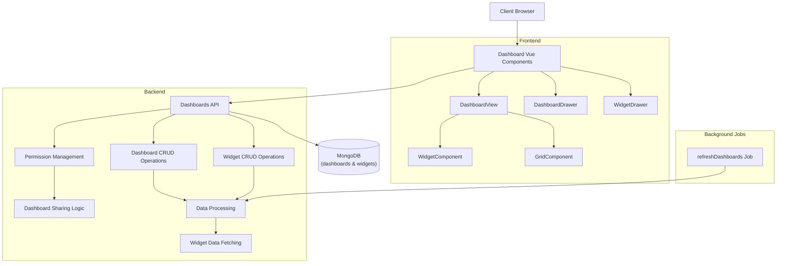
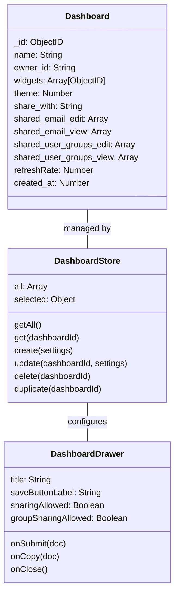
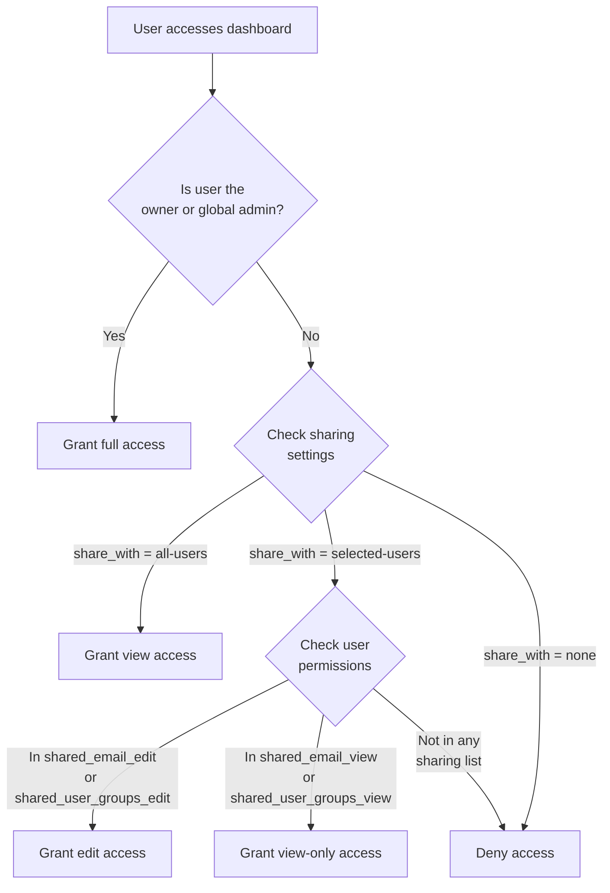
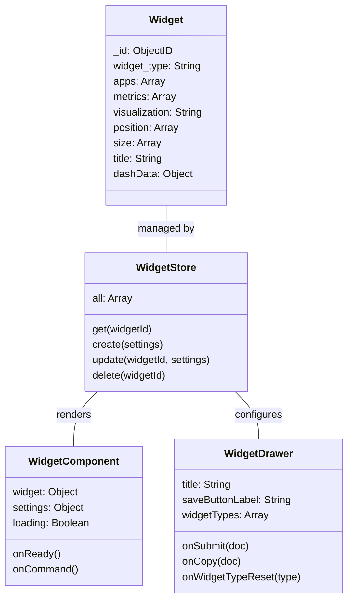
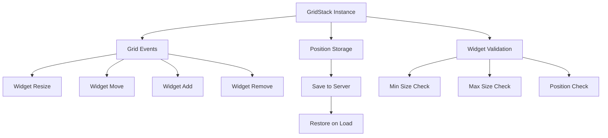
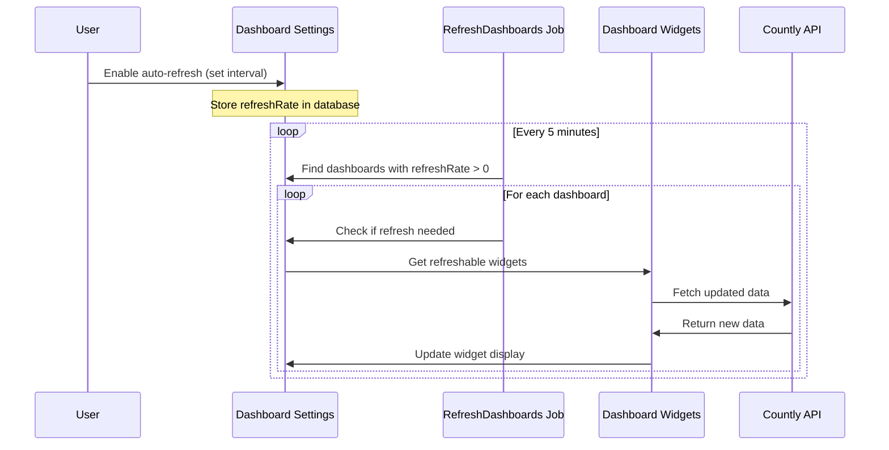
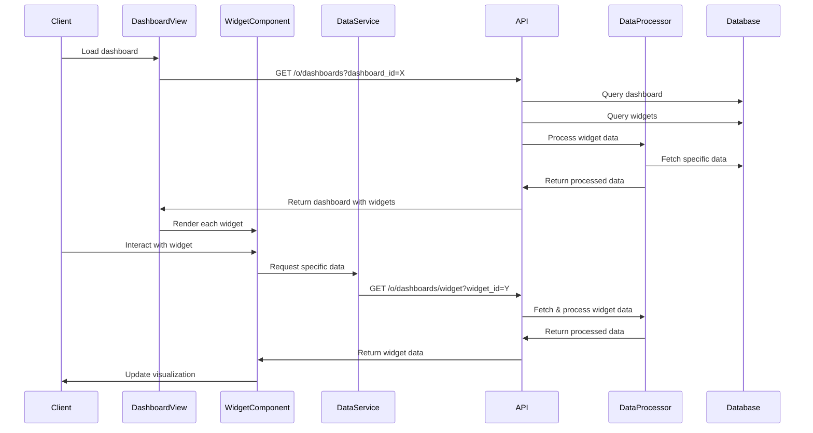

# Custom Dashboards Plugin

<details>
<summary>Relevant source files</summary>

The following files were used as context for generating this wiki page:

- [frontend/express/public/javascripts/dom/gridstack/gridstack-h5.js](https://github.com/Countly/countly-server/blob/1527df18/frontend/express/public/javascripts/dom/gridstack/gridstack-h5.js)
- [frontend/express/public/javascripts/dom/gridstack/gridstack.css](https://github.com/Countly/countly-server/blob/1527df18/frontend/express/public/javascripts/dom/gridstack/gridstack.css)
- [plugins/dashboards/api/api.js](https://github.com/Countly/countly-server/blob/1527df18/plugins/dashboards/api/api.js)
- [plugins/dashboards/api/jobs/refreshDashboards.js](https://github.com/Countly/countly-server/blob/1527df18/plugins/dashboards/api/jobs/refreshDashboards.js)
- [plugins/dashboards/api/parts/dashboards.js](https://github.com/Countly/countly-server/blob/1527df18/plugins/dashboards/api/parts/dashboards.js)
- [plugins/dashboards/frontend/public/javascripts/countly.helpers.js](https://github.com/Countly/countly-server/blob/1527df18/plugins/dashboards/frontend/public/javascripts/countly.helpers.js)
- [plugins/dashboards/frontend/public/javascripts/countly.models.js](https://github.com/Countly/countly-server/blob/1527df18/plugins/dashboards/frontend/public/javascripts/countly.models.js)
- [plugins/dashboards/frontend/public/javascripts/countly.views.js](https://github.com/Countly/countly-server/blob/1527df18/plugins/dashboards/frontend/public/javascripts/countly.views.js)
- [plugins/dashboards/frontend/public/javascripts/countly.widgets.note.js](https://github.com/Countly/countly-server/blob/1527df18/plugins/dashboards/frontend/public/javascripts/countly.widgets.note.js)
- [plugins/dashboards/frontend/public/localization/dashboards.properties](https://github.com/Countly/countly-server/blob/1527df18/plugins/dashboards/frontend/public/localization/dashboards.properties)
- [plugins/dashboards/frontend/public/stylesheets/main.scss](https://github.com/Countly/countly-server/blob/1527df18/plugins/dashboards/frontend/public/stylesheets/main.scss)
- [plugins/dashboards/frontend/public/templates/dashboards-drawer.html](https://github.com/Countly/countly-server/blob/1527df18/plugins/dashboards/frontend/public/templates/dashboards-drawer.html)
- [plugins/dashboards/frontend/public/templates/grid.html](https://github.com/Countly/countly-server/blob/1527df18/plugins/dashboards/frontend/public/templates/grid.html)
- [plugins/dashboards/frontend/public/templates/index.html](https://github.com/Countly/countly-server/blob/1527df18/plugins/dashboards/frontend/public/templates/index.html)
- [plugins/dashboards/frontend/public/templates/widget-drawer.html](https://github.com/Countly/countly-server/blob/1527df18/plugins/dashboards/frontend/public/templates/widget-drawer.html)
- [plugins/dashboards/frontend/public/templates/widget.html](https://github.com/Countly/countly-server/blob/1527df18/plugins/dashboards/frontend/public/templates/widget.html)
- [plugins/dashboards/frontend/public/templates/widgets/analytics/widget.html](https://github.com/Countly/countly-server/blob/1527df18/plugins/dashboards/frontend/public/templates/widgets/analytics/widget.html)
- [plugins/dashboards/frontend/public/templates/widgets/note/drawer.html](https://github.com/Countly/countly-server/blob/1527df18/plugins/dashboards/frontend/public/templates/widgets/note/drawer.html)
- [plugins/dashboards/frontend/public/templates/widgets/note/widget.html](https://github.com/Countly/countly-server/blob/1527df18/plugins/dashboards/frontend/public/templates/widgets/note/widget.html)

</details>


This document provides a technical reference guide for Countly's Custom Dashboards Plugin. The plugin enables users to create personalized dashboards with customizable widgets displaying analytics data from across the Countly platform. For information about specific widget types, see [Plugin System](#4).

## Overview

The Custom Dashboards Plugin allows users to:
- Create multiple dashboards with customizable layouts
- Add various types of widgets (analytics, events, notes, etc.)
- Share dashboards with specific users or groups with different permission levels
- Configure auto-refresh for dashboards with real-time data updates
- Visualize data across multiple applications simultaneously

## Architecture

The Dashboard plugin follows a client-server architecture with frontend Vue.js components and a backend API layer for data processing and storage.



Sources: [plugins/dashboards/frontend/public/javascripts/countly.views.js](https://github.com/Countly/countly-server/blob/1527df18/plugins/dashboards/frontend/public/javascripts/countly.views.js), [plugins/dashboards/api/api.js](https://github.com/Countly/countly-server/blob/1527df18/plugins/dashboards/api/api.js), [plugins/dashboards/api/parts/dashboards.js](https://github.com/Countly/countly-server/blob/1527df18/plugins/dashboards/api/parts/dashboards.js), [plugins/dashboards/api/jobs/refreshDashboards.js](https://github.com/Countly/countly-server/blob/1527df18/plugins/dashboards/api/jobs/refreshDashboards.js)

## Core Components

### Dashboard Management

The dashboard management system handles the creation, editing, sharing, and deletion of dashboards. Each dashboard contains a collection of widgets arranged in a customizable grid layout.



Sources: [plugins/dashboards/api/api.js:596-757](https://github.com/Countly/countly-server/blob/1527df18/plugins/dashboards/api/api.js#L596-L757), [plugins/dashboards/frontend/public/javascripts/countly.models.js:5-54](https://github.com/Countly/countly-server/blob/1527df18/plugins/dashboards/frontend/public/javascripts/countly.models.js#L5-L54), [plugins/dashboards/frontend/public/javascripts/countly.views.js:474-682](https://github.com/Countly/countly-server/blob/1527df18/plugins/dashboards/frontend/public/javascripts/countly.views.js#L474-L682)

### Dashboard Sharing System

Dashboards can be shared with other users with different levels of permissions. The system supports three sharing options:

1. **All users** - Everyone in the organization can view the dashboard
2. **Selected users** - Specific users or groups with either edit or view-only permissions
3. **Private** - Only accessible by the dashboard owner

The access check flow is implemented in the backend API layer:



Sources: [plugins/dashboards/api/api.js:107-203](https://github.com/Countly/countly-server/blob/1527df18/plugins/dashboards/api/api.js#L107-L203), [plugins/dashboards/frontend/public/templates/dashboards-drawer.html:15-95](https://github.com/Countly/countly-server/blob/1527df18/plugins/dashboards/frontend/public/templates/dashboards-drawer.html#L15-L95)

### Widget System

The widget system is the core of the dashboards functionality. Widgets are modular components that can display different types of data with various visualization options.



Sources: [plugins/dashboards/frontend/public/javascripts/countly.views.js:707-915](https://github.com/Countly/countly-server/blob/1527df18/plugins/dashboards/frontend/public/javascripts/countly.views.js#L707-L915), [plugins/dashboards/frontend/public/javascripts/countly.models.js:206-397](https://github.com/Countly/countly-server/blob/1527df18/plugins/dashboards/frontend/public/javascripts/countly.models.js#L206-L397), [plugins/dashboards/api/parts/dashboards.js:142-367](https://github.com/Countly/countly-server/blob/1527df18/plugins/dashboards/api/parts/dashboards.js#L142-L367)

#### Widget Types

The dashboard supports various types of widgets:

| Widget Type | Description | Visualization Options |
|-------------|-------------|----------------------|
| Analytics | Display session, user, technology, or geo data | Time-series, bar chart, pie chart, number, table |
| Events | Display custom event data | Time-series, bar chart, pie chart, number, table |
| Note | Text content with formatting options | Rich text |
| Plugin-specific | Content from other plugins (Crashes, Push, etc.) | Various |

Sources: [plugins/dashboards/api/parts/dashboards.js:142-367](https://github.com/Countly/countly-server/blob/1527df18/plugins/dashboards/api/parts/dashboards.js#L142-L367), [plugins/dashboards/frontend/public/javascripts/countly.widgets.note.js](https://github.com/Countly/countly-server/blob/1527df18/plugins/dashboards/frontend/public/javascripts/countly.widgets.note.js)

### Grid System

The dashboard uses GridStack.js for the widget layout system. This allows widgets to be:
- Resized and moved 
- Automatically positioned in a responsive grid
- Dimensions are preserved across dashboard loads



Sources: [plugins/dashboards/frontend/public/javascripts/countly.views.js:917-1500](https://github.com/Countly/countly-server/blob/1527df18/plugins/dashboards/frontend/public/javascripts/countly.views.js#L917-L1500), [frontend/express/public/javascripts/dom/gridstack/gridstack-h5.js](https://github.com/Countly/countly-server/blob/1527df18/frontend/express/public/javascripts/dom/gridstack/gridstack-h5.js), [frontend/express/public/javascripts/dom/gridstack/gridstack.css](https://github.com/Countly/countly-server/blob/1527df18/frontend/express/public/javascripts/dom/gridstack/gridstack.css)

### Automatic Refresh System

Dashboards can be configured to automatically refresh widget data at a specified interval. The refresh system has these components:

1. **Dashboard configuration** - Users can enable auto-refresh and set interval (minimum 5 minutes)
2. **Background job** - `refreshDashboards` job that runs every 5 minutes to check for dashboards needing refresh
3. **Widget data refresh** - For eligible dashboards, triggers data refresh for widgets that support it



Sources: [plugins/dashboards/api/jobs/refreshDashboards.js](https://github.com/Countly/countly-server/blob/1527df18/plugins/dashboards/api/jobs/refreshDashboards.js), [plugins/dashboards/api/parts/dashboards.js:77-141](https://github.com/Countly/countly-server/blob/1527df18/plugins/dashboards/api/parts/dashboards.js#L77-L141)

## Data Flow

Understanding how data flows through the dashboard system is essential for working with or extending the plugin.



Sources: [plugins/dashboards/api/api.js:107-203](https://github.com/Countly/countly-server/blob/1527df18/plugins/dashboards/api/api.js#L107-L203), [plugins/dashboards/api/api.js:315-353](https://github.com/Countly/countly-server/blob/1527df18/plugins/dashboards/api/api.js#L315-L353), [plugins/dashboards/api/parts/dashboards.js:434-632](https://github.com/Countly/countly-server/blob/1527df18/plugins/dashboards/api/parts/dashboards.js#L434-L632)

## API Endpoints

The dashboard plugin exposes several API endpoints for dashboard and widget management:

| Endpoint | Method | Purpose |
|----------|--------|---------|
| `/o/dashboards` | GET | Get dashboard with all widgets and apps data |
| `/o/dashboards/widget` | GET | Get data for a specific widget |
| `/o/dashboards/all` | GET | Get all dashboards for the current user |
| `/i/dashboards/create` | GET | Create a new dashboard |
| `/i/dashboards/update` | GET | Update a dashboard |
| `/i/dashboards/delete` | GET | Delete a dashboard |
| `/i/dashboards/add-widget` | GET | Add a widget to a dashboard |
| `/i/dashboards/update-widget` | GET | Update a widget |
| `/i/dashboards/remove-widget` | GET | Remove a widget from a dashboard |

Sources: [plugins/dashboards/api/api.js:32-555](https://github.com/Countly/countly-server/blob/1527df18/plugins/dashboards/api/api.js#L32-L555), [plugins/dashboards/frontend/public/javascripts/countly.models.js:56-203](https://github.com/Countly/countly-server/blob/1527df18/plugins/dashboards/frontend/public/javascripts/countly.models.js#L56-L203)

## Widget Registration

New widget types can be registered to the dashboard system by using the container registration mechanism. Each widget needs to define:

1. A drawer component for configuration
2. A grid component for display
3. Type and getter function for identification 
4. Default dimensions and settings

```javascript
countlyVue.container.registerData("/custom/dashboards/widget", {
    type: "widgetType",
    label: "Widget Label",
    priority: 1,
    primary: true,
    getter: function(widget) {
        return widget.widget_type === "widgetType";
    },
    templates: [...],
    drawer: {
        component: DrawerComponent,
        getEmpty: function() {...}
    },
    grid: {
        component: WidgetComponent,
        dimensions: function() {...}
    }
});
```

Sources: [plugins/dashboards/frontend/public/javascripts/countly.widgets.note.js:92-132](https://github.com/Countly/countly-server/blob/1527df18/plugins/dashboards/frontend/public/javascripts/countly.widgets.note.js#L92-L132)

## Extending Dashboards

To extend the dashboard functionality with new widget types, follow these steps:

1. Create drawer and grid Vue components for your widget
2. Register the widget with the container registration system
3. Implement any necessary data fetching in the backend
4. Add the widget type handling in `dashboards.js` if needed

The plugin's modular architecture makes it easily extensible for new visualization types and data sources.