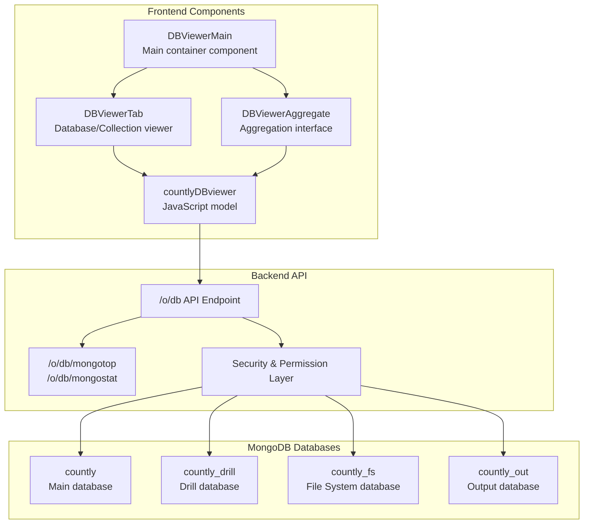
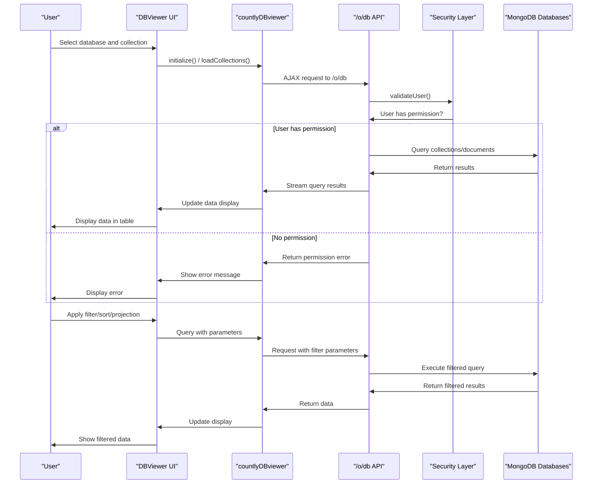
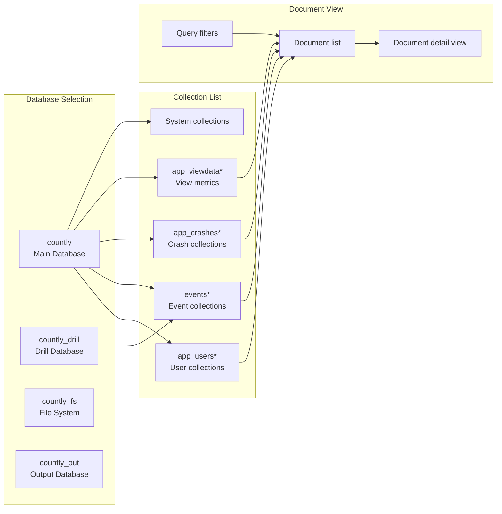
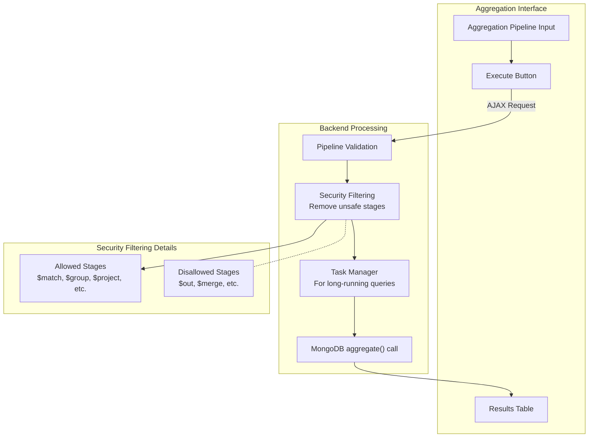
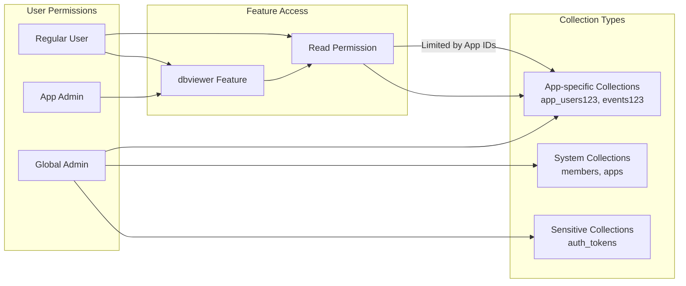

# Database Viewer Plugin

Relevant source files

The following files were used as context for generating this wiki page:

- [api/utils/rights.js](https://github.com/Countly/countly-server/blob/1527df18/api/utils/rights.js)
- [frontend/express/public/javascripts/countly/countly.auth.js](https://github.com/Countly/countly-server/blob/1527df18/frontend/express/public/javascripts/countly/countly.auth.js)
- [plugins/dbviewer/api/api.js](https://github.com/Countly/countly-server/blob/1527df18/plugins/dbviewer/api/api.js)
- [plugins/dbviewer/frontend/public/javascripts/countly.models.js](https://github.com/Countly/countly-server/blob/1527df18/plugins/dbviewer/frontend/public/javascripts/countly.models.js)
- [plugins/dbviewer/frontend/public/javascripts/countly.views.js](https://github.com/Countly/countly-server/blob/1527df18/plugins/dbviewer/frontend/public/javascripts/countly.views.js)
- [plugins/dbviewer/frontend/public/localization/dbviewer.properties](https://github.com/Countly/countly-server/blob/1527df18/plugins/dbviewer/frontend/public/localization/dbviewer.properties)
- [plugins/dbviewer/frontend/public/stylesheets/main.scss](https://github.com/Countly/countly-server/blob/1527df18/plugins/dbviewer/frontend/public/stylesheets/main.scss)
- [plugins/dbviewer/frontend/public/templates/aggregate.html](https://github.com/Countly/countly-server/blob/1527df18/plugins/dbviewer/frontend/public/templates/aggregate.html)
- [plugins/dbviewer/frontend/public/templates/main.html](https://github.com/Countly/countly-server/blob/1527df18/plugins/dbviewer/frontend/public/templates/main.html)
- [plugins/dbviewer/frontend/public/templates/tab.html](https://github.com/Countly/countly-server/blob/1527df18/plugins/dbviewer/frontend/public/templates/tab.html)

The Database Viewer Plugin provides a user interface and API endpoints to explore, query, and analyze Countly's MongoDB databases. This tool allows developers and administrators to view database collections, documents, indexes, and execute aggregation pipelines directly from the Countly dashboard.

## Overview

The Database Viewer plugin provides direct access to the MongoDB databases that Countly uses to store application data. Key features include:

- Browse all MongoDB databases used by Countly (main, drill, file system, etc.)
- View collections and documents in an interactive interface
- Filter, sort, and project data with MongoDB query syntax
- Execute MongoDB aggregation pipelines
- View database indexes
- Export data

The plugin implements proper access controls to ensure users can only access data they have permission to view based on their role and app access rights.

Sources:
- [plugins/dbviewer/frontend/public/localization/dbviewer.properties:1-49](https://github.com/Countly/countly-server/blob/1527df18/plugins/dbviewer/frontend/public/localization/dbviewer.properties#L1-L49)
- [plugins/dbviewer/frontend/public/javascripts/countly.views.js:5-6](https://github.com/Countly/countly-server/blob/1527df18/plugins/dbviewer/frontend/public/javascripts/countly.views.js#L5-L6)

## Architecture

The Database Viewer plugin follows a standard Countly plugin architecture with frontend and backend components.

### Component Architecture

The plugin architecture consists of:

1. **Frontend Components**: Vue.js components for the user interface
2. **JavaScript Model**: Client-side data handling and API requests
3. **Backend API**: Server-side endpoints for database access
4. **Security Layer**: Permission validation and query filtering
5. **MongoDB Access**: Connections to various Countly databases

Sources:
- [plugins/dbviewer/frontend/public/javascripts/countly.views.js:7-393](https://github.com/Countly/countly-server/blob/1527df18/plugins/dbviewer/frontend/public/javascripts/countly.views.js#L7-L393)
- [plugins/dbviewer/frontend/public/javascripts/countly.views.js:395-496](https://github.com/Countly/countly-server/blob/1527df18/plugins/dbviewer/frontend/public/javascripts/countly.views.js#L395-L496)
- [plugins/dbviewer/frontend/public/javascripts/countly.views.js:498-597](https://github.com/Countly/countly-server/blob/1527df18/plugins/dbviewer/frontend/public/javascripts/countly.views.js#L498-L597)
- [plugins/dbviewer/api/api.js:1-14](https://github.com/Countly/countly-server/blob/1527df18/plugins/dbviewer/api/api.js#L1-L14)

## Data Flow

The following diagram illustrates how data flows through the Database Viewer plugin:

This diagram shows:

1. Initial data loading flow
2. Permission validation process
3. Query execution with filters
4. Results streaming back to the UI

Sources:
- [plugins/dbviewer/frontend/public/javascripts/countly.models.js:9-135](https://github.com/Countly/countly-server/blob/1527df18/plugins/dbviewer/frontend/public/javascripts/countly.models.js#L9-L135)
- [plugins/dbviewer/api/api.js:136-657](https://github.com/Countly/countly-server/blob/1527df18/plugins/dbviewer/api/api.js#L136-L657)
- [plugins/dbviewer/frontend/public/javascripts/countly.views.js:99-147](https://github.com/Countly/countly-server/blob/1527df18/plugins/dbviewer/frontend/public/javascripts/countly.views.js#L99-L147)

## User Interface Components

The Database Viewer plugin provides several key UI components:

### Main Dashboard View

The main view consists of:
- Database tabs (countly, countly_drill, countly_fs, countly_out)
- Collection sidebar with search functionality
- App filter dropdown
- Document viewer with expandable rows

### Collection Browser

The collection browser displays:
- Collection documents in a paginated table
- Document IDs and content in expandable rows
- Filter, projection, and sort controls

### Aggregation Interface

A specialized interface for running MongoDB aggregation pipelines:
- Text area for entering aggregation pipeline JSON
- Results display in tabular format
- Pipeline validation and security filtering

Sources:
- [plugins/dbviewer/frontend/public/templates/main.html:1-22](https://github.com/Countly/countly-server/blob/1527df18/plugins/dbviewer/frontend/public/templates/main.html#L1-L22)
- [plugins/dbviewer/frontend/public/templates/tab.html:1-173](https://github.com/Countly/countly-server/blob/1527df18/plugins/dbviewer/frontend/public/templates/tab.html#L1-L173)
- [plugins/dbviewer/frontend/public/templates/aggregate.html:1-66](https://github.com/Countly/countly-server/blob/1527df18/plugins/dbviewer/frontend/public/templates/aggregate.html#L1-L66)
- [plugins/dbviewer/frontend/public/stylesheets/main.scss:1-120](https://github.com/Countly/countly-server/blob/1527df18/plugins/dbviewer/frontend/public/stylesheets/main.scss#L1-L120)

## Core Functionality

### Database and Collection Navigation

The plugin allows users to navigate between different Countly databases and their collections:

Users can:
1. Select a database from the tabs
2. Choose a collection from the sidebar
3. View documents in the main content area
4. Expand documents to see detailed content

Sources:
- [plugins/dbviewer/frontend/public/javascripts/countly.views.js:409-447](https://github.com/Countly/countly-server/blob/1527df18/plugins/dbviewer/frontend/public/javascripts/countly.views.js#L409-L447)
- [plugins/dbviewer/frontend/public/javascripts/countly.views.js:37-38](https://github.com/Countly/countly-server/blob/1527df18/plugins/dbviewer/frontend/public/javascripts/countly.views.js#L37-L38)
- [plugins/dbviewer/api/api.js:349-403](https://github.com/Countly/countly-server/blob/1527df18/plugins/dbviewer/api/api.js#L349-L403)

### Query and Filtering

The plugin provides a user interface for creating MongoDB queries to filter collections:

1. **Filter Query**: Write JSON queries to filter documents
2. **Projection**: Select specific fields to include in results
3. **Sorting**: Choose fields to sort by (ascending or descending)

The filter queries use MongoDB's query syntax and are transmitted to the backend where they're executed against the database.

Sources:
- [plugins/dbviewer/frontend/public/javascripts/countly.views.js:188-230](https://github.com/Countly/countly-server/blob/1527df18/plugins/dbviewer/frontend/public/javascripts/countly.views.js#L188-L230)
- [plugins/dbviewer/frontend/public/templates/tab.html:70-152](https://github.com/Countly/countly-server/blob/1527df18/plugins/dbviewer/frontend/public/templates/tab.html#L70-L152)
- [plugins/dbviewer/api/api.js:214-269](https://github.com/Countly/countly-server/blob/1527df18/plugins/dbviewer/api/api.js#L214-L269)

### Aggregation Pipeline Interface

The aggregation feature allows users to execute MongoDB aggregation pipelines:

The aggregation interface allows:
1. Writing complex aggregation pipelines in JSON format
2. Securely executing them against MongoDB
3. Viewing the results in a tabular format

For security, certain aggregation stages (like `$out` and `$merge`) are disallowed for non-admin users.

Sources:
- [plugins/dbviewer/frontend/public/javascripts/countly.views.js:498-597](https://github.com/Countly/countly-server/blob/1527df18/plugins/dbviewer/frontend/public/javascripts/countly.views.js#L498-L597)
- [plugins/dbviewer/api/api.js:15-61](https://github.com/Countly/countly-server/blob/1527df18/plugins/dbviewer/api/api.js#L15-L61)
- [plugins/dbviewer/api/api.js:406-483](https://github.com/Countly/countly-server/blob/1527df18/plugins/dbviewer/api/api.js#L406-L483)
- [plugins/dbviewer/frontend/public/templates/aggregate.html:1-66](https://github.com/Countly/countly-server/blob/1527df18/plugins/dbviewer/frontend/public/templates/aggregate.html#L1-L66)

## Security and Permissions

The Database Viewer plugin implements a comprehensive security model to ensure users can only access data they have permission to view:

### Permission Model

1. **Global Admins**: Have full access to all databases and collections
2. **App Admins**: Can access collections related to the apps they manage
3. **Regular Users**: Can access collections based on specific feature permissions

The security is implemented at multiple levels:
- Frontend permission checks using `countlyAuth.validateRead()`
- Backend permission validation in API endpoints
- Collection-level access control
- Document field filtering for sensitive information

Sources:
- [plugins/dbviewer/api/api.js:485-529](https://github.com/Countly/countly-server/blob/1527df18/plugins/dbviewer/api/api.js#L485-L529)
- [api/utils/rights.js:395-456](https://github.com/Countly/countly-server/blob/1527df18/api/utils/rights.js#L395-L456)
- [frontend/express/public/javascripts/countly/countly.auth.js:92-130](https://github.com/Countly/countly-server/blob/1527df18/frontend/express/public/javascripts/countly/countly.auth.js#L92-L130)
- [plugins/dbviewer/frontend/public/javascripts/countly.views.js:5-6](https://github.com/Countly/countly-server/blob/1527df18/plugins/dbviewer/frontend/public/javascripts/countly.views.js#L5-L6)

### Collection Access Control

The plugin maps collections to applications, controlling access based on the user's application permissions:

The system:
1. Validates if the user has the `dbviewer` feature permission
2. Checks if the user has access to the specific app associated with a collection
3. Automatically filters out sensitive fields (`password`, `api_key`, etc.) from certain collections
4. Applies app-specific filters for non-global admins

Sources:
- [plugins/dbviewer/api/api.js:531-655](https://github.com/Countly/countly-server/blob/1527df18/plugins/dbviewer/api/api.js#L531-L655)
- [api/utils/rights.js:486-529](https://github.com/Countly/countly-server/blob/1527df18/api/utils/rights.js#L486-L529)

## API Endpoints

The plugin exposes the following main API endpoints:

| Endpoint | Method | Description |
|----------|--------|-------------|
| `/o/db` | GET | Main endpoint for database access, collection browsing, and document retrieval |
| `/o/db/mongotop` | GET | Admin-only endpoint for MongoDB server statistics |
| `/o/db/mongostat` | GET | Admin-only endpoint for MongoDB server statistics |

### `/o/db` Endpoint Parameters

| Parameter | Description |
|-----------|-------------|
| `dbs` or `db` | Database name (countly, countly_drill, etc.) |
| `collection` | Collection name to query |
| `filter` | MongoDB query filter in JSON format |
| `projection` | Fields to include in results |
| `sort` | Sort specification for results |
| `skip` | Number of documents to skip (pagination) |
| `limit` | Maximum number of documents to return |
| `document` | Document ID for single document retrieval |
| `action` | Special action (e.g., "get_indexes") |
| `aggregation` | Aggregation pipeline in JSON format |

Sources:
- [plugins/dbviewer/api/api.js:92-135](https://github.com/Countly/countly-server/blob/1527df18/plugins/dbviewer/api/api.js#L92-L135)
- [plugins/dbviewer/api/api.js:660-723](https://github.com/Countly/countly-server/blob/1527df18/plugins/dbviewer/api/api.js#L660-L723)
- [plugins/dbviewer/frontend/public/javascripts/countly.models.js:56-80](https://github.com/Countly/countly-server/blob/1527df18/plugins/dbviewer/frontend/public/javascripts/countly.models.js#L56-L80)

## Advanced Features

### Document Export

The plugin allows exporting filtered data sets to various formats using Countly's export system. The export functionality:

1. Preserves all applied filters, projections, and sorting
2. Exports the data in formats like CSV, JSON, or Excel
3. Uses the task manager for large exports to prevent request timeouts

Sources:
- [plugins/dbviewer/frontend/public/javascripts/countly.views.js:246-265](https://github.com/Countly/countly-server/blob/1527df18/plugins/dbviewer/frontend/public/javascripts/countly.views.js#L246-L265)
- [plugins/dbviewer/frontend/public/templates/tab.html:44-49](https://github.com/Countly/countly-server/blob/1527df18/plugins/dbviewer/frontend/public/templates/tab.html#L44-L49)

### MongoDB Performance Tools Integration

For global administrators, the plugin integrates with native MongoDB performance monitoring tools:

1. **Mongotop**: Shows which collections have the most read/write activity
2. **Mongostat**: Provides MongoDB server statistics

These features help administrators monitor database performance and identify potential bottlenecks.

Sources:
- [plugins/dbviewer/api/api.js:664-723](https://github.com/Countly/countly-server/blob/1527df18/plugins/dbviewer/api/api.js#L664-L723)
- [plugins/dbviewer/frontend/public/javascripts/countly.models.js:160-196](https://github.com/Countly/countly-server/blob/1527df18/plugins/dbviewer/frontend/public/javascripts/countly.models.js#L160-L196)

## Conclusion

The Database Viewer plugin provides a powerful interface for exploring and querying the MongoDB databases that power Countly. It combines direct database access with proper security controls to help developers, administrators, and analysts explore their data safely.

The plugin is useful for:
- Debugging issues with application data
- Running ad-hoc queries against Countly data
- Data export and analysis
- Understanding the Countly data model