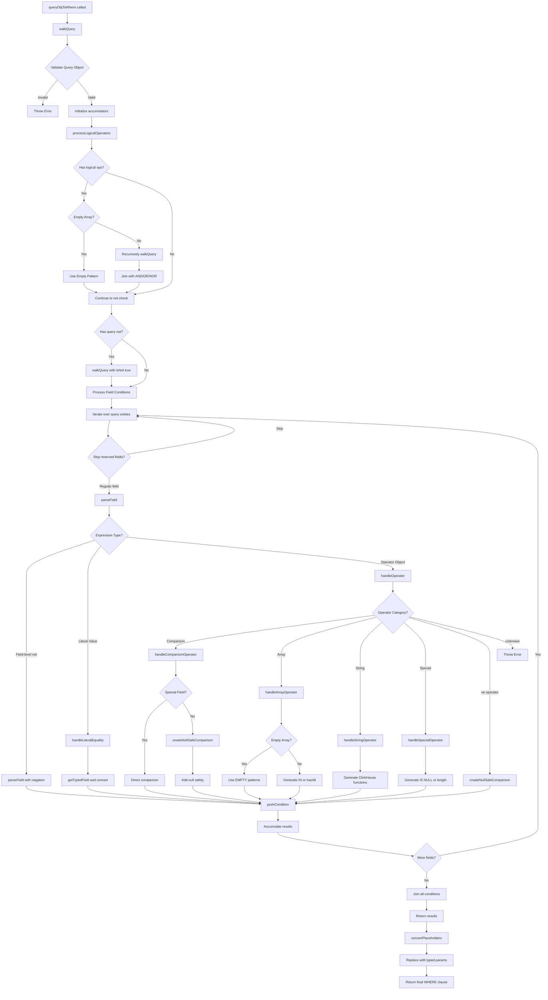

# WhereClauseConverter

A robust utility for converting MongoDB-style query objects into ClickHouse SQL WHERE clauses with proper type handling and parameterized queries for security and performance.

## Table of Contents

- [Overview](#overview)
- [Conversion Flow](#conversion-flow)
- [Usage](#usage)
- [Supported Operators](#supported-operators)
- [Special Field Handling](#special-field-handling)
- [Edge Cases](#edge-cases)
- [Extending the Converter](#extending-the-converter)
- [Debugging](#debugging)
- [API Reference](#api-reference)

## Overview

The `WhereClauseConverter` bridges the gap between MongoDB-style queries and ClickHouse SQL, enabling seamless migration of query logic from MongoDB to ClickHouse while maintaining type safety and performance.

### Key Features

- **Type Safety**: Automatic type inference and casting for ClickHouse compatibility
- **Parameterized Queries**: Prevents SQL injection through proper parameter binding
- **Special Field Support**: Custom handling for DateTime64 and other specialized types
- **Comprehensive Operators**: Support for comparison, logical, array, and string operators
- **Edge Case Handling**: Robust handling of null values, empty arrays, and type coercion
- **Extensible Design**: Easy to add new operators and custom field types

### Architecture

The converter follows a multi-stage pipeline:
1. **Query Parsing**: Recursively parse MongoDB query objects
2. **Operator Routing**: Route operators to specialized handlers
3. **Type Inference**: Determine appropriate ClickHouse types
4. **SQL Generation**: Generate parameterized SQL fragments
5. **Parameter Conversion**: Convert values for ClickHouse compatibility

## Conversion Flow



## Usage

### Basic Usage

```javascript
const WhereClauseConverter = require('./WhereClauseConverter');

// Create converter with default configuration
const converter = new WhereClauseConverter();

// Simple equality
const result1 = converter.queryObjToWhere({ name: 'John' });
// Output: { sql: "WHERE name::String = {p0:String}", params: { p0: "John" } }

// Comparison operators
const result2 = converter.queryObjToWhere({ age: { $gt: 18 } });
// Output: { sql: "WHERE toFloat64OrNull(age::String) > {p0:Float64}", params: { p0: 18 } }

// Complex query
const result3 = converter.queryObjToWhere({
    $and: [
        { status: 'active' },
        { age: { $gte: 21 } },
        { tags: { $in: ['premium', 'vip'] } }
    ]
});
```

### Custom Configuration

```javascript
// Configure special fields for custom types
const converter = new WhereClauseConverter({
    specialFields: {
        'created_at': 'DateTime64(3)',     // Millisecond precision
        'updated_at': 'DateTime',          // Second precision
        'user_id': 'UInt64',              // 64-bit unsigned integer
        'price': 'Decimal(18,2)',         // Fixed-point decimal
        'coordinates': 'Point'             // Geospatial type
    }
});

// DateTime field will be handled specially
const result = converter.queryObjToWhere({
    created_at: { $gte: 1735678800000 }  // Millisecond timestamp
});
// Output: { sql: "WHERE created_at >= {p0:DateTime64(3)}", params: { p0: 1735678800 } }
```

## Supported Operators

### Comparison Operators

| MongoDB | ClickHouse | Example | Output |
|---------|------------|---------|---------|
| `$gt` | `>` | `{ age: { $gt: 18 } }` | `toFloat64OrNull(age::String) > {p0:Float64}` |
| `$gte` | `>=` | `{ score: { $gte: 80 } }` | `toFloat64OrNull(score::String) >= {p0:Float64}` |
| `$lt` | `<` | `{ price: { $lt: 100 } }` | `toFloat64OrNull(price::String) < {p0:Float64}` |
| `$lte` | `<=` | `{ rating: { $lte: 5 } }` | `toFloat64OrNull(rating::String) <= {p0:Float64}` |
| `$ne` | `!=` | `{ status: { $ne: 'inactive' } }` | `status::String != {p0:String}` |

**Note**: `$ne` uses the same null-safe comparison logic as other operators, so for numeric values it will use `toFloat64OrNull()`.

### Array Operators

| MongoDB | ClickHouse | Example | Output |
|---------|------------|---------|---------|
| `$in` | `IN` | `{ category: { $in: ['A', 'B'] } }` | `category::String IN ({p0:String},{p1:String})` |
| `$nin` | `NOT IN` | `{ status: { $nin: ['deleted'] } }` | `status::String NOT IN ({p0:String})` |
| `$all` | `hasAll` | `{ tags: { $all: ['red', 'blue'] } }` | `hasAll(tags::String, [{p0:String},{p1:String}])` |

### String/Regex Operators

| MongoDB | ClickHouse Function | Description |
|---------|-------------------|-------------|
| `$regex` | `match()` | Regular expression matching |
| `rgxcn` | `match()` | Contains pattern |
| `rgxntc` | `NOT match()` | Does not contain pattern |
| `rgxbw` | `startsWith()` | Begins with pattern |
| `rgxitl` | `match(lower(), lower())` | Case-insensitive match |

### Special Operators

| MongoDB | ClickHouse | Description |
|---------|------------|-------------|
| `$exists` | `IS NOT NULL` / `IS NULL` | Field existence check |
| `$size` | `length() = ?` | Array size check |

### Logical Operators

| MongoDB | Behavior | Example |
|---------|----------|---------|
| `$and` | All conditions must be true | `{ $and: [{ a: 1 }, { b: 2 }] }` |
| `$or` | Any condition must be true | `{ $or: [{ a: 1 }, { b: 2 }] }` |
| `$nor` | No condition must be true | `{ $nor: [{ a: 1 }, { b: 2 }] }` |
| `$not` | Negates the condition | `{ $not: { a: 1 } }` |

## Special Field Handling

### DateTime64 Fields

DateTime64 fields receive special treatment for timestamp conversion:

```javascript
// Configuration
const converter = new WhereClauseConverter({
    specialFields: { 'timestamp': 'DateTime64(3)' }
});

// Input: millisecond timestamp
converter.queryObjToWhere({ timestamp: { $gte: 1735678800000 } });
// Converts to: timestamp >= {p0:DateTime64(3)} with params: { p0: 1735678800 }

// Supports multiple input formats:
// - Number (milliseconds): 1735678800000 → 1735678800
// - Date object: new Date() → getTime() / 1000
// - String: "2025-01-01" → new Date().getTime() / 1000
```

### Type Inference Rules

| JavaScript Type | ClickHouse Type | Notes |
|-----------------|----------------|-------|
| `number` | `Float64` | All numbers as Float64 |
| `string` | `String` | Default string type |
| `boolean` | `Bool` | Boolean values |
| `null`/`undefined` | `Nullable(String)` | Nullable wrapper |
| `Date` | `DateTime` | Date objects |
| `Array` | `Array(T)` | Array of inferred type T |

## Edge Cases

### Empty Arrays

The converter handles empty arrays with appropriate boolean logic:

```javascript
// Empty $in - should match nothing
{ field: { $in: [] } }  →  "1 = 0"  // Always false

// Empty $nin - should match everything  
{ field: { $nin: [] } }  →  "1 = 1"  // Always true

// Empty $or - should match nothing
{ $or: [] }  →  "(1 = 0)"  // Always false

// Empty $and - should match everything
{ $and: [] }  →  "(1 = 1)"  // Always true
```

### Null Value Handling

```javascript
// Null equality
{ field: null }  →  "field::Nullable(String) = {p0:Nullable(String)}"

// Null in comparisons - note: null is inferred as Nullable(String), not Float64
{ score: { $gt: null } }  →  "score::Nullable(String) > {p0:Nullable(String)}"
```

### Field-level vs Query-level $not

```javascript
// Field-level $not
{ status: { $not: { $ne: 'active' } } }  →  "NOT (status::String != {p0:String})"

// Query-level $not  
{ $not: { status: 'active' } }  →  "NOT (status::String = {p0:String})"
```

## Extending the Converter

### Adding New Operators

To add a new operator, follow these steps:

1. **Add operator mapping** (if needed):
```javascript
this.#operators.CUSTOM = {
    '$myop': 'MY_CLICKHOUSE_OP'
};
```

2. **Create handler method**:
```javascript
#handleCustomOperator(parts, paramsArr, fieldNamesArr, field, op, val, isNot) {
    const typedField = this.#getTypedField(field, val);
    let sql;
    
    switch (op) {
        case '$myop':
            sql = `myClickHouseFunction(${typedField}, ?)`;
            break;
        // Add more cases as needed
    }
    
    fieldNamesArr.push(field);
    this.#pushCondition(parts, paramsArr, isNot ? `NOT (${sql})` : sql, val);
}
```

3. **Route in handleOperator**:
```javascript
#handleOperator(parts, paramsArr, fieldNamesArr, field, op, val, isNot) {
    // ... existing conditions ...
    else if (op === '$myop') {
        this.#handleCustomOperator(parts, paramsArr, fieldNamesArr, field, op, val, isNot);
    }
    // ... rest of method
}
```

### Example: Adding $mod Operator

```javascript
// 1. Add to handleOperator routing
else if (op === '$mod') {
    const typedField = this.#getTypedField(field, val);
    const [divisor, remainder] = val; // MongoDB $mod expects [divisor, remainder]
    const sql = `${typedField} % ? = ?`;
    fieldNamesArr.push(field, field);
    this.#pushCondition(parts, paramsArr, isNot ? `NOT (${sql})` : sql, divisor, remainder);
}

// Usage:
converter.queryObjToWhere({ user_id: { $mod: [10, 3] } });
// Output: "WHERE user_id::Float64 % {p0:Float64} = {p1:Float64}"
// Params: { p0: 10, p1: 3 }
```

## Debugging

### Common Issues

#### 1. **Unsupported Operator Error**
```
Error: Unsupported operator $unknown
```
**Solution**: Add the operator to the appropriate handler or check for typos.

#### 2. **Type Mismatch**
```javascript
// Problem: DateTime field not configured as special field
{ timestamp: { $gte: 1735678800000 } }
// Generates: toFloat64OrNull(timestamp::String) >= {p0:Float64}

// Solution: Configure as special field
const converter = new WhereClauseConverter({
    specialFields: { 'timestamp': 'DateTime64(3)' }
});
```

#### 3. **Empty Result**
```javascript
converter.queryObjToWhere({});
// Returns: { sql: "", params: {} }
```
This is expected behavior for empty queries.

### Debugging Techniques

#### 1. **Log Intermediate Steps**
```javascript
// Since internal methods are private, you can add logging by extending the class
class DebuggingWhereClauseConverter extends WhereClauseConverter {
    queryObjToWhere(query) {
        console.log('Input query:', JSON.stringify(query, null, 2));
        const result = super.queryObjToWhere(query);
        console.log('Generated SQL:', result.sql);
        console.log('Parameters:', JSON.stringify(result.params, null, 2));
        return result;
    }
}

const converter = new DebuggingWhereClauseConverter();
```

#### 2. **Inspect Generated SQL**
```javascript
const result = converter.queryObjToWhere(complexQuery);
console.log('SQL:', result.sql);
console.log('Params:', JSON.stringify(result.params, null, 2));
```

#### 3. **Validate ClickHouse Compatibility**
Test generated SQL directly in ClickHouse:
```sql
-- Replace parameters manually for testing
SELECT * FROM your_table WHERE user_id::Float64 > 18;
```

### Performance Considerations

#### 1. **Type Casting Overhead**
- Special fields avoid type casting: `timestamp >= ?` vs `toFloat64OrNull(field::String) >= ?`
- Configure frequently queried fields as special fields

#### 2. **Parameter Count**
- Large `$in` arrays generate many parameters
- Consider using ClickHouse `IN` with subqueries for very large arrays

#### 3. **Null-Safe Comparisons**
- `toFloat64OrNull()` adds overhead but ensures MongoDB compatibility
- Use special fields when you can guarantee type consistency

## API Reference

### Constructor

```javascript
new WhereClauseConverter(config?)
```

**Parameters:**
- `config.specialFields` (Object): Map of field names to ClickHouse types

### Main Method

```javascript
queryObjToWhere(query) → {sql: string, params: Object}
```

**Parameters:**
- `query` (Object): MongoDB-style query object

**Returns:**
- `sql` (string): ClickHouse WHERE clause (empty string if no conditions)
- `params` (Object): Named parameters for ClickHouse query

### Internal Methods

All internal methods are private (prefixed with `#`) and not part of the public API:

- `#walkQuery()`: Recursively processes query objects
- `#parseField()`: Handles individual field expressions
- `#handleOperator()`: Routes operators to specific handlers
- `#handleComparisonOperator()`: Processes comparison operators
- `#handleArrayOperator()`: Processes array operators
- `#handleStringOperator()`: Processes string/regex operators
- `#handleSpecialOperator()`: Processes special operators
- `#processLogicalOperators()`: Processes logical operators
- `#convertPlaceholders()`: Converts ? placeholders to typed parameters
- `#inferType()`: Infers ClickHouse types from JavaScript values
- `#createNullSafeComparison()`: Creates null-safe comparison expressions
- `#getTypedField()`: Generates field names with type casting
- `#convertValueForField()`: Converts values for special fields
- `#pushCondition()`: Adds conditions to accumulators

### Error Handling

The converter throws errors in these cases:

- **Invalid query structure**: `Error: Unexpected literal at root: [value]`
- **Unsupported operator**: `Error: Unsupported operator $unknown`

Handle errors appropriately in your application:

```javascript
try {
    const result = converter.queryObjToWhere(query);
    // Use result.sql and result.params
} catch (error) {
    console.error('Query conversion failed:', error.message);
    // Handle error - perhaps fall back to simpler query
}
```