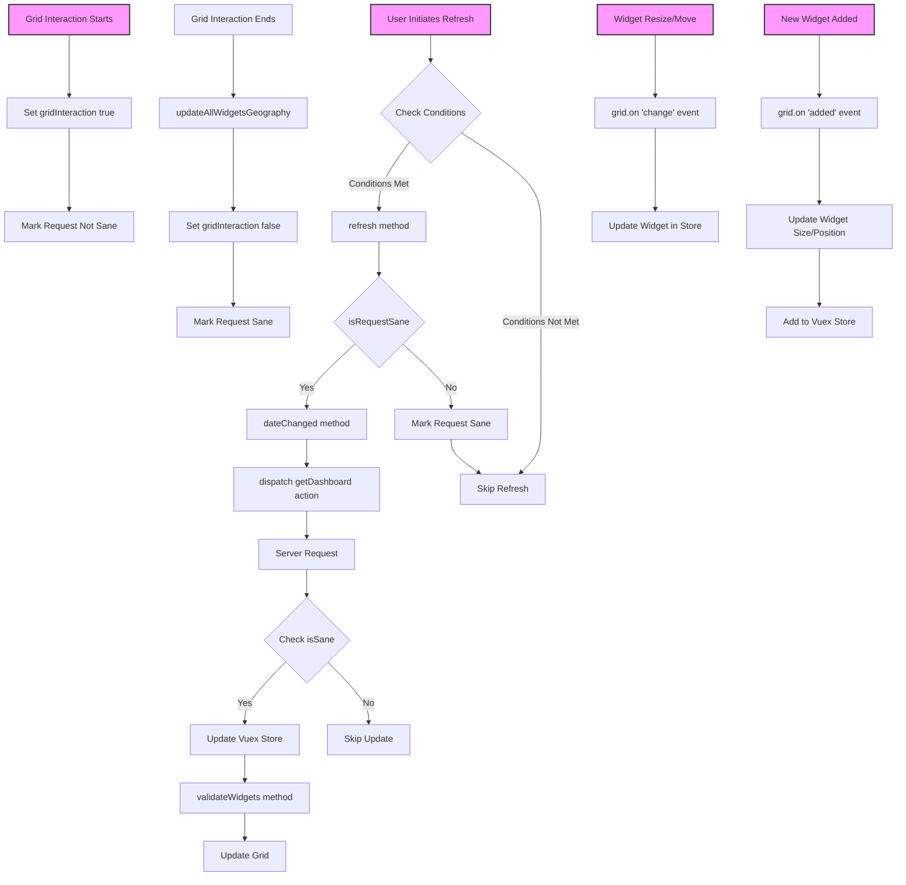

# Custom Dashboards

## Dashboard Frontend request & grid interaction flow

```mermaid

graph TD
    A[User Initiates Refresh] --> B{Check Conditions}
    B -->|Conditions Met| C[refresh method]
    B -->|Conditions Not Met| Z[Skip Refresh]
    
    C --> D{isRequestSane}
    D -->|Yes| E[dateChanged method]
    D -->|No| Y[Mark Request Sane]
    Y --> Z
    
    E --> F[dispatch getDashboard action]
    F --> G[Server Request]
    G --> H{Check isSane}
    H -->|Yes| I[Update Vuex Store]
    H -->|No| X[Skip Update]
    
    I --> J[validateWidgets method]
    J --> K[Update Grid]
    
    L[Grid Interaction Starts] --> M[Set gridInteraction true]
    M --> N[Mark Request Not Sane]
    
    O[Grid Interaction Ends] --> P[updateAllWidgetsGeography]
    P --> Q[Set gridInteraction false]
    Q --> R[Mark Request Sane]
    
    S[Widget Resize/Move] --> T[grid.on 'change' event]
    T --> U[Update Widget in Store]
    
    V[New Widget Added] --> W[grid.on 'added' event]
    W --> X1[Update Widget Size/Position]
    X1 --> Y1[Add to Vuex Store]

    style A fill:#f9f,stroke:#333,stroke-width:2px
    style L fill:#f9f,stroke:#333,stroke-width:2px
    style S fill:#f9f,stroke:#333,stroke-width:2px
    style V fill:#f9f,stroke:#333,stroke-width:2px
    
```